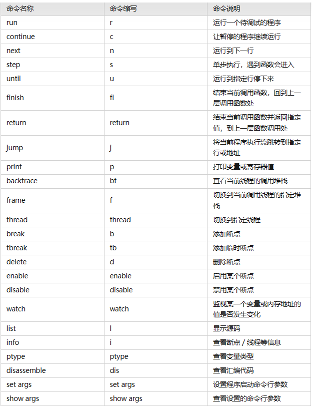

# `gbd`

- [`gbd`](#gbd)
  - [1. 生成调试信息](#1-生成调试信息)
  - [2. 启动调试](#2-启动调试)
  - [3. 退出调试](#3-退出调试)
  - [4. 常用命令](#4-常用命令)
    - [4.1 `run`](#41-run)
    - [4.2 `continue`](#42-continue)
    - [4.3 `break`](#43-break)
    - [4.4 `info break, enable, disable, delete`](#44-info-break-enable-disable-delete)
    - [4.5 `backtrace, frame`](#45-backtrace-frame)
    - [4.6 `list`](#46-list)
    - [4.7 `print`](#47-print)
    - [4.8 `whatis, ptype`](#48-whatis-ptype)
    - [4.9 `thread`](#49-thread)
    - [4.10 `next, step`](#410-next-step)
    - [4.11 `return, finish`](#411-return-finish)
    - [4.12 `until`](#412-until)
    - [4.13 `jump`](#413-jump)
    - [4.14 `x`](#414-x)
    - [4.15 `watch`](#415-watch)
  - [5. 快速定位错误](#5-快速定位错误)

---

## 1. 生成调试信息

```c
gcc -g filename app

gcc file -g -o  app
```

---

## 2. 启动调试

```c
1. 直接调用目标程序： gdb ./filename
2. 附加进程：gdb attach pid
3. 调试core文件：gdb filename corename
```

---

## 3. 退出调试

```c
quit 退出gdb
detach 退出附加进程
```

---

## 4. 常用命令



### 4.1 `run`

加入调试后，启动程序 可以简写为`r`

```c
(gdb) r
Starting program: /home/yl/io/app 
[Thread debugging using libthread_db enabled]
Using host libthread_db library "/lib/x86_64-linux-gnu/libthread_db.so.1".
```

### 4.2 `continue`

当触发断点或`ctrl+c`使程序中断后，`continue`使程序继续运行，简写为`c`

```c
(gdb) c
Continuing.

Program received signal SIGTSTP, Stopped (user).
0x00007ffff7ce57fa in __GI___clock_nanosleep (clock_id=clock_id@entry=0, flags=flags@entry=0, req=req@entry=0x7fffffffe260, rem=rem@entry=0x7fffffffe260) at ../sysdeps/unix/sysv/linux/clock_nanosleep.c:78
78 in ../sysdeps/unix/sysv/linux/clock_nanosleep.c
```

### 4.3 `break`

添加断点 简写为`b`：

- `break FunctionName`：在函数人口处添加断点
- `break LineNo`：在当前文件行号为`LineNo`处添加断点
- `break FileName:LineNo`：在`FileName`文件中行号为`LineNo`处添加断点
- `break FileName:FunctionName`：在`FileName`文件中函数人口为`FunctionName`处添加断点
- `break -/+ offset`：在当前程序暂停位置的前/后`offset`行处添加断点
- `break  ... if cond,`下条件断点

```c
1. 入口添加断点
(gdb) b main
Note: breakpoint 1 also set at pc 0x555555555255.
Breakpoint 2 at 0x555555555255: file seek.c, line 17.
(gdb) run
The program being debugged has been started already.
Start it from the beginning? (y or n) y
Starting program: /home/yl/io/app 
[Thread debugging using libthread_db enabled]
Using host libthread_db library "/lib/x86_64-linux-gnu/libthread_db.so.1".

Breakpoint 1, main () at seek.c:17
17              int fd=open("abc",O_RDWR);

2. 指定函数添加断点
(gdb) b main
Note: breakpoint 1 also set at pc 0x555555555255.
Breakpoint 2 at 0x555555555255: file seek.c, line 17.
(gdb) run
The program being debugged has been started already.
Start it from the beginning? (y or n) y
Starting program: /home/yl/io/app 
[Thread debugging using libthread_db enabled]
Using host libthread_db library "/lib/x86_64-linux-gnu/libthread_db.so.1".

Breakpoint 1, main () at seek.c:17
17              int fd=open("abc",O_RDWR);

```

### 4.4 `info break, enable, disable, delete`

- `info break`：可以简写为`i b`，显示当前所有断点的信息
- `disable 断点编号`：禁用某个断点，使得断点不会被触发
- `enable 断点编号`：启用某个被禁用得断点
- `delete 断点编号`：删除某个断点

```c
1. 查看所有断点
(gdb) b main
Breakpoint 5 at 0x555555555255: file seek.c, line 17.
(gdb) i b
Num     Type           Disp Enb Address            What
5       breakpoint     keep y   0x0000555555555255 in main at seek.c:17 

2. 禁用断点
(gdb) i b
Num     Type           Disp Enb Address            What
5       breakpoint     keep n   0x0000555555555255 in main at seek.c:17

3. 启用断点
(gdb) enable 5
(gdb) i b
Num     Type           Disp Enb Address            What
5       breakpoint     keep y   0x0000555555555255 in main at seek.c:17

4. 删除断点
(gdb) delete 5
(gdb) i b
No breakpoints or watchpoints.
```

### 4.5 `backtrace, frame`

- `backtrace`：简写为`bt`，用于查看当前调用堆栈以及函数层级关系
- `frame 堆栈编号`：简写为`f 堆栈编号`，用于切换到其他堆栈处

```c
1. 查看当前调用堆栈
(gdb) bt
#0  0x00007ffff7ce57fa in __GI___clock_nanosleep (clock_id=clock_id@entry=0, flags=flags@entry=0, req=req@entry=0x7fffffffe260, 
    rem=rem@entry=0x7fffffffe260) at ../sysdeps/unix/sysv/linux/clock_nanosleep.c:78
#1  0x00007ffff7cea6e7 in __GI___nanosleep (req=req@entry=0x7fffffffe260, rem=rem@entry=0x7fffffffe260)
    at ../sysdeps/unix/sysv/linux/nanosleep.c:25
#2  0x00007ffff7cea61e in __sleep (seconds=0) at ../sysdeps/posix/sleep.c:55
#3  0x000055555555529a in main () at seek.c:23

2. 切换到其他堆栈
(gdb) frame 0
#0  0x00007ffff7ce57fa in __GI___clock_nanosleep (clock_id=clock_id@entry=0, flags=flags@entry=0, req=req@entry=0x7fffffffe260, 
    rem=rem@entry=0x7fffffffe260) at ../sysdeps/unix/sysv/linux/clock_nanosleep.c:78
78  in ../sysdeps/unix/sysv/linux/clock_nanosleep.c
```

### 4.6 `list`

用于显示代码

- `list`：显示上一个`list`显示后的代码，如果为第一次执行list，即显示当前在执行代码位置附加得代码
- `list -`：显示上一次`list`命令显示的代码前面的代码
- `list LineNo`：显示当前代码文件第`LineNo`行附近的代码
- `list FileName:LineNO`：显示`FileName`文件第`LineNo`行附近的代码
- `list FunctionName`：显示当前文件的`FunctionName`函数附近的代码
- `list FileName:FunctionName`：显示`FileName`文件的`FunctionName`函数附近的代码
- `list n1,n2`：显示n1~n2的代码

`list`默认只输出10行代码，可以修改：

- `show listsize`：查看`list`命令显示的代码数
- `set listsize count`：设置`list`命令显示的代码行数为`count`

```c
(gdb) show listsize
Number of source lines gdb will list by default is 10.
(gdb) set listsize 20
(gdb) list
16  {
17      int fd=open("abc",O_RDWR);
18      if(fd<0)
19      {
20          perror("open abc");
21          exit(1);
22      }
23      sleep(100);
24      int flags=fcntl(STDIN_FILENO, F_GETFL);
25      printf("%d\n",flags);
26      lseek(fd,0x1000,SEEK_SET);
27      write(fd,"a",1);
28      close(fd);
29
30      return 0;
31  }
32
33
```

### 4.7 `print`

用于查看和修改变量的值，简写为`p`

- `print param`：用于调试过程中查看变量的值
- `print param=value`： 用于在调试过程中修改变量的值
- `print a+b+c`：可以进行一定的表达式计算，例如计算a+b+c
- `print func()`：输出`func`函数执行的结果，常见的用途为打印函数执行失败原因
- `print *this`：在c++对象中，可以输出当前对象的各变量的值

### 4.8 `whatis, ptype`

- `whatis`：用于查看变量类型
- `ptype`：作用和`whatis`类似，但可以查看复合数据类型，会打印该类型的成员变量

```c
(gdb) whatis flags
type = int
```

### 4.9 `thread`

查看进程的线程运行状态，切换进程

- `info thread`：查看当前进程的所有线程的运行状态
- `thread 线程编号`：切换到具体编号的线程上去

```c
1. 查看当前进程的所有线程
(gdb) info thread
  Id   Target Id                               Frame 
* 1    Thread 0x7ffff7faa740 (LWP 20642) "app" 0x00007ffff7ce57fa in __GI___clock_nanosleep (clock_id=clock_id@entry=0, 
    flags=flags@entry=0, req=req@entry=0x7fffffffe260, rem=rem@entry=0x7fffffffe260)
    at ../sysdeps/unix/sysv/linux/clock_nanosleep.c:78

2. 切换到具体编号的线程上
(gdb) thread 1
[Switching to thread 1 (Thread 0x7ffff7faa740 (LWP 20642))]
#0  0x00007ffff7ce57fa in __GI___clock_nanosleep (clock_id=clock_id@entry=0, flags=flags@entry=0, req=req@entry=0x7fffffffe260, 
    rem=rem@entry=0x7fffffffe260) at ../sysdeps/unix/sysv/linux/clock_nanosleep.c:78
78  in ../sysdeps/unix/sysv/linux/clock_nanosleep.c
```

### 4.10 `next, step`

- `next`：单步步过，即遇见函数直接跳过，不进入函数内部
- `step`: 单步步入，即遇见函数会进入函数内部

### 4.11 `return, finish`

退出函数

- `return`：立即退出当前函数，剩下的代码不会执行，`return`可以指定函数的返回值
- `finish`：会继续执行该函数剩余代码再正常退出

### 4.12 `until`

使得程序运行到指定位置停下来，命令参数和`break`一样

### 4.13 `jump`

- `jump LineNo`：跳转到代码的`LineNo`行位置
- `jump +10`：跳转到距离当前代码下10行的位置
- `jump *0x12345567`：跳转到指定地址的代码处

### 4.14 `x`

查看内存

```c
x /20xw 显示20个单位，16进制，4字节每单位
```

### 4.15 `watch`

监视一个变量或一段内存，当被设置观察点的变量发送修改时，打印显示

- `info watch`：显示观察点
- `watch 变量`：设置变量

---

## 5. 快速定位错误

输出`core`文件，死后验尸，当出错时会存储到`core`文件中

```c
gcc test.c -g 编译

ulimit -c 1024 开启core文件

gbd a.out core 调试查看错误
```

---
