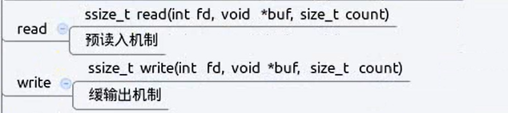

# `read` 和 `write`

- [`read` 和 `write`](#read-和-write)
  - [1. `read`](#1-read)
  - [2. `write`](#2-write)



---

## 1. `read`

`man 2 read`查看read的详解

```Linux
ssize_t read(int fd,void *buf,size_t size); 返回成功读取的字节数  
size为请求读取的总字节数
```

---

## 2. `write`

Linux中`write`，可以写入文件内容

`man 2 write`查看write的详解

```Linux
ssize_t write(int fd, const void *buf, size_t count);

例如：
char buf[]="hello world"
先打开文件： int fd=open("abc",O_RDWR) 以读写的方式打开
写入内容：　write(fd,buf,strlen(buf))
close(fd); 关闭文件


读取到文件中的数据后再写入
char buf[1024];
int len;
int fd1=open("a",O_RDONLY);
int fd2=open("a",O_CREAT | O_WRONLY,0777);
while((len=read(fd1,buf,sizeof(buf))>0))
{
    write(fd2,buf,len); 将读取到的长度的数据写入到fd2中
}
```

---
