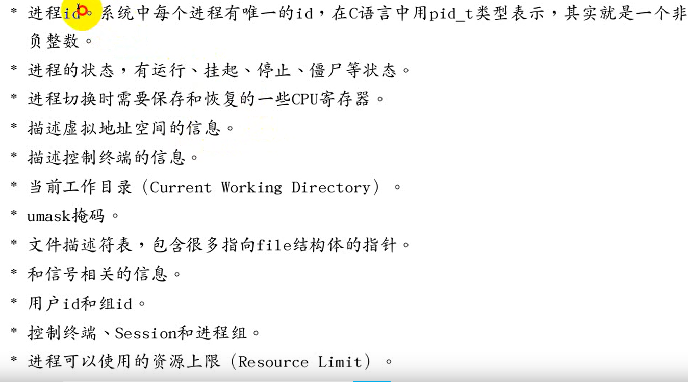
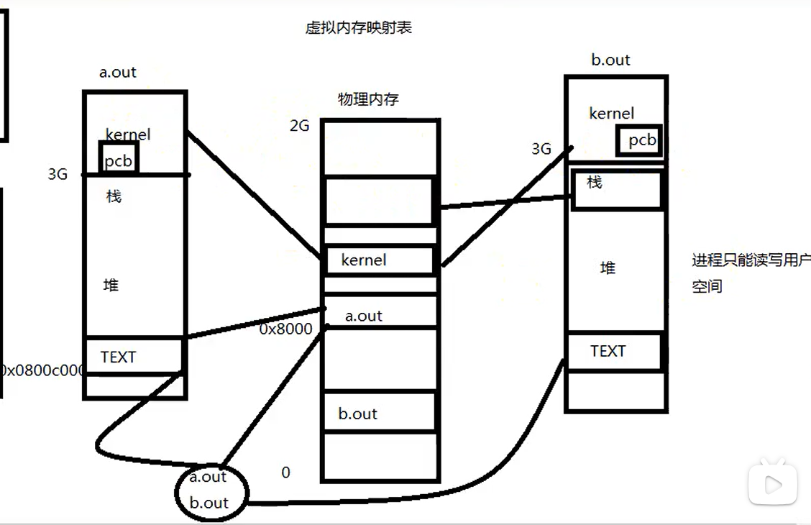
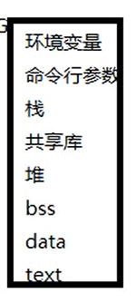

# 虚拟地址

---

## 进程控制块

---

## 虚拟地址映射

* 当创建一个进程后，会有虚拟空间，会映射到物理内存中，虚拟空间中其中`0~3G`为栈和堆，`3~4G`为`kernel`
* 进程只能读写用户空间，只有操作系统管理者才可以看到`PCB`
* 操作系统以`page`来管理物理内存，当虚拟空间中申请物理内存时，物理内存会分配`page 1page=4096B`，如果一个`page`没有用完，就把不会分配，同时`page`可以管理读写属性等

---

## 虚拟地址内容

