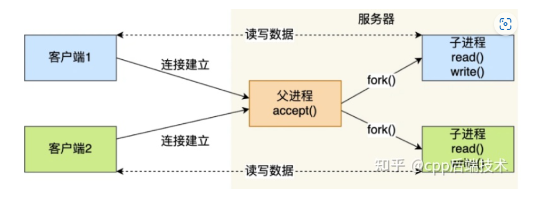

# 多进程并发服务器



**使用多进程并发服务器时要考虑以下几点**：

1. 父最大文件描述个数(父进程中需要close关闭accept返回的新文件描述符)
2. 系统内创建进程个数(内存大小相关)
3. 进程创建过多是否降低整体服务性能(进程调度)

- 使用`waitpid()`，通过信号来回收进程
- 要单独用一个进程来回收其他的进程，以免打断`accept`的那个进程的运行

---

## 1. `server`服务端

```c
#include <stdio.h>
#include <ctype.h>
#include <stdlib.h>
#include <string.h>
#include <unistd.h>
#include <sys/socket.h>
#include <netinet/in.h>
#include <arpa/inet.h>
#include "wrap.h"

#define MAXLINE 1024
#define SERV_PORT 8000

int main(void)
{
    struct sockaddr_in servaddr, cliaddr;
    socklen_t cliaddr_len;
    int listenfd, connfd;
    char buf[MAXLINE];
    char str[INET_ADDRSTRLEN];
    int i, n;
    pid_t pid;
    // 1. socket
    listenfd = Socket(AF_INET, SOCK_STREAM, 0);
    bzero(&servaddr, sizeof(servaddr));
    // 地址族协议类型 IPv4
    servaddr.sin_family = AF_INET;
    // IP地址
    servaddr.sin_addr.s_addr = htonl(INADDR_ANY);
    // 端口port
    servaddr.sin_port = htons(SERV_PORT);
    // 2. bind 绑定IP和端口
    Bind(listenfd, (struct sockaddr *)&servaddr, sizeof(servaddr));
    // 3. listen 
    Listen(listenfd, 125);
    printf("Accepting connections ...\n");
    while (1) {
        cliaddr_len = sizeof(cliaddr);
        // 4. accept阻塞监听客户端链接请求
        connfd = Accept(listenfd, (struct sockaddr *)&cliaddr, &cliaddr_len);

        pid = fork();

        if(pid == 0){
            // child
            Close(listenfd);

            printf("received from %s at PORT %d\n", 
                inet_ntop(AF_INET, &cliaddr.sin_addr, str, sizeof(str)),
                ntohs(cliaddr.sin_port));
            while(1){
                n = Read(connfd, buf, MAXLINE);
                // 输出IP 和 端口号
                if(n == 0){
                    printf("the other side has been closed\n");
                    break;
                }
                for (i = 0; i < n; i++)
                    buf[i] = toupper(buf[i]);
                Write(connfd, buf, n);
            }
            Close(connfd);2
            return 0;
        }
        else if(pid > 0){
            // parent
            Close(connfd);
        }
        else{
            perr_exit("fork");
        }
    }

    Close(listenfd);

    return 0;
}
```

---

## 2. `client`客户端

```c
#include <netinet/in.h>
#include <stdio.h>
#include <sys/types.h>
#include <sys/socket.h>
#include <string.h>
#include <arpa/inet.h>
#include <unistd.h>
#include <stdlib.h>
#include <sys/stat.h>
#include <fcntl.h>
#include "wrap.h"

#define SERVER_PORT 8000
#define MAX_LEN 1024

int main(int argc, char *argv[])
{
    struct sockaddr_in serveraddr;
    int confd;
    char ipstr[] = "10.193.128.250";
    //char ipstr[] = "127.0.0.1";
    char buf[MAX_LEN];
    // 1. 创建一个socket
    confd = Socket(AF_INET, SOCK_STREAM, 0);
    // 2. 初始化一个服务器地址
    bzero(&serveraddr, sizeof(serveraddr));
    // 地址族协议 IPv4
    serveraddr.sin_family = AF_INET;
    //serveraddr.sin_addr.s_addr = htonl(INADDR_ANY);
    // 服务器IP地址
    inet_pton(AF_INET, ipstr, &serveraddr.sin_addr.s_addr);
    // 端口号
    serveraddr.sin_port = htons(SERVER_PORT);
    // 3. 链接服务器
    Connect(confd, (struct sockaddr *)&serveraddr, sizeof(serveraddr));

    // 4. 请求服务器处理数据
    while(fgets(buf, MAX_LEN, stdin) != NULL){
        Write(confd, buf, strlen(buf));
        int len = Read(confd, buf, MAX_LEN);
        if(len == 0){
            printf("the other side has been closed\n");
        }
        else
            Write(STDOUT_FILENO, buf, len);
    }

    // 5. 关闭socket
    Close(confd);

    return 0;
}
```

---
