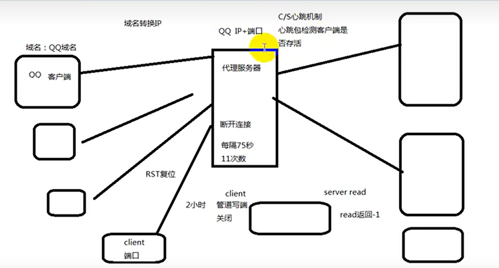

# 心跳机制-断开检查



## 1. 何为心跳机制?

心跳机制：定时发送一个自定义的结构体(心跳包)，让对方知道自己还活着，以确保连接的有效性的机制。

客户端向服务器端发送心跳包，告诉服务器端我还在，服务器收到后会回复一个固定信息，如果几分钟内没有收到客户端信息则视为客户端断开

## 2. 在何种情况下使用心跳机制?

网络中的接收和发送数据都是使用操作系统中的SOCKET进行实现，在TCP网络通信中经常会出现客户端和服务器之间的套接字已经断开，此时发送数据和接收数据的时候就一定会有问题，就需要实时检测查询链接状态。常用的解决方法就是在程序中加入心跳机制。

## 3. 实现心跳机制

### 2.1 `TCP`的`KeepAlive`机制

**缺点**：

`keepalive`选项需要为每个连接中的 `socket` 开启，这不一定是必须的，可能会产生大量无意义的带宽浪费，且 `keepalive` 选项不能与应用层很好地交互

```c
#include <sys/types.h>          /* See NOTES */
#include <sys/socket.h>

int getsockopt(int sockfd, int level, int optname,
            void *optval, socklen_t *optlen);
int setsockopt(int sockfd, int level, int optname,
            const void *optval, socklen_t optlen);
```

开启`KeepAlive`机制后，自动在规定的时间内向对方发送心跳包，另一个收到后就会自动回复

**开启后的情况**：

- 对方接收一切正常：以期望的ACK响应，2小时后，TCP将发出另一个探测分节
- 对方已崩溃且已重新启动：以RST响应。套接口的待处理错误被置为`ECONNRESET`，套接口本身则被关闭
- 对方无任何响应：套接口的待处理错误被置为`ETIMEOUT`，套接口本身则被关闭
