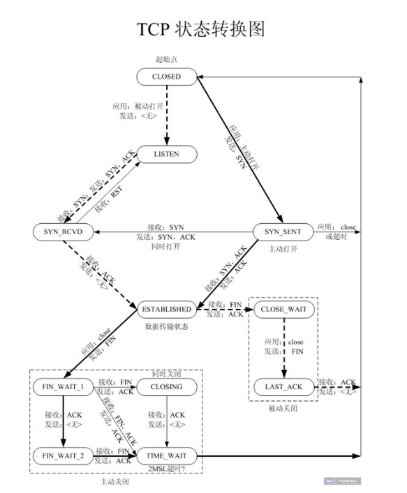

# TCP状态转换



虚线为服务端的状态，实线为客户端的状态

将上图转换即为下图：


---

## 1. 客户端状态转换

### 1.1 三次握手建立连接

客户端调用`connect`函数向服务器端发送`SYN J`后进入到`SYN_SENT`状态，当服务器端接收到`SYN J`后向客户端发送`ACK J + 1，SYN K`，客户端接收到后向服务器端发送`ACK K + 1`，客户端进入到`ESTABLISHED`状态，即三次握手成功，然后`connect`函数返回

### 1.2 四次握手解除连接

客户端调用`close`函数向服务器端发送`FIN X`后进入到`FIN_WAIT_1`状态，服务器端接收到`FIN X`后向客户端发送`ACK X + 1`，客户端接收到`ACK X + 1`后进入到`FIN_WAIT_2`状态，此时还可以传输数据，如果此时客户端又接收到`FIN Y`，客户端向服务器端发送`ACK Y + 1`后，即客户端进入到`TIME_WAIT`状态，过一段时间后连接断开，客户端回到`close`起初的状态

---

## 2. 服务器端状态转换

### 2.1 三次握手建立连接

服务器端调用`listen`函数进入到`LISTEN`监听状态，当接收到客户端发送来的`SYN J`后，随后响应向客户端发送`ACK J + 1，SYN K`，服务器端进入到`SYN_RECV`状态，客户端接收到`ACK J + 1，SYN K`后，向服务器端响应发送`ACK K + 1`，服务器端接收到`ACK K + 1`后进入到`ESTABLISHED`状态，即三次握手建立成功，`accept`函数返回代表这个连接的`socket`

### 2.2 四次握手解除连接

服务器端接收到客户端发送来的`FIN X`后，响应向客户端回复`ACK X + 1`，服务器端进入到`CLOSE_WAIT`状态，此时还可以传输数据，服务器端隐式调用`close`函数向客户端发送`FIN Y`，随即客户端进入到`LAST_ACK`状态，客户端接收到后回复`FIN Y + 1`，服务器端接收到后这个`TCP`断开

---

## 3. 所有状态

`FIN_WAIT_1` 和 `FIN_WAIT2`很重要

```c
CLOSED: 这个没什么好说的了，表示初始状态。

LISTEN: 这个也是非常容易理解的一个状态，表示服务器端的某个SOCKET处于监听状态，可以接受连接了。

SYN_RCVD: 这个状态表示接受到了SYN报文，在正常情况下，这个状态是服务器端的SOCKET在建立TCP连接时的三次握手会话过程中的一个中间状态，很短暂，基本 上用netstat你是很难看到这种状态的，除非你特意写了一个客户端测试程序，故意将三次TCP握手过程中最后一个ACK报文不予发送。因此这种状态 时，当收到客户端的ACK报文后，它会进入到ESTABLISHED状态。

SYN_SENT: 这个状态与SYN_RCVD遥想呼应，当客户端SOCKET执行CONNECT连接时，它首先发送SYN报文，因此也随即它会进入到了SYN_SENT状 态，并等待服务端的发送三次握手中的第2个报文。SYN_SENT状态表示客户端已发送SYN报文。

ESTABLISHED：这个容易理解了，表示连接已经建立了。

FIN_WAIT_1: 这个状态要好好解释一下，其实FIN_WAIT_1和FIN_WAIT_2状态的真正含义都是表示等待对方的FIN报文。而这两种状态的区别 是：FIN_WAIT_1状态实际上是当SOCKET在ESTABLISHED状态时，它想主动关闭连接，向对方发送了FIN报文，此时该SOCKET即 进入到FIN_WAIT_1状态。而当对方回应ACK报文后，则进入到FIN_WAIT_2状态，当然在实际的正常情况下，无论对方何种情况下，都应该马 上回应ACK报文，所以FIN_WAIT_1状态一般是比较难见到的，而FIN_WAIT_2状态还有时常常可以用netstat看到。

FIN_WAIT_2：上面已经详细解释了这种状态，实际上FIN_WAIT_2状态下的SOCKET，表示半连接，也即有一方要求close连接，但另外还告诉对方，我暂时还有点数据需要传送给你，稍后再关闭连接。

TIME_WAIT: 表示收到了对方的FIN报文，并发送出了ACK报文，就等2MSL后即可回到CLOSED可用状态了。如果FIN_WAIT_1状态下，收到了对方同时带 FIN标志和ACK标志的报文时，可以直接进入到TIME_WAIT状态，而无须经过FIN_WAIT_2状态。

CLOSING: 这种状态比较特殊，实际情况中应该是很少见，属于一种比较罕见的例外状态。正常情况下，当你发送FIN报文后，按理来说是应该先收到（或同时收到）对方的 ACK报文，再收到对方的FIN报文。但是CLOSING状态表示你发送FIN报文后，并没有收到对方的ACK报文，反而却也收到了对方的FIN报文。什 么情况下会出现此种情况呢？其实细想一下，也不难得出结论：那就是如果双方几乎在同时close一个SOCKET的话，那么就出现了双方同时发送FIN报文的情况，也即会出现CLOSING状态，表示双方都正在关闭SOCKET连接。

CLOSE_WAIT: 这种状态的含义其实是表示在等待关闭。怎么理解呢？当对方close一个SOCKET后发送FIN报文给自己，你系统毫无疑问地会回应一个ACK报文给对 方，此时则进入到CLOSE_WAIT状态。接下来呢，实际上你真正需要考虑的事情是察看你是否还有数据发送给对方，如果没有的话，那么你也就可以 close这个SOCKET，发送FIN报文给对方，也即关闭连接。所以你在CLOSE_WAIT状态下，需要完成的事情是等待你去关闭连接。

LAST_ACK: 这个状态还是比较容易好理解的，它是被动关闭一方在发送FIN报文后，最后等待对方的ACK报文。当收到ACK报文后，也即可以进入到CLOSED可用状态了。
```

---
