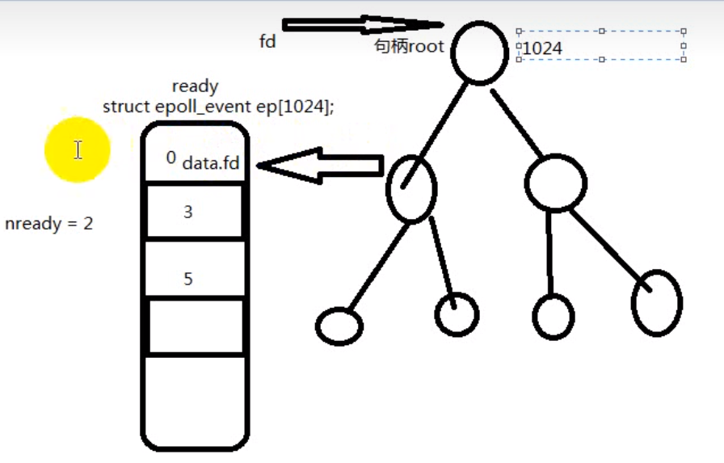

# 多路`I/O`转接服务器`epoll`

---

## 1. 修改文件描述符限制

```c
cat /proc/sys/fs/file-max
```

## 2. `epoll_create`

建一个`epoll`句柄，参数`size`用来告诉内核监听的文件描述符个数，跟内存大小有关



```c
int epoll_create(int size)
    size：告诉内核监听的数目
```

---

## 3. `epoll_ctl`

控制某个`epoll`监控的文件描述符上的事件：注册，修改，删除

```c
#include <sys/epoll.h>
int epoll_ctl(int epfd, int op, int fd, struct epoll_event *event)

    epfd：为epoll_creat的句柄

    op：表示动作，用3个宏来表示：
        EPOLL_CTL_ADD(注册新的fd到epfd)，
        EPOLL_CTL_MOD(修改已经注册的fd的监听事件)，
        EPOLL_CTL_DEL(从epfd删除一个fd)；

    event：告诉内核需要监听的事件

    struct epoll_event {
        __uint32_t events; /* Epoll events */
        epoll_data_t data; /* User data variable */
    };

    EPOLLIN ：表示对应的文件描述符可以读（包括对端SOCKET正常关闭）
    EPOLLOUT：表示对应的文件描述符可以写
    EPOLLPRI：表示对应的文件描述符有紧急的数据可读（这里应该表示有带外数据到来）
    EPOLLERR：表示对应的文件描述符发生错误
    EPOLLHUP：表示对应的文件描述符被挂断
    EPOLLET： 将EPOLL设为边缘触发(Edge Triggered)模式，这是相对于水平触发(LevelTriggered)来说的
    EPOLLONESHOT：只监听一次事件，当监听完这次事件之后，如果还需要继续监听这个socket的话，需要再次把这个socket加入到EPOLL队列里
```

---

## 4. `epoll_wait`

等待所监控文件描述符上有事件的产生


```c
#include <sys/epoll.h>
int epoll_wait(int epfd, struct epoll_event *events, int maxevents, int timeout)
    events：用来从内核得到事件的集合

    maxevents：告之内核这个events有多大，这个maxevents的值不能大于创建epoll_create()时的size

    timeout：是超时时间
            -1：阻塞
            0 ：立即返回，非阻塞
            >0：指定微秒
    
    返回值：成功返回有多少文件描述符就绪，时间到时返回0，出错返回-1
```

---

## 5. `server`服务端

```c
#include <stdio.h>
#include <stdlib.h>
#include <string.h>
#include <netinet/in.h>
#include <arpa/inet.h>
#include <sys/epoll.h>
#include <errno.h>
#include "wrap.h"
#define MAXLINE 80
#define SERV_PORT 8000
#define OPEN_MAX 1024
int main(int argc, char *argv[])
{
    int i, j, maxi, listenfd, connfd, sockfd;
    int nready, efd, res;
    ssize_t n;
    char buf[MAXLINE], str[INET_ADDRSTRLEN];
    socklen_t clilen;
    int client[OPEN_MAX];
    struct sockaddr_in cliaddr, servaddr;
    struct epoll_event tep, ep[OPEN_MAX];

    listenfd = Socket(AF_INET, SOCK_STREAM, 0);

    bzero(&servaddr, sizeof(servaddr));
    servaddr.sin_family = AF_INET;
    servaddr.sin_addr.s_addr = htonl(INADDR_ANY);
    servaddr.sin_port = htons(SERV_PORT);
    
    Bind(listenfd, (struct sockaddr *) &servaddr, sizeof(servaddr));
    
    Listen(listenfd, 20);
    
    for (i = 0; i < OPEN_MAX; i++)
        client[i] = -1;
    maxi = -1;
    efd = epoll_create(OPEN_MAX);
    if (efd == -1)
        perr_exit("epoll_create");
    tep.events = EPOLLIN; 
    tep.data.fd = listenfd;
    res = epoll_ctl(efd, EPOLL_CTL_ADD, listenfd, &tep);
    if (res == -1)
        perr_exit("epoll_ctl");
    for ( ; ; ) {
        nready = epoll_wait(efd, ep, OPEN_MAX, -1); /* 阻塞监听 */
        if (nready == -1)
            perr_exit("epoll_wait");
        for (i = 0; i < nready; i++) {
            if (!(ep[i].events & EPOLLIN))
                continue;
            if (ep[i].data.fd == listenfd) {
                clilen = sizeof(cliaddr);
                connfd = Accept(listenfd, (struct sockaddr *)&cliaddr, &clilen);
                printf("received from %s at PORT %d
                \n", inet_ntop(AF_INET, &cliaddr.sin_addr, str, sizeof(str)), ntohs(cliaddr.sin_port));

                for (j = 0; j < OPEN_MAX; j++)
                    if (client[j] < 0) {
                        client[j] = connfd; /* save descriptor */
                        break;
                    }
                if (j == OPEN_MAX)
                    perr_exit("too many clients");
                if (j > maxi)
                    maxi = j; /* max index in client[] array */
                tep.events = EPOLLIN; 
                tep.data.fd = connfd;
                res = epoll_ctl(efd, EPOLL_CTL_ADD, connfd, &tep);
                if (res == -1)
                    perr_exit("epoll_ctl");
            }
            else {
                sockfd = ep[i].data.fd;
                n = Read(sockfd, buf, MAXLINE);
                if (n == 0) {
                    for (j = 0; j <= maxi; j++) {
                        if (client[j] == sockfd) {
                            client[j] = -1;
                            break;
                        }
                     }
                res = epoll_ctl(efd, EPOLL_CTL_DEL, sockfd, NULL);
                if (res == -1)
                    perr_exit("epoll_ctl");
                Close(sockfd);
                printf("client[%d] closed connection\n", j);
                }
            else {
                for (j = 0; j < n; j++)
                    buf[j] = toupper(buf[j]);
                Writen(sockfd, buf, n);
                }
            }
        }
    }
    close(listenfd);

    close(efd);

    return 0;
}
```

---

## 6. `client`客户端

```c
/* client.c */
#include <stdio.h>
#include <string.h>
#include <unistd.h>
#include <netinet/in.h>
#include "wrap.h"
#define MAXLINE 80
#define SERV_PORT 8000
int main(int argc, char *argv[])
{
    struct sockaddr_in servaddr;
    char buf[MAXLINE];
    int sockfd, n;
    sockfd = Socket(AF_INET, SOCK_STREAM, 0);
    bzero(&servaddr, sizeof(servaddr));
    servaddr.sin_family = AF_INET;
    inet_pton(AF_INET, "127.0.0.1", &servaddr.sin_addr);
    servaddr.sin_port = htons(SERV_PORT);

    Connect(sockfd, (struct sockaddr *)&servaddr, sizeof(servaddr));

    while (fgets(buf, MAXLINE, stdin) != NULL) {
        Write(sockfd, buf, strlen(buf));
        n = Read(sockfd, buf, MAXLINE);
        if (n == 0)
            printf("the other side has been closed.\n");
        else
            Write(STDOUT_FILENO, buf, n);
    }
    Close(sockfd);
    return 0;
}
```

---
