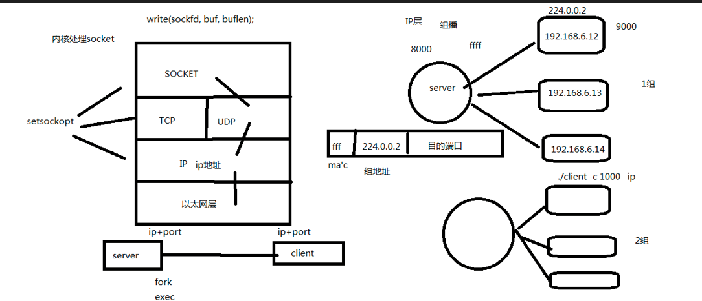

# `udp`组播服务器

---

## 1. 概念

组播 又称为 多播，只有加入某个多播组的主机才能收到数据。



---

## 2. `setsockopt`函数

```c
#include <sys/types.h>          
#include <sys/socket.h>

int setsockopt(int sockfd, int level, int optname,const void *optval, socklen_t optlen);

参数：
sockfd：套接字

level：选项的级别
    IPPROTO_IP  IP级别

optname：选项的名称
    IP_ADD_MEMBERSHIP   在指定接口上加入组播组

optval：结构体
struct ip_mreqn {
    struct in_addr imr_multiaddr; /* 多播组的地址 */
    struct in_addr imr_address;   /* 本地的IP地址 */
    int    imr_ifindex;           /* 接口索引 0 表示任意接口 */
};

optlen：optval的大小
```

**注意**：

- 可以使用setsockopt设置超时检测，通过`SO_KEEPALIVE`发送心跳包检测
- 使用setsockopt设置端口复用

## 3. 组播流程

```c
------
发送者：
    1.创建套接字 socket()
    2.填充组播信息结构体 sockaddr_in
    3.指定组播组 struct ip_mreqn group
    4.指定发送到组播地址上clientaddr
    5.发送数据 sendto() 发送给clientaddr
-------

接收者：
-------
    1.创建套接字 scoket()
    2.填充组播信息结构体 sockaddr_in
    3.将套接字与组播信息结构体绑定 bind()
    4.设置为加入多播组 setsockopt()
    5.接收数据 recvfrom()
-------
```

---

## 4. `server.c`服务端

```c
#include <stdio.h>
#include <unistd.h>
#include <stdlib.h>
#include <string.h>
#include <arpa/inet.h>
#include <netinet/in.h>
#include <sys/socket.h>
#include <ctype.h>
#include <netinet/ip.h>
#include <netinet/in.h>
#include <net/if.h>
#include "wrap.h"

#define GROUP "239.0.0.2"
#define CLIENT_PORT 9000
#define SERVER_PORT 8000
#define MAX_LEN 1024
int main(void)
{
    int sockfd, i; 
    struct sockaddr_in serveraddr, clientaddr;
    char buf[MAX_LEN];
    char ipstr[INET_ADDRSTRLEN]; // 宏 16字节
    socklen_t client_len;
    ssize_t len;
    struct ip_mreqn group;
    // 1. socket(UDP) 
    sockfd = Socket(AF_INET, SOCK_DGRAM, 0);
    // 清空
    bzero(&serveraddr, sizeof(serveraddr));
    // 地址族 IPv4
    serveraddr.sin_family = AF_INET; 
    // IP地址 任意IP
    serveraddr.sin_addr.s_addr = htonl(INADDR_ANY);
    // 端口号
    serveraddr.sin_port = htons(SERVER_PORT);
    // 2. bind 将绑定到IP和端口
    Bind(sockfd, (struct sockaddr *)&serveraddr, sizeof(serveraddr));

    /* 设置多播组地址 */
    inet_pton(AF_INET, GROUP, &group.imr_multiaddr);
    /* 本地的任意IP */
    inet_pton(AF_INET, "0.0.0.0", &group.imr_address);
    /* 网卡对应的编号 */
    group.imr_ifindex = if_nametoindex("ens33");

    int t = setsockopt(sockfd, IPPROTO_IP, IP_MULTICAST_IF, &group, sizeof(group));
    if(t < 0){
        perr_exit("setsockopt error");
    }
    /* 构造client 地址 IP + 端口*/
    bzero(&clientaddr, sizeof(clientaddr));
    clientaddr.sin_family = AF_INET;
    inet_pton(AF_INET, GROUP, &clientaddr.sin_addr.s_addr);
    clientaddr.sin_port = htons(CLIENT_PORT);

    while(1){
        fgets(buf, sizeof(buf), stdin);
        sendto(sockfd, buf, strlen(buf), 0, (struct sockaddr *)&clientaddr, sizeof(clientaddr));
    }
    Close(sockfd);
    return 0;
}
```

---

## 5. `client.c`客户端

```c
#include <arpa/inet.h>
#include <stdio.h>
#include <unistd.h>
#include <stdlib.h>
#include <sys/socket.h>
#include <netinet/in.h>
#include <string.h>
#include <net/if.h>
#include "wrap.h"

#define CLIENT_PORT 9000
#define GROUP "239.0.0.2"
#define SERVER_PORT 8000
#define MAX_LEN 1024
int main(void)
{
    int confd, n;
    struct sockaddr_in localaddr;
    char ipstr[] = "192.168.206.249";
    char buf[MAX_LEN];
    ssize_t len; 
    struct ip_mreqn group;
    // socket UDP
    confd = Socket(AF_INET, SOCK_DGRAM, 0);
    // 清空 
    bzero(&localaddr, sizeof(localaddr));
    // 地址协议族 IPv4 
    localaddr.sin_family = AF_INET;
    // IP
    inet_pton(AF_INET, "0.0.0.0", &localaddr.sin_addr.s_addr);
    // 端口
    localaddr.sin_port = htons(CLIENT_PORT);

    Bind(confd, (struct sockaddr *)&localaddr, sizeof(localaddr));

    /* 加入到组播组中 */
    inet_pton(AF_INET, GROUP, &group.imr_multiaddr);
    /* 本地连接 */
    inet_pton(AF_INET, "0.0.0.0", &group.imr_address);
    /* 网卡号 */
    group.imr_ifindex = if_nametoindex("ens33");

    /* 加入到多播组 */
    int t = setsockopt(confd, IPPROTO_IP, IP_ADD_MEMBERSHIP, &group, sizeof(group));
    if(t < 0){
        perr_exit("setsockopt error");
    }
    while(1){
        // 接收数据
        len = recvfrom(confd, buf, sizeof(buf), 0, NULL, 0);
        // 向屏幕输出
        Write(STDOUT_FILENO, buf, len);
    }
    Close(confd);

    return 0;
}

```