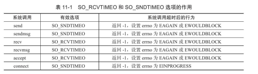

# 定时器

---

## 1. 概念

网络程序需要处理的第三类事件是定时事件，比如定期检测一个客户连接的活动状态。

将每个定时事件封装为成定时器

---

## 2. 定时方法

1. `socket`选项`SO_RCVTIMEO`  和 `SO_SNDTIMEO`
2. `SIGALRM`信号
3. `I/O`复用系统调用的超时参数

---

## 3. 通过`socket`选项设置定时



```c
先创建一个定时器

struct timeval timeout;
timeout.tv_sec = time;
timeout.tv_usec = 0;
socklen_t len = sizeof(timeout);

再通过setsockopt设置定时选项
ret = setsockopt(sockfd, SOL_SOCKET, SO_SNDTIMEO, ＆timeout,len);
```

---

## 4. `SIGALRM`信号设置定时

由`alarm`和`setitimer`函数设置的实时闹钟一旦超时，将触发`SIGALRM`信号

### 4.1 基于升序列表的计时器

```c++
#ifndef LST_TIMER
#define LST_TIMER

#include <unistd.h>
#include <signal.h>
#include <sys/types.h>
#include <sys/epoll.h>
#include <fcntl.h>
#include <sys/socket.h>
#include <netinet/in.h>
#include <arpa/inet.h>
#include <assert.h>
#include <sys/stat.h>
#include <string.h>
#include <pthread.h>
#include <stdio.h>
#include <stdlib.h>
#include <sys/mman.h>
#include <stdarg.h>
#include <errno.h>
#include <sys/wait.h>
#include <sys/uio.h>

#include <time.h>
#include "../log/log.h"

class util_timer;

struct client_data
{
    sockaddr_in address;
    int sockfd;
    util_timer *timer;
};

class util_timer
{
public:
    util_timer() : prev(NULL), next(NULL) {}

public:
    time_t expire;
    
    void (* cb_func)(client_data *);
    client_data *user_data;
    util_timer *prev;
    util_timer *next;
};

class sort_timer_lst
{
public:
    sort_timer_lst();
    ~sort_timer_lst();

    void add_timer(util_timer *timer);
    void adjust_timer(util_timer *timer);
    void del_timer(util_timer *timer);
    void tick();

private:
    void add_timer(util_timer *timer, util_timer *lst_head);

    util_timer *head;
    util_timer *tail;
};

class Utils
{
public:
    Utils() {}
    ~Utils() {}

    void init(int timeslot);

    //对文件描述符设置非阻塞
    int setnonblocking(int fd);

    //将内核事件表注册读事件，ET模式，选择开启EPOLLONESHOT
    void addfd(int epollfd, int fd, bool one_shot, int TRIGMode);

    //信号处理函数
    static void sig_handler(int sig);

    //设置信号函数
    void addsig(int sig, void(handler)(int), bool restart = true);

    //定时处理任务，重新定时以不断触发SIGALRM信号
    void timer_handler();

    void show_error(int connfd, const char *info);

public:
    static int *u_pipefd;
    sort_timer_lst m_timer_lst;
    static int u_epollfd;
    int m_TIMESLOT;
};

void cb_func(client_data *user_data);

#endif
```
