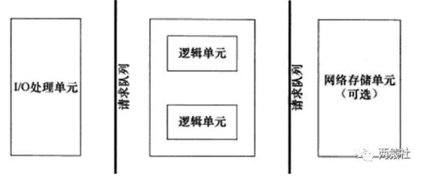

# 线程池

---

## 1. 服务器编程基本框架



1. `I/O`单元：处理客户端连接，读取网络数据
2. 逻辑单元： 处理业务逻辑的的线程
3. 网络存储： 本地数据库和文件

---

## 2. `I/O`模型

- 阻塞`I/O`：调用者调用了某个函数，等待这个函数返回，期间什么也不做，不停的去检查这个函数有没有返回，必须等这个函数返回才能进行下一步动作
- 非阻塞IO：非阻塞等待，每隔一段时间就去检测IO事件是否就绪。没有就绪就可以做其他事。非阻塞I/O执行系统调用总是立即返回，不管时间是否已经发生，若时间没有发生，则返回-1，此时可以根据errno区分这两种情况，对于accept，recv和send，事件未发生时，errno通常被设置成eagain
- 信号驱动`IO`：linux用套接口进行信号驱动IO，安装一个信号处理函数，进程继续运行并不阻塞，当IO时间就绪，进程收到SIGIO信号。然后处理IO事件
- `I/O`复用：:linux用select/poll函数实现IO复用模型，这两个函数也会使进程阻塞，但是和阻塞IO所不同的是这两个函数可以同时阻塞多个IO操作。而且可以同时对多个读操作、写操作的IO函数进行检测。知道有数据可读或可写时，才真正调用IO操作函数
- 异步`IO`：linux中，可以调用aio_read函数告诉内核描述字缓冲区指针和缓冲区的大小、文件偏移及通知的方式，然后立即返回，当内核将数据拷贝到缓冲区后，再通知应用程序

---

## 3. 事件处理模式

- `reactor`模式：主线程(`I/O`处理单元)只负责监听文件描述符上是否有事件发生，有的话就通知工作线程(逻辑单元)，读取数据，接收新的连接及处理客户请求均在工作线程中完成，通常由同步`I/O`实现
- `proactor`模式：主线程和内核负责处理读取数据，接收连接等操作，工作线程只负责业务逻辑，如处理客户机请求。通常由异步`I/O`实现

---

## 4. 同步`I/O`模拟`proactor`模式

流程为：

- 主线程往`epoll`内核事件注册表中注册`socket`上的读就绪事件
- 主线程调用`epoll_wait`等待`socket`上由数据可读
- 当`socket`上有数据可读，`epoll_wait`通知主线程，主线程从`socket`循环读取数据，直到没有更多数据可读，然后将读取到的数据封装成一个请求对象并插入请求队列
- 睡眠在请求队列上某个工作线程被唤醒，它获得请求对象并处理客户请求，然后往`epoll`内核事件表中注册该`socket`上的写就绪事件
- 主线程调用`epoll_wait`等待`socket`可写
- 当`socket`上有数据可写，`epoll_wait`通知主线程。主线程往`socket`上写入服务器处理客户请求的结果

---

## 5. 半同步/半反应堆工作流程(proactor为例)

- 主线程充当异步线程，负责监听所有socket上的事件
- 若有新请求到来，主线程接收之以得到新的连接socket，然后往epoll内核事件表中注册该socket上的读写事件
- 如果连接socket上有读写事件发生，主线程从socket上接收数据，并将数据封装成请求对象插入到请求队列中
- 所有工作线程睡眠在请求队列上，当有任务到来时，通过竞争（如互斥锁）获得任务的接管权

---

## 6. 线程池分析

设计模式为半同步/半反应堆模式，具体为`proactor`模式

主线程为异步线程，负责监听文件描述符，接收`socket`新连接，若当前监听的`socket`发生了读写事件，将任务插入到请求队列中。工作线程从请求队列中取出任务，完成读写数据的处理

---

## 7. 线程池类定义

```c++
template <typename T>
class threadpool
{
public:
    /*thread_number是线程池中线程的数量，max_requests是请求队列中最多允许的、等待处理的请求的数量*/
    threadpool(int actor_model, connection_pool *connPool, int thread_number = 8, int max_request = 10000);
    ~threadpool();
    // 新的请求，加入到请求队列中
    bool append(T *request, int state);
    bool append_p(T *request);

private:
    /*工作线程运行的函数，它不断从工作队列中取出任务并执行之*/
    static void *worker(void *arg);
    void run();

private:
    int m_thread_number;        //线程池中的线程数
    int m_max_requests;         //请求队列中允许的最大请求数
    pthread_t *m_threads;       //描述线程池的数组，其大小为m_thread_number
    std::list<T *> m_workqueue; //请求队列
    locker m_queuelocker;       //保护请求队列的互斥锁
    sem m_queuestat;            //是否有任务需要处理
    connection_pool *m_connPool;  //数据库
    int m_actor_model;          //模型切换
};
```

---

## 8. 线程的创建和回收

```c++
template <typename T>
threadpool<T>::threadpool( int actor_model, connection_pool *connPool, int thread_number, int max_requests) : m_actor_model(actor_model),m_thread_number(thread_number), m_max_requests(max_requests), m_threads(NULL),m_connPool(connPool)
{
    if (thread_number <= 0 || max_requests <= 0)
        throw std::exception();
    m_threads = new pthread_t[m_thread_number];
    if (!m_threads)
        throw std::exception();
    for (int i = 0; i < thread_number; ++i)
    {
        if (pthread_create(m_threads + i, NULL, worker, this) != 0)
        {
            delete[] m_threads;
            throw std::exception();
        }
        if (pthread_detach(m_threads[i]))
        {
            delete[] m_threads;
            throw std::exception();
        }
    }
}
```

---

## 9. 向请求队列中添加任务

通过`list`创建请求队列，向队列中添加时，通过互斥锁保证线程安全，添加完后通过信号量唤醒等待线程来处理任务

```c++
template <typename T>
bool threadpool<T>::append(T *request, int state)
{
    m_queuelocker.lock();
    if (m_workqueue.size() >= m_max_requests)
    {
        m_queuelocker.unlock();
        return false;
    }
    request->m_state = state;
    m_workqueue.push_back(request);
    m_queuelocker.unlock();
    m_queuestat.post();
    return true;
}
```

---

## 10. 线程处理函数

```c++
template <typename T>
void *threadpool<T>::worker(void *arg)
{
    threadpool *pool = (threadpool *)arg;
    pool->run();
    return pool;
}
```

---

## 11. 执行任务

工作线程从请求队列中取出某个任务来处理

判断时什么事件，`m_state == 0`为写事件， `m_state  == 1`为读事件

```c++
template <typename T>
void threadpool<T>::run()
{
    while (true)
    {
        m_queuestat.wait();
        m_queuelocker.lock();
        if (m_workqueue.empty())
        {
            m_queuelocker.unlock();
            continue;
        }
        T *request = m_workqueue.front();
        m_workqueue.pop_front();
        m_queuelocker.unlock();
        if (!request)
            continue;
        if (1 == m_actor_model)
        {
            if (0 == request->m_state)
            {
                if (request->read_once())
                {
                    request->improv = 1;
                    connectionRAII mysqlcon(&request->mysql, m_connPool);
                    request->process();
                }
                else
                {
                    request->improv = 1;
                    request->timer_flag = 1;
                }
            }
            else
            {
                if (request->write())
                {
                    request->improv = 1;
                }
                else
                {
                    request->improv = 1;
                    request->timer_flag = 1;
                }
            }
        }
        else
        {
            connectionRAII mysqlcon(&request->mysql, m_connPool);
            request->process();
        }
    }
}
```

---
