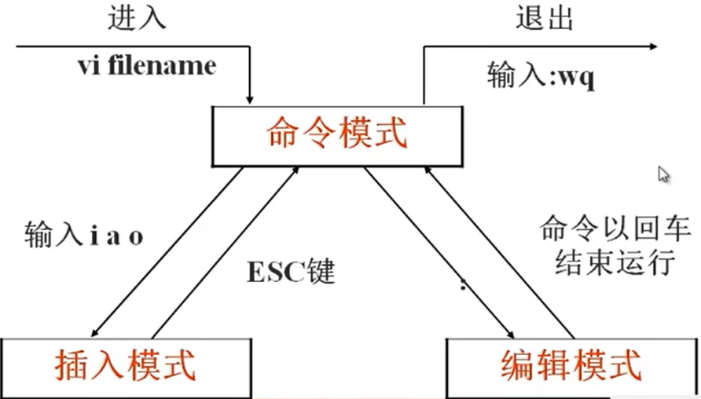
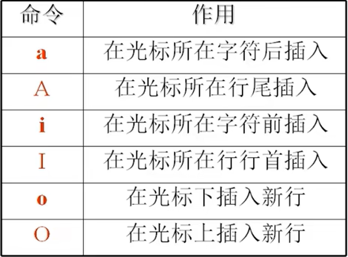
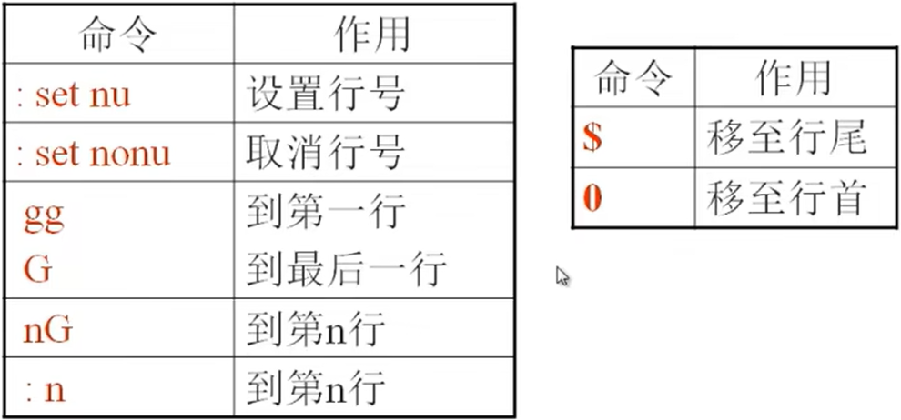
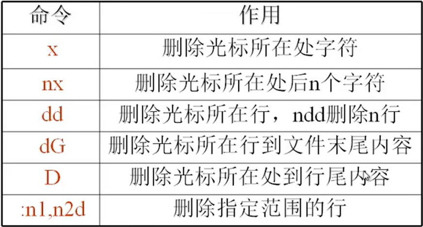
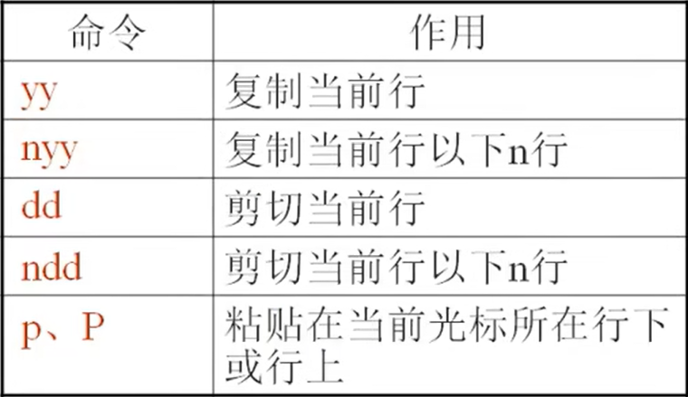
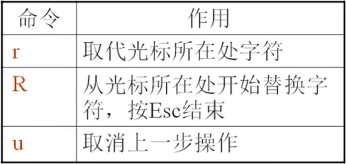
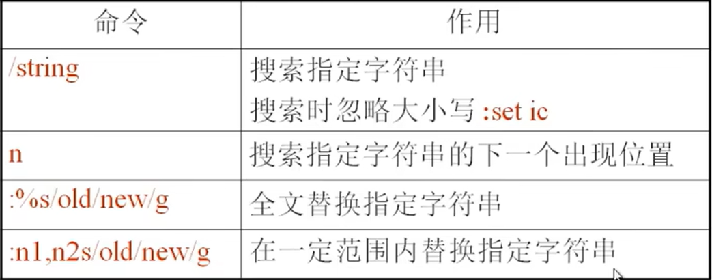
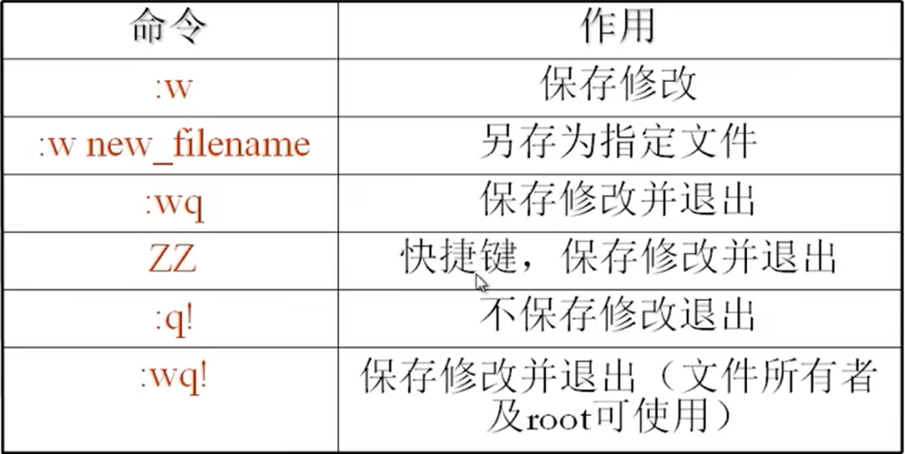

# vim编辑器  

- [vim编辑器](#vim编辑器)
  - [vim工作模式](#vim工作模式)
  - [插入命令](#插入命令)
  - [定位命令](#定位命令)
  - [删除命令](#删除命令)
  - [复制和剪切命令](#复制和剪切命令)
  - [替换和取消命令](#替换和取消命令)
  - [搜索和搜索替换命令](#搜索和搜索替换命令)
  - [保存和退出命令](#保存和退出命令)
  - [分屏](#分屏)

---

## vim工作模式  

  

```vim
vim filename 进入vim界面，处于命令模式 
按i/a/o 进入插入模式，可以插入删除
按esc键，退出插入模式，回到命令模式
在命令模式下输入(:+相应指令),进入到编辑模式，按回车退出编辑模式
```  

---

## 插入命令  

  

---

## 定位命令  

  

---

## 删除命令  

  

---

## 复制和剪切命令  

  

---

## 替换和取消命令  

  

---

## 搜索和搜索替换命令  

  

---

## 保存和退出命令  

  

---

## 分屏

```Linux
sp 上下分屏
vsp 左右分屏
```

---
