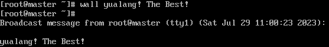
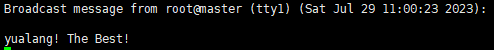
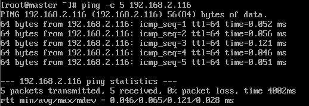

# 网络命令  

- [网络命令](#网络命令)
  - [`write`](#write)
  - [`wall`](#wall)
  - [`ping`](#ping)
  - [`ifconfig`](#ifconfig)
  - [`last`](#last)
  - [`lastlog`](#lastlog)
  - [`traceroute`](#traceroute)
  - [`netstat`](#netstat)
  - [`setup`](#setup)

---

## `write`  

```Linux
功能：
write 给用户发信息，以ctrl+d保存结束

语法：
write <用户名>
例如：
write yuanlang 向yuanlang发送信息
```  


  

---

## `wall`  

```Linux
功能：
wall 发送广播信息 向所有用户发送信息  --> write all

语法：
wall [message] 
例如：
wall yuanlang! The Best! 向所有用户发送该消息
```

  

  

---

## `ping`  

```Linux
功能：
ping 测试网络联通性

语法：
ping 选项 IP地址
     -c 指定发送次数
ping 192.168.31.1 当没有指定发送次数时，会一直发送，按ctrl+c才会停止
ping -c 5 192.168.31.1 发送5次
```  

  

---

## `ifconfig`  

```Linux
功能：
ifconfig 查看和设置网卡信息 --> interface configure

语法：
ifconfig 网卡名称 IP地址
例如: 
ifconfig eth0 192.168.8.250
```  

---

## `last`  

```Linux
功能：
last 列出目前与过去等入系统的用户信息 

语法：
last 
```

---

## `lastlog`  

```Linux
功能：
lastlog 检测某特定用户上次登录的时间 

语法：
lastlog [-u] [用户ID号]
例如：
lastlog -u 502 查看用户502的最后登录信息
```  

---

## `traceroute`  

```Linux
功能：
traceroute 显示数据包到主机间的路径  

语法：
traceroute www.baidu.com 
```  

---

## `netstat`  

```Linux
功能：
netstat 显示网络相关信息

语法:
netstat [选项]
        -t TCP协议
        -u UDP协议
        -l 监听
        -r 路由
        -n 显示IP地址或端口号
例如：
netstat -an 查看本机所有的网络连接
netstat -tlun 查看本机监听的端口
netstat -rn 查看本机路由器
```  

---

## `setup`  

```Linux
功能：
setup 配置网络

语法：
setup 进入到配置界面
```  

---
