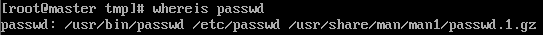
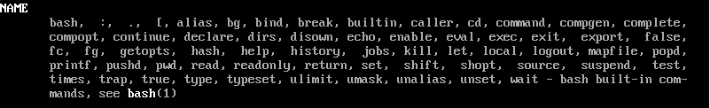

# 帮助命令  

- [帮助命令](#帮助命令)
  - [`man`](#man)
  - [`--help`](#--help)
  - [`help`](#help)

---

## `man`  

```Linux
功能：
man 获得帮助信息 --> manual 

语法：
man [命令或配置文件] 查看命令或配置文件的帮助信息  
例如：
man ls 查看ls命令的帮助信息，进入到帮助信息界面后，按more的格式去浏览  
man services 查看配置文件services的帮助信息
查看界面时，可以通过/d查找想要的
```  

**帮助类型**：

  

以`passwd`举例: 出现1即为命令的帮助信息，出现5即为配置文件的帮助信息  

---

## `--help`  

```Linux
命令 --help 出现命令的选项  

例如： ls --help 看ls命令的选项 
```

---

## `help`  

```Linux
功能：
help 获得shell内置命令的帮助信息  --> Shell内置命令  

语法：
help 命令 
例如：
help umask 查看umask命令的帮助信息  
```  

`Shell`**内置命令**：

  

---
