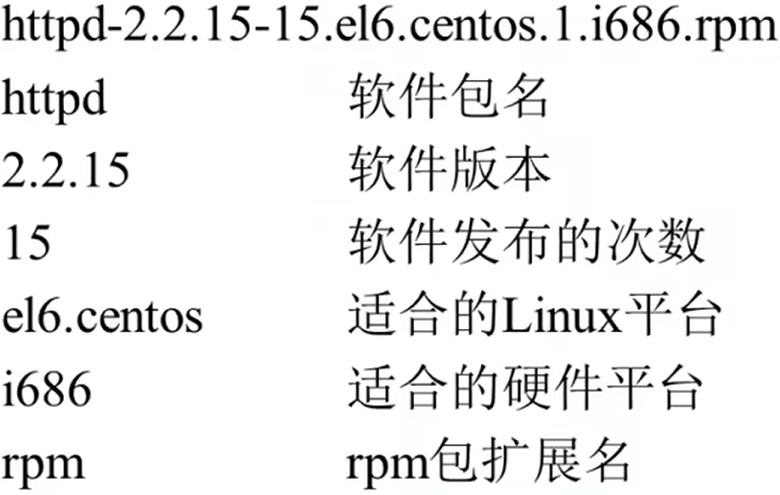
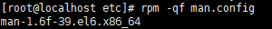
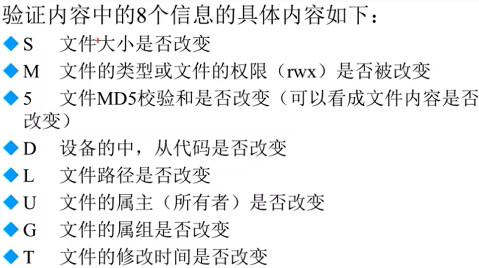
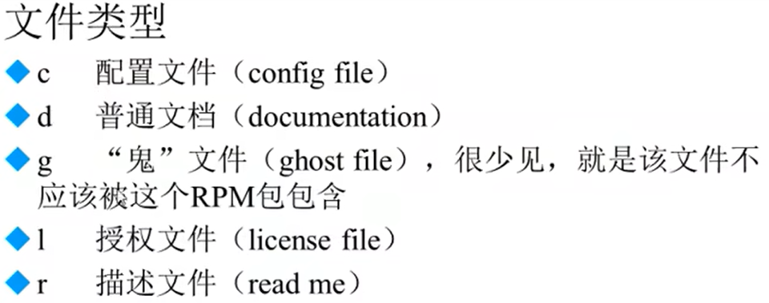
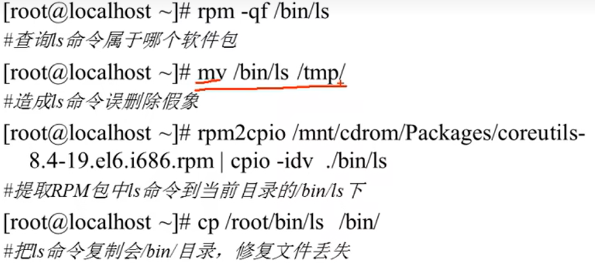

# rpm命令管理

- [rpm命令管理](#rpm命令管理)
  - [RPM包命名规则](#rpm包命名规则)
  - [RPM包依赖性](#rpm包依赖性)
  - [RPM包安装升级和卸载](#rpm包安装升级和卸载)
    - [包全名和包名](#包全名和包名)
    - [RPM安装](#rpm安装)
    - [RPM包升级](#rpm包升级)
    - [RPM包卸载](#rpm包卸载)
  - [查询](#查询)
    - [查询是否安装](#查询是否安装)
    - [查询安装信息](#查询安装信息)
    - [查询安装位置](#查询安装位置)
    - [查询系统文件属于那个RPM包](#查询系统文件属于那个rpm包)
    - [查询软件包的依赖性](#查询软件包的依赖性)
  - [检验和文件提取](#检验和文件提取)
    - [RPM包检验](#rpm包检验)
    - [RPM包文件提取](#rpm包文件提取)

---

## RPM包命名规则  

  

---

## RPM包依赖性  

  

安装时先安装a再b，删除时先删除b再删除a  

.so.1/2..数字 --> 库依赖包  

---

## RPM包安装升级和卸载  

### 包全名和包名  

  

### RPM安装  

```Linux
rpm -ivh 包全名
选项：
    -i ->install 安装
    -v -> verbose 显示详细信息
    -h -> bash 显示进度
    --nodeps 不检查依赖性
```

---

### RPM包升级

```Linux
rpm -Uvh 包全名
    -U -> upgrade 升级
```

---

### RPM包卸载

```Linux
rpm -e 包全名
    -e -> erase 卸载
    -nodeps 不检查依赖性
```

---

## 查询

### 查询是否安装

```Linux
rpm -q 包名  查询是否安装
    -q 查询
    -qa 列出所有安装

例如：
rpm -qa 列出所有安装
```

### 查询安装信息

```Linux
rpm -qi 包名
    -i 查询软件信息
    -p查询未安装包信息

例如：
rpm -qip time-1.7-38.el6.x86_64.rpm 看未安装的包相关信息
```

### 查询安装位置

```Linux
rpm -ql 包名
    -l 列表
    -p 查询未安装信息

例如：
rpm -ql httpd 看安装位置
rpm -qlp 包名
```

### 查询系统文件属于那个RPM包

```Linux
rpm -qf 系统文件名
    -f 查询系统文件属于哪个文件包(file)

例如：
rpm -qf man.config 查询/etc目录下的man.config系统文件属于哪个包
```



### 查询软件包的依赖性

```Linux
rpm -qR 包名 查询软件包的依赖性
    -R 查询软件包的依赖性(requires)
    -p 查询未安装包信息
例如
rpm -qRp httpd-2.2.15-59.el6.centos.x86_64.rpm 查看未安装包的依赖性
```

---

## 检验和文件提取  

### RPM包检验

```Linux
rpm -V 已安装的包

例如：
rpm -V httpd 看已安装包的修改
```





### RPM包文件提取



