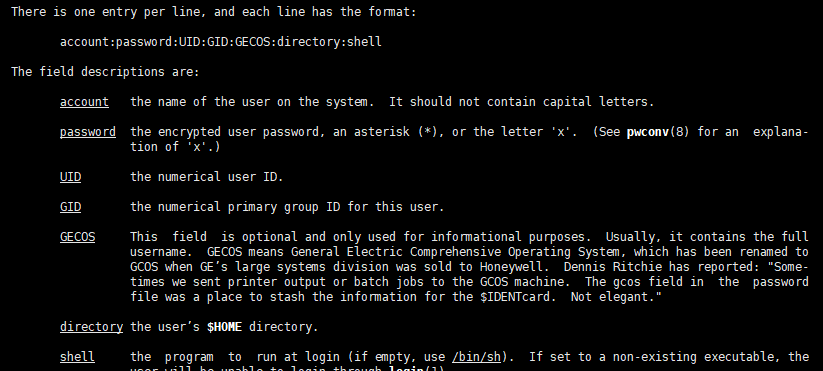

# 用户配置文件

- [用户配置文件](#用户配置文件)
  - [用户管理](#用户管理)
  - [用户信息文件`/etc/passwd`](#用户信息文件etcpasswd)
  - [影子文件`/etc/shadow`](#影子文件etcshadow)
  - [组文件信息`/etc/group`](#组文件信息etcgroup)

---

## 用户管理

通过用户配置文件来查看和修改用户信息

---

## 用户信息文件`/etc/passwd`

通过查看`/etc/passwd`文件内容：


```Linux
第一字段：用户名称
第二字段：密码标志
第三字段：UID(用户ID)
         0: 超级用户
         1-499：系统用户(伪用户)  -> 不能登录不能删除
         500-65535：普通用户 
第四字段：GID(用户初始组)
第五字段：用户说明
第六字段：家目录
         普通用户：/home/用户名
         超级用户：/root/
第七字段：登录之后的Shell(命令解释器)  root在/sbin/halt中，系统用户在/sbin/nologin中,普通用户在/bin/bash中
```



---

## 影子文件`/etc/shadow`

用户密码的格式，可以暴力破解用户密码


```Linux
第一字段：用户名
第二字段：加密密码：
                加密密码升级为SHA512散列加密算法
                如果"!!或者"*"代表没有密码，不能登录
第三字段：密码最后修改时间 --> 采用时间戳，从1970/01/01开始，过一天就增加1
第四字段：两次密码的修改时间间隔(和第三字段相比)
第五字段：密码有效期(和第三字段相比)
第六字段：密码修改到期前的警告天数(和第五字段相比)
第七字段：密码过期后的宽限天数(和第五字段相比)
         0：代表密码过期后立即失效
         -1：代表密码永远不会失效
第八字段：账号失效时间  用时间戳表示
第九字段：保留
```

**时间戳换算**：

```Linux
把时间戳换算为日期： date -d "1970-01-01 9999 days"
把日期换上为时间戳： echo $(($(date --date="2023/08/05" +%s)/86400+1)) 当天的日期来运算
```

---

## 组文件信息`/etc/group`


```Linux
第一字段：组名
第二字段：组密码
第三字段：组管理员用户名(GID)
第四字段：组中附加用户
```
