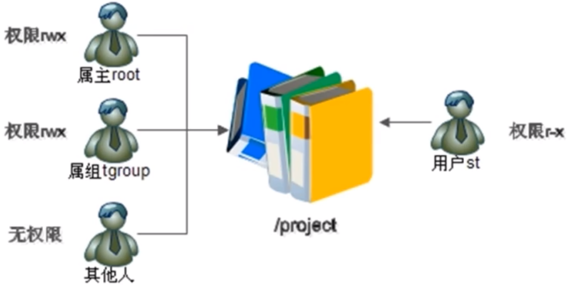
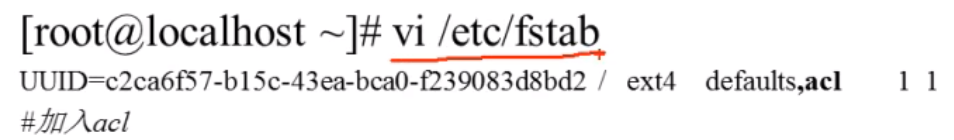

# 简介与开启

- [简介与开启](#简介与开启)
  - [1. ACL权限简介](#1-acl权限简介)
  - [2. 查看分区ACL权限是否开启](#2-查看分区acl权限是否开启)
  - [3. 临时开启分区ACL权限](#3-临时开启分区acl权限)
  - [4. 永久开启分区ACL权限](#4-永久开启分区acl权限)

---

## 1. ACL权限简介



---

## 2. 查看分区ACL权限是否开启

```Linux
dumpe2fs -h /dev/sda3  
dumpe2fs 查询指定分区详细系统信息的命令
-h 仅显示超级块中的信息，而不显示磁盘块组的详细信息
```

---

## 3. 临时开启分区ACL权限

```Linux
mount -o remount,acl / 重新挂载根分区，并挂载加入acl权限 
```

---

## 4. 永久开启分区ACL权限

```Linux
vim /etc/fstab 加入文件中
```

向文件中添加内容：



添加完内容后`mount -o remount /`重新挂载：


---
