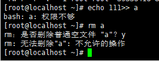

# 文件系统属性chattr权限

- [文件系统属性chattr权限](#文件系统属性chattr权限)
  - [1 `chattr`命令格式](#1-chattr命令格式)
  - [2. 查看文件系统属性](#2-查看文件系统属性)

---

## 1 `chattr`命令格式

```Linux
chattr [+-=] [选项] 文件或目录名
       +: 增加权限
       -: 删除权限
       =: 等于某权限
```

---

## 2. 查看文件系统属性

```Linux
lsattr 选项 文件名
       -a  显示所有文件或目录
       -d  若目标是目录，仅列出目录本身的属性，而不是子文件的
```

---


给文件`i`属性，相当于将文件锁起来


