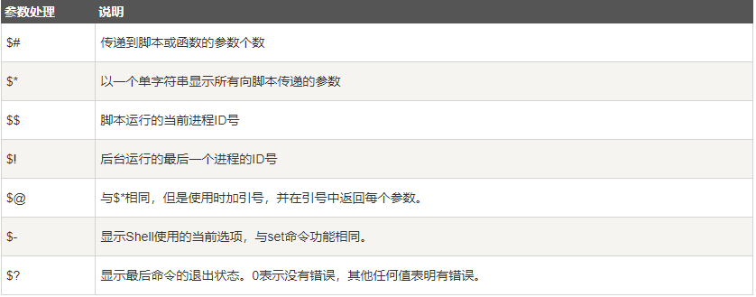

# 函数

- [函数](#函数)
  - [无参数](#无参数)
  - [有参数](#有参数)

---

## 无参数

```Linux
[function] name [()]
{
    action
    [return int;]
}

例如：
demo()
{
    echo "shell函数"
}

运行：
demo

demo2()
{
    a=1
    b=2
    return $(($a+$b))
}

运行：
demo
```

---

## 有参数



```Linux
demo()
{
    echo "第一个参数 $1"
    echo "第二个参数 $2"
    echo "第三个参数 $3"
}

运行：
demo 1 2 3
```

---
