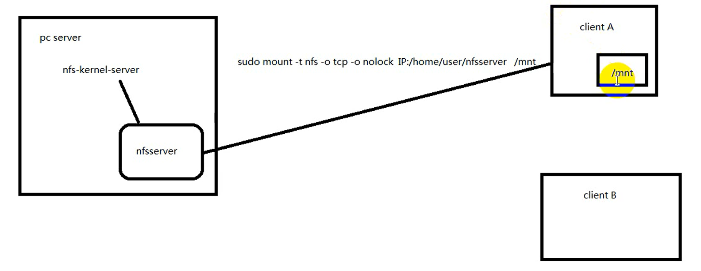

# `nfs`

- [`nfs`](#nfs)
  - [1. `nfs`服务器](#1-nfs服务器)
  - [2. 安装`nfs`服务器](#2-安装nfs服务器)
  - [3. 配置文件](#3-配置文件)
  - [4. 重启使用服务器](#4-重启使用服务器)
  - [5. 挂载服务器](#5-挂载服务器)

---

## 1. `nfs`服务器

将网络上的文件夹映射为本地的文件夹



## 2. 安装`nfs`服务器

```Linux
sudo apt-get install nfs-kernel-server
```

---

## 3. 配置文件

```Linux
sudo vi /etc/exports

添加： 
/home/用户名/nfsserver  *(rw,sync,no_root_squash) 

解释:
/home/用户名/nfsserver -> 服务器上面的文件
* -> 所有人都可以访问 如果为IP即只有该IP可以访问
rw -> 读写
sync -> 异步 多个访问时更新 资料会先暂存于内存中，而非直接写入硬盘
no_root_squash -> 登入 NFS 主机使用分享目录的使用者
```

---

## 4. 重启使用服务器

```Linux
sudo /etc/init.d/nfs-kernel-server restart
```

---

## 5. 挂载服务器

```Linux
sudo mount -t nfs -o tcp -o nolock 10.193.176.134:/home/yl/nfsserver /mnt
将服务器挂载到mnt命令下后,即nfsserver的内容会更新到mnt命令下
```

---
