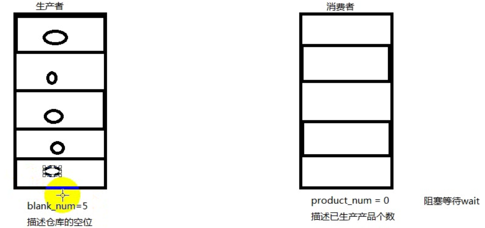

# 信号量

- [信号量](#信号量)
  - [1. 概念](#1-概念)
  - [2. 信号量控制原语](#2-信号量控制原语)
  - [3. 实例](#3-实例)

---

## 1. 概念

信号量 == 计数器，当有进程使用信号量即P操作对信号量-1，当减到0时代表没有资源了，其他进程申请就得等待，使用完后就继续V操作对信号量+1，

1. 系统首先要检测该资源的信号量；
2. 若该资源的信号量值大于0，则进程可以使用该资源，此时，进程将该资源的信号量值减1；
3. 若该资源的信号量值为0，则进程进入休眠状态，直到信号量值大于0时进程被唤醒，访问该资源；

---

## 2. 信号量控制原语

```c
#include <semaphore.h>

sem_t

初始化信号量 value指定起初的资源量为多少
int sem_init(sem_t *sem, int pshared, unsigned int value);
 
上锁
int sem_wait(sem_t *sem);

申请是否能上锁
int sem_trywait(sem_t *sem);

定时申请上锁
 int sem_timedwait(sem_t *sem, const struct timespec *abs_timeout);

解锁
int sem_post(sem_t *sem)

销毁锁
int sem_destroy(sem_t *sem);
```

---

## 3. 实例

生产者消费者实例



```c
#include <stdio.h>
#include <unistd.h>
#include <stdlib.h>
#include <pthread.h>
#include <semaphore.h>
#define NUM 5
// 信号量 
sem_t blank_num;  // 仓库的空位
sem_t product_num;  // 已经生产物品数量 
// 物品数组
int queue[NUM]; 

void *th_producer(void *arg)
{
    int p = 0;
    while(1){
        // 空位-1
        sem_wait(&blank_num);
        queue[p] = rand() % 1000 + 1;
        printf("Produce %d\n", queue[p]);
        // 以生产物品+1
        sem_post(&product_num);
        p = (p + 1) % NUM;
        sleep(rand()%NUM);
    }
    return NULL;
}

void *th_consumer(void *arg)
{
    int c = 0;
    while(1){
        // 以生产物品-1
        sem_wait(&product_num);
        printf("Consum %d\n", queue[c]);
        queue[c] = 0; 
        // 空位+1
        sem_post(&blank_num);
        c = (c + 1) % NUM;
        sleep(rand()%NUM);
    }
    return NULL;
}

int main(void)
{
    // 生产者线程 消费者线程
    pthread_t pid, cid;
    // 初始化信号量
    sem_init(&blank_num, 0, NUM);  
    sem_init(&product_num, 0, 0);
    // 创建线程
    pthread_create(&pid, NULL, th_producer, NULL);
    pthread_create(&cid, NULL, th_consumer, NULL);

    // 回收线程
    pthread_join(pid, NULL);
    pthread_join(cid, NULL);
    // 销毁信号量
    sem_destroy(&blank_num);
    sem_destroy(&product_num);

    return 0;
}
```

---
