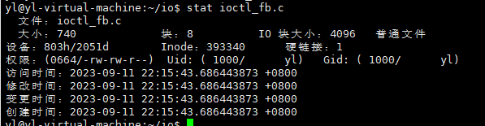
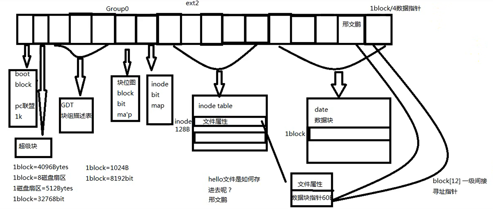
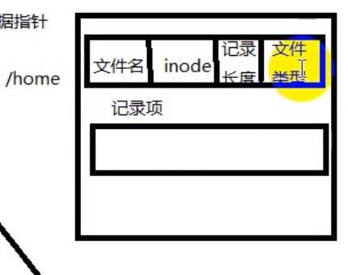
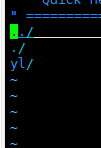
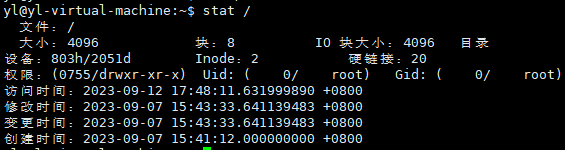
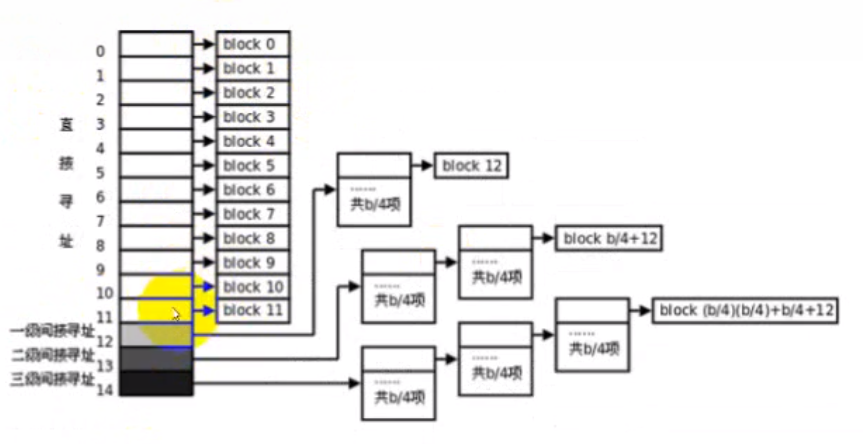

# `ext2`文件系统

- [`ext2`文件系统](#ext2文件系统)
  - [文件系统](#文件系统)
  - [如何存储文件](#如何存储文件)
  - [如何删除文件](#如何删除文件)
  - [目录中记录项文件类型](#目录中记录项文件类型)
    - [打开文件的过程](#打开文件的过程)
    - [出现的思考](#出现的思考)
  - [数据块寻址](#数据块寻址)

---

## 文件系统


硬盘的最小存储单位叫做`扇区`，1扇区=512Btyes(字节)
一个块(block)有多个扇区组成，1block=8扇区=2096B

文件信息存储在块中，储存文件元信息的区域就叫做`inode`

```Linux
1block=1024B
1block=8192bit

一个block组中： 超级块 + GDT(块组描述表) + 块位图 +  inode位图 +  inode table + 数据块

inode table：存放文件属性
inode bitmap：描述inode使用情况
块位图：描述整个group中块的使用情况
快组描述表： 描述当前group从第几个块开始是块位图，是inode位图等等

```

例如：



---

## 如何存储文件

```Linux
比如存储文件hello 

1. 向文件系统申请一个inode
2. 通过GDT找到inode bitmap的位置
3. 通过inode bitmap找到空闲的inode
4. 在inode table中的空闲inode里面保存文件属性和数据块指针(60B)
5. 当向文件中写数据，即向数据块指针指向的数据块写入数据
6. 数据块写入数据后，block bitmap中表示该数据块已经使用 
```



---

## 如何删除文件

```Linux
1. 将文件数据对应的block bitmap中的块标识翻转，将数据块释放掉
2. 将inode bitmap中将文件对应的inode标识翻转
```

---

## 目录中记录项文件类型

文件名没有存在`inode`里面



```Linux
比如说home目录：
1. home目录首先得到一个inode，inode指向数据块
2. 数据块里面存储记 录项，记录项为： 文件名 + inode + 记录长度 + 文件类型 
```

当我用`vim /home`，显示文件下的文件名



特别：根目录必须在inode为2的inode上   -- `stat 文件名`可以查看文件的信息



### 打开文件的过程

当你在`open("/home/yl/oi/test")`文件时，打开文件的过程为：

```Linux
1. /目录的inode为2，即通过inode table 找到 inode为2指向的数据块中找到yl的记录项
2. 找到记录项后得知yl的inode，在inode table中找到指向的数据块，找到oi的记录项
3. 重复操作，直到找到test的inode，通过inode table 找到指向的数据块，找到存储文件内容的地方
```

### 出现的思考

当文件特别大时，数据块被使用完，但是inode被浪费

当文件特别小，但是很多，inode被使用完，但是数据块被浪费

---

## 数据块寻址

每个`inode`有`128B`，其中有`60B`用于指针，即有`15`个指针，当指针用到最后三个时，也就是从`Blocks[12]`开始，会用于二级指针。同样，三级指针也是这样的。

二级指针：二级指针指向的数据块，会作于指针域使用，指向新的数据块



---
