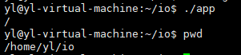

# 相关函数2

- [相关函数2](#相关函数2)
  - [1. `chdir`](#1-chdir)
  - [2. `getcwd`](#2-getcwd)
  - [3. `pathconf`](#3-pathconf)

---

## 1. `chdir`

`chdir`

改变目录，改变当前进程的工作目录

```Linux
int chdir(const char *path);
int fchdir(int fd);
```

---

## 2. `getcwd`

获取当前进程的工作目录

```Linux
char *getcwd(char *buf, size_t size); 将当前工作目录存到buf中，size为buf的大小，防止越界

char *getwd(char *buf);

char *get_current_dir_name(void);

例如：
char buf[4096];
chdir("\"); 切换到\目录下
printf("%s\n",buf,sizeof(buf)); -> 将当前的工作目录存到buf中
```



当工作目录切换后，进程结束后又回到之前进程

---

## 3. `pathconf`

测试一些系统的资源限制值，例如最大文件名等

```Linux
 long fpathconf(int fd, int name);
long pathconf(const char *path, int name);
```

---
