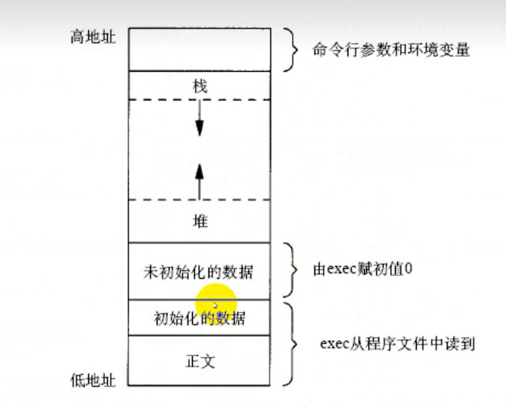

# 进程环境

- [进程环境](#进程环境)S
  - [1. `env`](#1-env)S
  - [2. 打印环境变量](#2-打印环境变量)
  - [3. 操作环境变量](#3-操作环境变量)
    - [3.1 通过`name`查找环境变量`value`](#31-通过name查找环境变量value)
    - [3.2 修改环境变量](#32-修改环境变量)



---

## 1. `env`

`env`命令可以显示所有的环境变量

---

## 2. 打印环境变量

```c
#include <stdio.h>

int main(void)
{
    extern char **environ;
    for(int i=0;environ[i]!=NULL;i++)
        printf("%s\n",environ[i]);
    return 0;
}
```

---

## 3. 操作环境变量

### 3.1 通过`name`查找环境变量`value`

```c
#include <stdlib.h>

char *getenv(const char *name);
```

### 3.2 修改环境变量

```c
#include <stdlib.h>

int setenv(const char *name, const char *value, int rewrite);
void unsetenv(const char *name);  // 删除环境变量   
```

`setenv`将环境变量`name`的值设置为`value`，如果已经存在`name`，
如果`rewrite!=0`，则覆盖原来的定义
如果`rewrite=0`，则不覆盖原来的定义，也不返回错误

---
