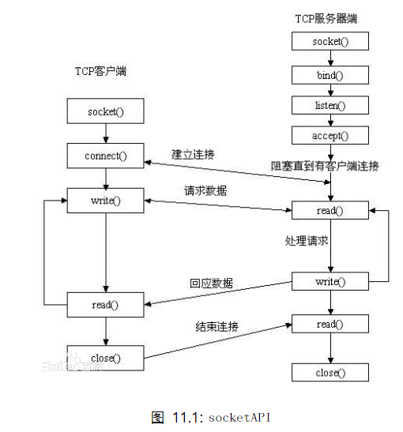
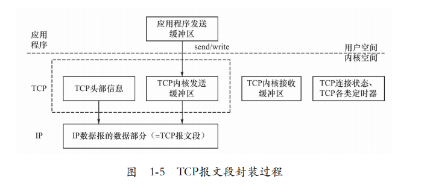
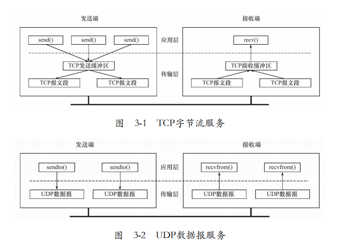
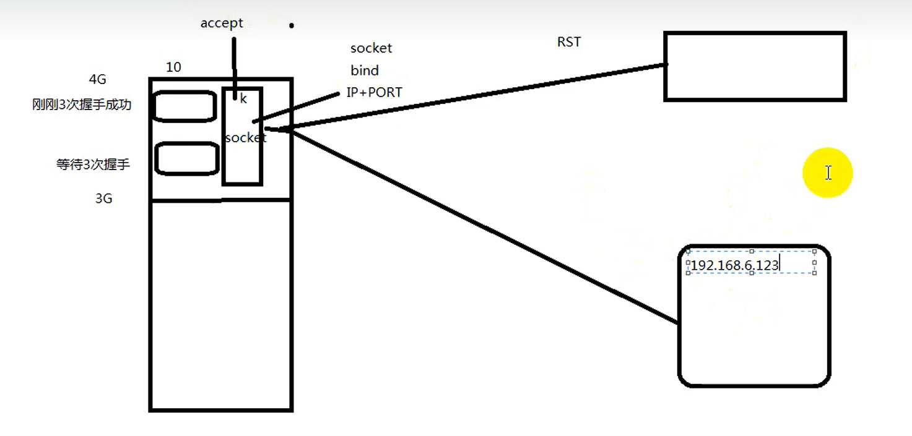

# 网络套字节函数



- 应用程序数据从用户缓冲区中复制到TCP/UDP内核发送缓冲区，以交付内核来发送数据；
- 从内核TCP/UDP接收缓冲区中复制数据到用户缓冲区，以读取数据；
- 应用程序可以通过它们来修改内核中各层协议的某些头部信息或其他数据结构，从而精细地控制底层通信的行为。





---

## 1. `socket`函数

socket()打开一个网络通讯端口，如果成功的话，就像open()一样返回一个文件描述符，应用程序可以像读写文件一样用read/write在网络上收发数据

```c
#include <sys/types.h> /* See NOTES */
#include <sys/socket.h>
int socket(int domain, int type, int protocol);

domain:
    AF_INET 这是大多数用来产生socket的协议，使用TCP或UDP来传输，用IPv4的地址
    AF_INET6 与上面类似，不过是来用IPv6的地址
    AF_UNIX 本地协议，使用在Unix和Linux系统上，一般都是当客户端和服务器在同一台及其上的时候使用
type:
    OCK_STREAM 这个协议是按照顺序的、可靠的、数据完整的基于字节流的连接。这是一个使用最多的socket类型，这个socket是使用TCP来进行传输。
    SOCK_DGRAM 这个协议是无连接的、固定长度的传输调用。该协议是不可靠的，使用UDP来进行它的连接。
    SOCK_SEQPACKET 这个协议是双线路的、可靠的连接，发送固定长度的数据包进行传输。必须把这个包完整的接受才能进行读取。
    SOCK_RAW 这个socket类型提供单一的网络访问，这个socket类型使用ICMP公共协议。（ping、traceroute使用该协议）
    SOCK_RDM 这个类型是很少使用的，在大部分的操作系统上没有实现，它是提供给数据链路层使用，不保证数据包的顺序
protocol:
    0 默认协议
返回值：
    成功返回一个新的文件描述符，失败返回-1，设置errno
```

---

## 2. `bind`函数

```c
#include <sys/types.h> /* See NOTES */
#include <sys/socket.h>
int bind(int sockfd, const struct sockaddr *addr, socklen_t addrlen);
sockfd：
    socket文件描述符
addr:
    构造出IP地址加端口号
addrlen:
    sizeof(addr)长度
返回值：
    成功返回0，失败返回-1, 设置errno
```

将参数`sockfd`和`addr`绑定在一起，使`sockfd`这个用于网络通讯的文件描述符监听`addr`所描述的地址和端口号

```c
struct sockaddr_in servaddr;
bzero(&servaddr, sizeof(servaddr));
servaddr.sin_family = AF_INET;   // 地址类型
servaddr.sin_addr.s_addr = htonl(INADDR_ANY);  // 网络地址
servaddr.sin_port = htons(8000);  // 端口号

bind(socket_fd, &servaddr, sizeof(servaddr));  // 将socket和addr绑定在一起
```

`socket`和`addr`绑定到一起后，当访问到`addr`中的地址和端口号后，数据就会转到`socket`中进行解析

---

### 3. `listen`函数



调用`socket()`、`bind()`之后就会调用`listen()`来监听这个`socket`，如果有`connect()`发送来的请求就接收

```c
#include <sys/types.h> /* See NOTES */
#include <sys/socket.h>

int listen(int sockfd, int backlog);

sockfd:
    socket文件描述符
backlog:
    排队建立3次握手队列和刚刚建立3次握手队列的链接数和

成功返回0，失败返回-1
```

`socket()`函数创建的`socket`默认是一个主动类型的，`listen`函数将`socket`变为被动类型的，等待客户的连接请求

`listen()`声明`sockfd`处于监听状态，并且最多允许有`backlog`个客户端处于连接待状态，如果接收到更多的连接请求就忽略

---

## 4. `accept`函数

```c
#include <sys/types.h> /* See NOTES */
#include <sys/socket.h>

int accept(int sockfd, struct sockaddr *addr, socklen_t *addrlen);

sockdf:
    socket文件描述符
addr:
    传出参数，返回链接客户端地址信息，含IP地址和端口号
addrlen:
    传入传出参数（值-结果）,传入sizeof(addr)大小，函数返回时返回真正接收到地址结构体的大小
返回值：
    成功返回一个新的socket文件描述符，用于和客户端通信，失败返回-1，设置errno
```

三方握手完成后，服务器调用`accept()`接受连接，如果服务器调用`accept()`时还没有客户端的连接请求，就阻塞等待直到有客户端连接上来

成功返回一个新的`socket`文件描述符，用于和客户端通信

---

## 5. `connect`函数

```c
#include <sys/types.h>  /* See NOTES */
#include <sys/socket.h>

int connect(int sockfd, const struct sockaddr *addr, socklen_t addrlen);

sockdf:
    socket文件描述符  客户端自己的socket
addr:
    传入参数，指定服务器端地址信息，含IP地址和端口号
addrlen:
    传入参数,传入sizeof(addr)大小
返回值：
    成功返回0，失败返回-1，设置errno
```

客户端调用`connect()`连接服务器，通过自己的`socket`进行封装

---
