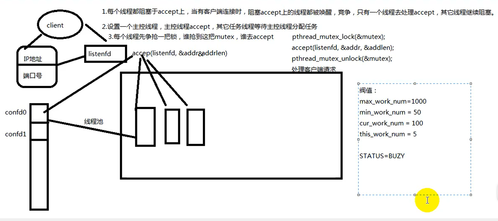
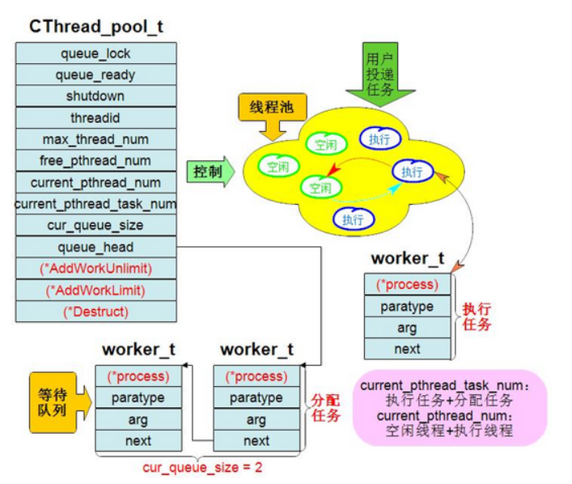
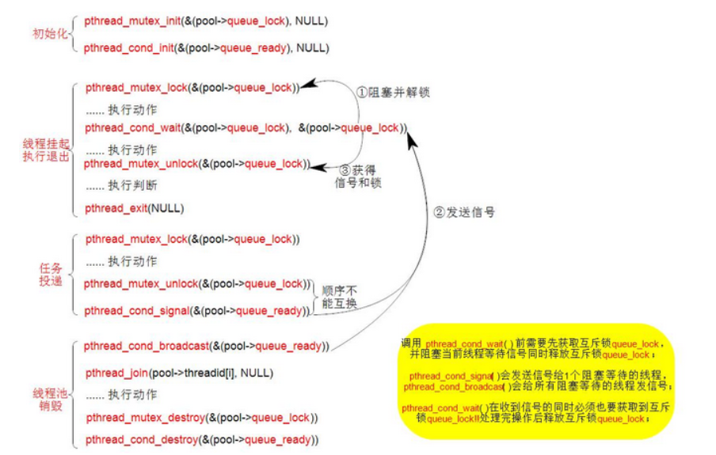

# 线程池高并发服务器



## 模型1：预先创建几个线程，每个线程都阻塞于`accept`，当有客户连接时，阻塞在`accept`上的线程都被唤醒，竞争，只有一个线程去处理`accept`，其他线程继续睡眠

## 模型2：设置一个主控线程，主控线程`accept`，其他任务线程等待主控线程分配任务

## 模型3：每个线程争抢一把锁，谁抢到锁，谁去`accept`

---

### 3.1 线程池结构



#### 3.1.1 线程池任务结点的结构

线程池任务结点用来保存用户投递过来的任务，并放入到线程池中的线程来执行

```c
/* 线程池任务结点 */
struct worker_t{
    void * (* process)(void * arg);     /* 回调函数 */
    int paratype;                       /* 函数类型 */
    void * arg;                         /* 回调函数参数 */
    struct worker_t * next;             /* 指向下一个结点 */
}
```

#### 3.1.2 线程池控制器

线程池控制器用来对线程池进行控制管理，描述当前线程池的最基本信息，包括任务的投递，线程池状态的更新与查询，线程池的销毁等

```c
max_thread_num：            线程池中可容纳的最大线程数
current_thread_num：        当前线程池存放的线程数
                            空闲线程 + 执行线程 + 已分配任务
current_thread_task_num：   当前线程池中已经执行任务和已分配任务的线程数目和 
                            执行任务 + 已分配任务
current_wait_queue_num：    当前等待队列的任务数目
free_pthread_num：          线程池允许最大的空闲线程数

当用户投递任务时：   空闲线程 -> 执行线程
执行完后：          执行线程 -> 空闲线程

空闲线程 = 当前线程池的线程数   -  当前线程池中已经执行任务和已分配任务的线程数目和
          current_thread_num  -  current_thread_task_num

投递任务时，首先放入等待队列`queue_head`链表中, 如果线程池中有空闲线程则放入空闲线程中执行，否则根据条件选择继续等待空闲线程或者新建一个线程来执行，新建的线程将放入线程池中。

执行的任务会从等待队列中脱离，并在任务执行完后释放任务结点worker_t
```

#### 3.1.3 线程池控制器结构

```c
/*线程控制器*/
struct CThread_pool_t {
    pthread_mutex_t queue_lock;     /*互斥锁*/
    pthread_cond_t  queue_ready;    /*条件变量*/
    
    worker_t * queue_head;          /*任务节点链表 保存所有投递的任务*/
    int shutdown;                   /*线程池销毁标志 1-销毁*/
    pthread_t * threadid;           /*线程ID*/
    
    int max_thread_num;             /*线程池可容纳最大线程数*/
    int current_pthread_num;        /*当前线程池存放的线程*/
    int current_pthread_task_num;   /*当前已经执行任务和已分配任务的线程数目和*/
    int current_wait_queue_num;     /*当前等待队列的的任务数目*/
    int free_pthread_num;           /*线程池允许最大的空闲线程数/*/
    
    /**
     *  function:       ThreadPoolAddWorkUnlimit
     *  description:    向线程池投递任务
     *  input param:    pthis   线程池指针
     *                  process 回调函数
     *                  arg     回调函数参数
     *  return Valr:    0       成功
     *                  -1      失败
     */     
    int (* AddWorkUnlimit)(void * pthis, void * (* process)(void * arg), void * arg);
    
    /**
     *  function:       ThreadPoolAddWorkLimit
     *  description:    向线程池投递任务,无空闲线程则阻塞
     *  input param:    pthis   线程池指针
     *                  process 回调函数
     *                  arg     回调函数参数
     *  return Val:     0       成功
     *                  -1      失败
     */     
    int (* AddWorkLimit)(void * pthis, void * (* process)(void * arg), void * arg);
    
    /**
     *  function:       ThreadPoolGetThreadMaxNum
     *  description:    获取线程池可容纳的最大线程数
     *  input param:    pthis   线程池指针
     */     
    int (* GetThreadMaxNum)(void * pthis);
    
    /**
     *  function:       ThreadPoolGetCurrentThreadNum
     *  description:    获取线程池存放的线程数
     *  input param:    pthis   线程池指针
     *  return Val:     线程池存放的线程数
     */     
    int (* GetCurrentThreadNum)(void * pthis);
    
    /**
     *  function:       ThreadPoolGetCurrentTaskThreadNum
     *  description:    获取当前正在执行任务和已经分配任务的线程数目和
     *  input param:    pthis   线程池指针
     *  return Val:     当前正在执行任务和已经分配任务的线程数目和
     */     
    int (* GetCurrentTaskThreadNum)(void * pthis);
    
    /**
     *  function:       ThreadPoolGetCurrentWaitTaskNum
     *  description:    获取线程池等待队列任务数
     *  input param:    pthis   线程池指针
     *  return Val:     等待队列任务数
     */     
    int (* GetCurrentWaitTaskNum)(void * pthis);
    
    /**
     *  function:       ThreadPoolDestroy
     *  description:    销毁线程池
     *  input param:    pthis   线程池指针
     *  return Val:     0       成功
     *                  -1      失败
     */     
    int (* Destroy)(void * pthis);    
};
```

#### 3.1.4 线程池创建

线程池创建，创建`max_num`个线程`ThreadRoutine`，即空闲线程

```c
/**
 *  function:       ThreadPoolConstruct
 *  description:    构建线程池
 *  input param:    max_num   线程池可容纳的最大线程数
 *                  free_num  线程池允许存在的最大空闲线程,超过则将线程释放回操作系统
 *  return Val:     线程池指针                 
 */     
CThread_pool_t * 
ThreadPoolConstruct(int max_num, int free_num)
{
    int i = 0;
    
    CThread_pool_t * pool = (CThread_pool_t *)malloc(sizeof(CThread_pool_t));
    if(NULL == pool)
        return NULL;
    
    memset(pool, 0, sizeof(CThread_pool_t));
    
    /*初始化互斥锁*/
    pthread_mutex_init(&(pool->queue_lock), NULL);
    /*初始化条件变量*/
    pthread_cond_init(&(pool->queue_ready), NULL);
    
    pool->queue_head                = NULL;
    pool->max_thread_num            = max_num; // 线程池可容纳的最大线程数
    pool->current_wait_queue_num    = 0;
    pool->current_pthread_task_num  = 0;
    pool->shutdown                  = 0;
    pool->current_pthread_num       = 0;
    pool->free_pthread_num          = free_num; // 线程池允许存在最大空闲线程
    pool->threadid                  = NULL;
    pool->threadid                  = (pthread_t *)malloc(max_num*sizeof(pthread_t));
    /*该函数指针赋值*/
    pool->AddWorkUnlimit            = ThreadPoolAddWorkUnlimit;
    pool->AddWorkLimit              = ThreadPoolAddWorkLimit;
    pool->Destroy                   = ThreadPoolDestroy;
    pool->GetThreadMaxNum           = ThreadPoolGetThreadMaxNum;
    pool->GetCurrentThreadNum       = ThreadPoolGetCurrentThreadNum;
    pool->GetCurrentTaskThreadNum   = ThreadPoolGetCurrentTaskThreadNum;
    pool->GetCurrentWaitTaskNum     = ThreadPoolGetCurrentWaitTaskNum;
    
    for(i=0; i<max_num; i++) {
        pool->current_pthread_num++;    // 当前池中的线程数
        /*创建线程*/
        pthread_create(&(pool->threadid[i]), NULL, ThreadPoolRoutine, (void *)pool);
        usleep(1000);        
    }
    
    return pool;
}
```

#### 3.1.5 投递任务

投递任务时先创建一个任务点保存回调函数和函数参数，并将任务结点放入等待队列中，如果没有空闲线程并且当前线程数小于能容纳的最大线程，创建新的线程。更新`current_pthread_num`和`current_pthread_task_num`，并发送信号`pthread_cond_signal(&(pool->queue_ready), &(pool->queue_lock))`，唤醒一个条件阻塞等待状态的线程

互斥锁：`pthread_mutex_t queue_ lock`
条件变量：`pthread_cond_t queue_ready`



```c
/**
 *  function:       ThreadPoolAddWorkLimit
 *  description:    向线程池投递任务,无空闲线程则阻塞
 *  input param:    pthis   线程池指针
 *                  process 回调函数
 *                  arg     回调函数参数
 *  return Val:     0       成功
 *                  -1      失败
 */     
int
ThreadPoolAddWorkLimit(void * pthis, void * (* process)(void * arg), void * arg)
{ 
    // int FreeThreadNum = 0;
    // int CurrentPthreadNum = 0;
    
    CThread_pool_t * pool = (CThread_pool_t *)pthis;
    
    /*为添加的任务队列节点分配内存*/
    worker_t * newworker  = (worker_t *)malloc(sizeof(worker_t)); 
    if(NULL == newworker) 
        return -1;
    
    newworker->process  = process;  // 回调函数,在线程ThreadPoolRoutine()中执行
    newworker->arg      = arg;      // 回调函数参数
    newworker->next     = NULL;      
    
    pthread_mutex_lock(&(pool->queue_lock));
    
    /*插入新任务队列节点*/
    worker_t * member = pool->queue_head;   // 指向任务队列链表整体
    if(member != NULL) {
        while(member->next != NULL) // 队列中有节点
            member = member->next;  // member指针往后移动
            
        member->next = newworker;   // 插入到队列链表尾部
    } else 
        pool->queue_head = newworker; // 插入到队列链表头
    
    assert(pool->queue_head != NULL);
    pool->current_wait_queue_num++; // 等待队列加1
    
    /*空闲的线程= 当前线程池存放的线程 - 当前已经执行任务和已分配任务的线程数目和*/
    int FreeThreadNum = pool->current_pthread_num - pool->current_pthread_task_num;
    /*如果没有空闲线程且池中当前线程数不超过可容纳最大线程*/
    if((0 == FreeThreadNum) && (pool->current_pthread_num < pool->max_thread_num)) {  //-> 条件为真进行新线程创建
        int CurrentPthreadNum = pool->current_pthread_num;
        
        /*新增线程*/
        pool->threadid = (pthread_t *)realloc(pool->threadid, 
                                        (CurrentPthreadNum+1) * sizeof(pthread_t));
                                        
        pthread_create(&(pool->threadid[CurrentPthreadNum]),
                                              NULL, ThreadPoolRoutine, (void *)pool);
        /*当前线程池中线程总数加1*/                                   
        pool->current_pthread_num++;
        
        /*分配任务线程数加1*/
        pool->current_pthread_task_num++;
        pthread_mutex_unlock(&(pool->queue_lock));
        
        /*发送信号给一个处与条件阻塞等待状态的线程*/
        pthread_cond_signal(&(pool->queue_ready));
        return 0;
    }
    
    pool->current_pthread_task_num++;
    pthread_mutex_unlock(&(pool->queue_lock));
    
    /*发送信号给一个处与条件阻塞等待状态的线程*/
    pthread_cond_signal(&(pool->queue_ready));
//  usleep(10);  //看情况  
    return 0;
}
```

#### 3.1.6 执行线程

在初始化创建线程时所有线程都全部阻塞在`pthread_cond_wait()`处此时的线程就为空闲线程，也就是线程被挂起，当收到信号并取得互斥锁时，表明任务投递过来则获取等待队列里的任务结点并执行回调函数；函数执行结束后回去判断当前等待队列是否还有任务，有则接下去执行，否则重新阻塞回到空闲线程状态。

```c
/**
 *  function:       ThreadPoolRoutine
 *  description:    线程池中执行的线程
 *  input param:    arg  线程池指针
 */     
void * 
ThreadPoolRoutine(void * arg)
{
    CThread_pool_t * pool = (CThread_pool_t *)arg;
    
    while(1) {
        /*上锁,pthread_cond_wait()调用会解锁*/
        pthread_mutex_lock(&(pool->queue_lock));
        
        /*队列没有等待任务*/
        while((pool->current_wait_queue_num == 0) && (!pool->shutdown)) {
            /*条件锁阻塞等待条件信号*/
            pthread_cond_wait(&(pool->queue_ready), &(pool->queue_lock));
        }
        
        if(pool->shutdown) {
            pthread_mutex_unlock(&(pool->queue_lock));
            pthread_exit(NULL);         // 释放线程
        }
        
        assert(pool->current_wait_queue_num != 0);
        assert(pool->queue_head != NULL);
        
        pool->current_wait_queue_num--; // 等待任务减1,准备执行任务
        worker_t * worker = pool->queue_head;   // 去等待队列任务节点头
        pool->queue_head = worker->next;        // 链表后移     
        pthread_mutex_unlock(&(pool->queue_lock));
        
        (* (worker->process))(worker->arg);      // 执行回调函数
        
        pthread_mutex_lock(&(pool->queue_lock));
        pool->current_pthread_task_num--;       // 函数执行结束
        free(worker);   // 释放任务结点
        worker = NULL;
        
        if((pool->current_pthread_num - pool->current_pthread_task_num) > pool->free_pthread_num) {
            pthread_mutex_unlock(&(pool->queue_lock));
            break;  // 当线程池中空闲线程超过 free_pthread_num 则将线程释放回操作系统
        }
        pthread_mutex_unlock(&(pool->queue_lock));    
    }
    
    pool->current_pthread_num--;    // 当前线程数减1
    pthread_exit(NULL);             // 释放线程
    
    return (void *)NULL;
}
```

---

## 2. 完整代码

`CThreadPool.h`文件：

```c
/**
 *  线程池头文件
 *
 **/

#ifndef _CTHREADPOOL_H_
#define _CTHREADPOOL_H_

#include <pthread.h>

/*线程池可容纳最大线程数*/
#define DEFAULT_MAX_THREAD_NUM      100

/*线程池允许最大的空闲线程，超过则将线程释放回操作系统*/
#define DEFAULT_FREE_THREAD_NUM     10

typedef struct worker_t         worker_t;
typedef struct CThread_pool_t   CThread_pool_t;

/*线程池任务节点*/
struct worker_t {
    void * (* process)(void * arg); /*回调函数*/
    int    paratype;                /*函数类型(预留)*/
    void * arg;                     /*回调函数参数*/
    struct worker_t * next;         /*链接下一个任务节点*/
};

/*线程控制器*/
struct CThread_pool_t {
    pthread_mutex_t queue_lock;     /*互斥锁*/
    pthread_cond_t  queue_ready;    /*条件变量*/
    
    worker_t * queue_head;          /*任务节点链表 保存所有投递的任务*/
    int shutdown;                   /*线程池销毁标志 1-销毁*/
    pthread_t * threadid;           /*线程ID*/
    
    int max_thread_num;             /*线程池可容纳最大线程数*/
    int current_pthread_num;        /*当前线程池存放的线程*/
    int current_pthread_task_num;   /*当前已经执行任务和已分配任务的线程数目和*/
    int current_wait_queue_num;     /*当前等待队列的的任务数目*/
    int free_pthread_num;           /*线程池允许最大的空闲线程数/*/
    
    /**
     *  function:       ThreadPoolAddWorkUnlimit
     *  description:    向线程池投递任务
     *  input param:    pthis   线程池指针
     *                  process 回调函数
     *                  arg     回调函数参数
     *  return Valr:    0       成功
     *                  -1      失败
     */     
    int (* AddWorkUnlimit)(void * pthis, void * (* process)(void * arg), void * arg);
    
    /**
     *  function:       ThreadPoolAddWorkLimit
     *  description:    向线程池投递任务,无空闲线程则阻塞
     *  input param:    pthis   线程池指针
     *                  process 回调函数
     *                  arg     回调函数参数
     *  return Val:     0       成功
     *                  -1      失败
     */     
    int (* AddWorkLimit)(void * pthis, void * (* process)(void * arg), void * arg);
    
    /**
     *  function:       ThreadPoolGetThreadMaxNum
     *  description:    获取线程池可容纳的最大线程数
     *  input param:    pthis   线程池指针
     */     
    int (* GetThreadMaxNum)(void * pthis);
    
    /**
     *  function:       ThreadPoolGetCurrentThreadNum
     *  description:    获取线程池存放的线程数
     *  input param:    pthis   线程池指针
     *  return Val:     线程池存放的线程数
     */     
    int (* GetCurrentThreadNum)(void * pthis);
    
    /**
     *  function:       ThreadPoolGetCurrentTaskThreadNum
     *  description:    获取当前正在执行任务和已经分配任务的线程数目和
     *  input param:    pthis   线程池指针
     *  return Val:     当前正在执行任务和已经分配任务的线程数目和
     */     
    int (* GetCurrentTaskThreadNum)(void * pthis);
    
    /**
     *  function:       ThreadPoolGetCurrentWaitTaskNum
     *  description:    获取线程池等待队列任务数
     *  input param:    pthis   线程池指针
     *  return Val:     等待队列任务数
     */     
    int (* GetCurrentWaitTaskNum)(void * pthis);
    
    /**
     *  function:       ThreadPoolDestroy
     *  description:    销毁线程池
     *  input param:    pthis   线程池指针
     *  return Val:     0       成功
     *                  -1      失败
     */     
    int (* Destroy)(void * pthis);    
};

/**
 *  function:       ThreadPoolConstruct
 *  description:    构建线程池
 *  input param:    max_num   线程池可容纳的最大线程数
 *                  free_num  线程池允许存在的最大空闲线程,超过则将线程释放回操作系统
 *  return Val:     线程池指针                 
 */     
CThread_pool_t * ThreadPoolConstruct(int max_num, int free_num);

/**
 *  function:       ThreadPoolConstructDefault
 *  description:    创建线程池,以默认的方式初始化,未创建线程
 *
 *  return Val:     线程池指针                 
 */     
CThread_pool_t * ThreadPoolConstructDefault(void);

#endif  // _CTHREADPOOL_H_
```

`CThreadPool.c`文件：

```c
/**
 *  线程池实现
 *
 **/

#include <stdio.h>
#include <stdlib.h>
#include <string.h>
#include <unistd.h>
#include <sys/types.h>
#include <pthread.h>
#include <assert.h>

#include "CThreadPool.h"

void * ThreadPoolRoutine(void * arg); 

/**
 *  function:       ThreadPoolAddWorkLimit
 *  description:    向线程池投递任务,无空闲线程则阻塞
 *  input param:    pthis   线程池指针
 *                  process 回调函数
 *                  arg     回调函数参数
 *  return Val:     0       成功
 *                  -1      失败
 */     
int
ThreadPoolAddWorkLimit(void * pthis, void * (* process)(void * arg), void * arg)
{ 
    // int FreeThreadNum = 0;
    // int CurrentPthreadNum = 0;
    
    CThread_pool_t * pool = (CThread_pool_t *)pthis;
    
    /*为添加的任务队列节点分配内存*/
    worker_t * newworker  = (worker_t *)malloc(sizeof(worker_t)); 
    if(NULL == newworker) 
        return -1;
    
    newworker->process  = process;  // 回调函数,在线程ThreadPoolRoutine()中执行
    newworker->arg      = arg;      // 回调函数参数
    newworker->next     = NULL;      
    
    pthread_mutex_lock(&(pool->queue_lock));
    
    /*插入新任务队列节点*/
    worker_t * member = pool->queue_head;   // 指向任务队列链表整体
    if(member != NULL) {
        while(member->next != NULL) // 队列中有节点
            member = member->next;  // member指针往后移动
            
        member->next = newworker;   // 插入到队列链表尾部
    } else 
        pool->queue_head = newworker; // 插入到队列链表头
    
    assert(pool->queue_head != NULL);
    pool->current_wait_queue_num++; // 等待队列加1
    
    /*空闲的线程= 当前线程池存放的线程 - 当前已经执行任务和已分配任务的线程数目和*/
    int FreeThreadNum = pool->current_pthread_num - pool->current_pthread_task_num;
    /*如果没有空闲线程且池中当前线程数不超过可容纳最大线程*/
    if((0 == FreeThreadNum) && (pool->current_pthread_num < pool->max_thread_num)) {
        int CurrentPthreadNum = pool->current_pthread_num;
        
        /*新增线程*/
        pool->threadid = (pthread_t *)realloc(pool->threadid, 
                                        (CurrentPthreadNum+1) * sizeof(pthread_t));
                                        
        pthread_create(&(pool->threadid[CurrentPthreadNum]),
                                              NULL, ThreadPoolRoutine, (void *)pool);
        /*当前线程池中线程总数加1*/                                   
        pool->current_pthread_num++;
        
        /*分配任务线程数加1*/
        pool->current_pthread_task_num++;
        pthread_mutex_unlock(&(pool->queue_lock));
        
        /*发送信号给一个处与条件阻塞等待状态的线程*/
        pthread_cond_signal(&(pool->queue_ready));
        return 0;
    }
    
    pool->current_pthread_task_num++;
    pthread_mutex_unlock(&(pool->queue_lock));
    
    /*发送信号给一个处与条件阻塞等待状态的线程*/
    pthread_cond_signal(&(pool->queue_ready));
//  usleep(10);  //看情况  
    return 0;
}

/**
 *  function:       ThreadPoolAddWorkUnlimit
 *  description:    向线程池投递任务
 *  input param:    pthis   线程池指针
 *                  process 回调函数
 *                  arg     回调函数参数
 *  return Valr:    0       成功
 *                  -1      失败
 */
int
ThreadPoolAddWorkUnlimit(void * pthis, void * (* process)(void * arg), void * arg)
{
    // int FreeThreadNum = 0;
    // int CurrentPthreadNum = 0;
    
    CThread_pool_t * pool = (CThread_pool_t *)pthis;
    
    /*给新任务队列节点分配内存*/
    worker_t * newworker = (worker_t *)malloc(sizeof(worker_t));
    if(NULL == newworker)
        return -1;
    
    newworker->process  = process;  // 回调函数
    newworker->arg      = arg;      // 回调函数参数
    newworker->next     = NULL;
    
    pthread_mutex_lock(&(pool->queue_lock));
    
    /*新节点插入任务队列链表操作*/
    worker_t * member = pool->queue_head;
    if(member != NULL) {
        while(member->next != NULL)
            member = member->next;
        
        member->next = newworker;       // 插入队列链表尾部
    } else 
        pool->queue_head = newworker;   // 插入到头(也就是第一个节点,之前链表没有节点)
    
    assert(pool->queue_head != NULL);
    pool->current_wait_queue_num++;     // 当前等待队列的的任务数目+1
    
    int FreeThreadNum = pool->current_pthread_num - pool->current_pthread_task_num;
    /*只判断是否没有空闲线程*/
    if(0 == FreeThreadNum) {
        int CurrentPthreadNum = pool->current_pthread_num;
        pool->threadid = (pthread_t *)realloc(pool->threadid,
                                           (CurrentPthreadNum+1)*sizeof(pthread_t));
        pthread_create(&(pool->threadid[CurrentPthreadNum]),NULL,
                                        ThreadPoolRoutine, (void *)pool);
        pool->current_pthread_num++;
        if(pool->current_pthread_num > pool->max_thread_num)
            pool->max_thread_num = pool->current_pthread_num;
        
        pool->current_pthread_task_num++;
        pthread_mutex_unlock(&(pool->queue_lock));
        pthread_cond_signal(&(pool->queue_ready));
        return 0;
    }
    
    pool->current_pthread_task_num++;
    pthread_mutex_unlock(&(pool->queue_lock));
    pthread_cond_signal(&(pool->queue_ready));
//  usleep(10);    
    return 0;   
}

/**
 *  function:       ThreadPoolGetThreadMaxNum
 *  description:    获取线程池可容纳的最大线程数
 *  input param:    pthis   线程池指针
 *  return val:     线程池可容纳的最大线程数
 */     
int
ThreadPoolGetThreadMaxNum(void * pthis)
{
    int num = 0;   
    CThread_pool_t * pool = (CThread_pool_t *)pthis;
    
    pthread_mutex_lock(&(pool->queue_lock));
    num = pool->max_thread_num;
    pthread_mutex_unlock(&(pool->queue_lock));
    
    return num;
}

/**
 *  function:       ThreadPoolGetCurrentThreadNum
 *  description:    获取线程池存放的线程数
 *  input param:    pthis   线程池指针
 *  return Val:     线程池存放的线程数
 */     
int 
ThreadPoolGetCurrentThreadNum(void * pthis)
{
    int num = 0;
    CThread_pool_t * pool = (CThread_pool_t *)pthis;
    
    pthread_mutex_lock(&(pool->queue_lock));
    num = pool->current_pthread_num;
    pthread_mutex_unlock(&(pool->queue_lock));
    
    return num;       
}

/**
 *  function:       ThreadPoolGetCurrentTaskThreadNum
 *  description:    获取当前正在执行任务和已经分配任务的线程数目和
 *  input param:    pthis   线程池指针
 *  return Val:     当前正在执行任务和已经分配任务的线程数目和
 */   
int
ThreadPoolGetCurrentTaskThreadNum(void * pthis)
{
    int num = 0;
    CThread_pool_t * pool = (CThread_pool_t *)pthis;
    
    pthread_mutex_lock(&(pool->queue_lock));
    num = pool->current_pthread_task_num;
    pthread_mutex_unlock(&(pool->queue_lock));
    
    return num;   
}

/**
 *  function:       ThreadPoolGetCurrentWaitTaskNum
 *  description:    获取线程池等待队列任务数
 *  input param:    pthis   线程池指针
 *  return Val:     等待队列任务数
 */     
int
ThreadPoolGetCurrentWaitTaskNum(void * pthis)
{
    int num = 0;
    CThread_pool_t * pool = (CThread_pool_t *)pthis;
    
    pthread_mutex_lock(&(pool->queue_lock));
    num = pool->current_wait_queue_num;
    pthread_mutex_unlock(&(pool->queue_lock));
    
    return num;   
}

/**
 *  function:       ThreadPoolDestroy
 *  description:    销毁线程池
 *  input param:    pthis   线程池指针
 *  return Val:     0       成功
 *                  -1      失败
 */     
int
ThreadPoolDestroy(void * pthis)
{
    int i;
    CThread_pool_t * pool = (CThread_pool_t *)pthis;
    
    if(pool->shutdown)      // 已销毁
        return -1;
        
    pool->shutdown = 1;     // 销毁标志置位
    
    /*唤醒所有pthread_cond_wait()等待线程*/
    pthread_cond_broadcast(&(pool->queue_ready));
    for(i=0; i<pool->current_pthread_num; i++)
        pthread_join(pool->threadid[i], NULL);  // 等待所有线程执行结束
    
    free(pool->threadid);   // 释放
       
    /*销毁任务队列链表*/
    worker_t * head = NULL;
    while(pool->queue_head != NULL) {
        head = pool->queue_head;
        pool->queue_head = pool->queue_head->next;
        free(head);    
    }
    
    /*销毁锁*/
    pthread_mutex_destroy(&(pool->queue_lock));
    pthread_cond_destroy(&(pool->queue_ready));
    
    free(pool);
    pool = NULL;
    
    return 0;
}

/**
 *  function:       ThreadPoolRoutine
 *  description:    线程池中运行的线程
 *  input param:    arg  线程池指针
 */     
void * 
ThreadPoolRoutine(void * arg)
{
    CThread_pool_t * pool = (CThread_pool_t *)arg;
    
    while(1) {
        /*上锁,pthread_cond_wait()调用会解锁*/
        pthread_mutex_lock(&(pool->queue_lock));
        
        /*队列没有等待任务*/
        while((pool->current_wait_queue_num == 0) && (!pool->shutdown)) {
            /*条件锁阻塞等待条件信号*/
            pthread_cond_wait(&(pool->queue_ready), &(pool->queue_lock));
        }
        
        if(pool->shutdown) {
            pthread_mutex_unlock(&(pool->queue_lock));
            pthread_exit(NULL);         // 释放线程
        }
        
        assert(pool->current_wait_queue_num != 0);
        assert(pool->queue_head != NULL);
        
        pool->current_wait_queue_num--; // 等待任务减1,准备执行任务
        worker_t * worker = pool->queue_head;   // 去等待队列任务节点头
        pool->queue_head = worker->next;        // 链表后移     
        pthread_mutex_unlock(&(pool->queue_lock));
        
        (* (worker->process))(worker->arg);      // 执行回调函数
        
        pthread_mutex_lock(&(pool->queue_lock));
        pool->current_pthread_task_num--;       // 函数执行结束
        free(worker);   // 释放任务结点
        worker = NULL;
        
        if((pool->current_pthread_num - pool->current_pthread_task_num) > pool->free_pthread_num) {
            pthread_mutex_unlock(&(pool->queue_lock));
            break;  // 当线程池中空闲线程超过 free_pthread_num 则将线程释放回操作系统
        }
        pthread_mutex_unlock(&(pool->queue_lock));    
    }
    
    pool->current_pthread_num--;    // 当前线程数减1
    pthread_exit(NULL);             // 释放线程
    
    return (void *)NULL;
}

/**
 *  function:       ThreadPoolConstruct
 *  description:    构建线程池
 *  input param:    max_num   线程池可容纳的最大线程数
 *                  free_num  线程池允许存在的最大空闲线程,超过则将线程释放回操作系统
 *  return Val:     线程池指针                 
 */     
CThread_pool_t * 
ThreadPoolConstruct(int max_num, int free_num)
{
    int i = 0;
    
    CThread_pool_t * pool = (CThread_pool_t *)malloc(sizeof(CThread_pool_t));
    if(NULL == pool)
        return NULL;
    
    memset(pool, 0, sizeof(CThread_pool_t));
    
    /*初始化互斥锁*/
    pthread_mutex_init(&(pool->queue_lock), NULL);
    /*初始化条件变量*/
    pthread_cond_init(&(pool->queue_ready), NULL);
    
    pool->queue_head                = NULL;
    pool->max_thread_num            = max_num; // 线程池可容纳的最大线程数
    pool->current_wait_queue_num    = 0;
    pool->current_pthread_task_num  = 0;
    pool->shutdown                  = 0;
    pool->current_pthread_num       = 0;
    pool->free_pthread_num          = free_num; // 线程池允许存在最大空闲线程
    pool->threadid                  = NULL;
    pool->threadid                  = (pthread_t *)malloc(max_num*sizeof(pthread_t));
    /*该函数指针赋值*/
    pool->AddWorkUnlimit            = ThreadPoolAddWorkUnlimit;
    pool->AddWorkLimit              = ThreadPoolAddWorkLimit;
    pool->Destroy                   = ThreadPoolDestroy;
    pool->GetThreadMaxNum           = ThreadPoolGetThreadMaxNum;
    pool->GetCurrentThreadNum       = ThreadPoolGetCurrentThreadNum;
    pool->GetCurrentTaskThreadNum   = ThreadPoolGetCurrentTaskThreadNum;
    pool->GetCurrentWaitTaskNum     = ThreadPoolGetCurrentWaitTaskNum;
    
    for(i=0; i<max_num; i++) {
        pool->current_pthread_num++;    // 当前池中的线程数
        /*创建线程*/
        pthread_create(&(pool->threadid[i]), NULL, ThreadPoolRoutine, (void *)pool);
        usleep(1000);        
    }
    
    return pool;
}

/**
 *  function:       ThreadPoolConstructDefault
 *  description:    创建线程池,以默认的方式初始化,未创建线程
 *
 *  return Val:     线程池指针                 
 */     
CThread_pool_t * 
ThreadPoolConstructDefault(void)
{
    CThread_pool_t * pool = (CThread_pool_t *)malloc(sizeof(CThread_pool_t));
    if(NULL == pool)
        return NULL;
    
    memset(pool, 0, sizeof(CThread_pool_t));
    
    pthread_mutex_init(&(pool->queue_lock), NULL);
    pthread_cond_init(&(pool->queue_ready), NULL);
    
    pool->queue_head                = NULL;
    pool->max_thread_num            = DEFAULT_MAX_THREAD_NUM; // 默认值
    pool->current_wait_queue_num    = 0;
    pool->current_pthread_task_num  = 0;
    pool->shutdown                  = 0;
    pool->current_pthread_num       = 0;
    pool->free_pthread_num          = DEFAULT_FREE_THREAD_NUM; // 默认值
    pool->threadid                  = NULL;
    /*该函数指针赋值*/
    pool->AddWorkUnlimit            = ThreadPoolAddWorkUnlimit;
    pool->AddWorkLimit              = ThreadPoolAddWorkLimit;
    pool->Destroy                   = ThreadPoolDestroy;
    pool->GetThreadMaxNum           = ThreadPoolGetThreadMaxNum;
    pool->GetCurrentThreadNum       = ThreadPoolGetCurrentThreadNum;
    pool->GetCurrentTaskThreadNum   = ThreadPoolGetCurrentTaskThreadNum;
    pool->GetCurrentWaitTaskNum     = ThreadPoolGetCurrentWaitTaskNum;
    
    return pool;
}
```

---

## 3. 实践

```c
#include <stdio.h> 
#include <stdlib.h> 
#include <unistd.h> 
#include <sys/types.h> 
#include <pthread.h> 
#include <assert.h> 
#include <string.h>

#include "CThreadPool.h"


void * thread_1(void * arg);
void * thread_2(void * arg);
void * thread_3(void * arg);
void DisplayPoolStatus(CThread_pool_t * pPool);

int nKillThread = 0;

int main()
{
    CThread_pool_t * pThreadPool = NULL;
    
    pThreadPool = ThreadPoolConstruct(5, 1);
    int nNumInput = 5;
    char LogInput[] = "OK!";

    DisplayPoolStatus(pThreadPool);
    /*可用AddWorkLimit()替换看执行的效果*/
    pThreadPool->AddWorkUnlimit((void *)pThreadPool, (void *)thread_1, (void *)NULL);
    /*
     * 没加延迟发现连续投递任务时pthread_cond_wait()会收不到信号pthread_cond_signal() !!
     * 因为AddWorkUnlimit()进去后调用pthread_mutex_lock()把互斥锁锁上,导致pthread_cond_wait()
     * 收不到信号!!也可在AddWorkUnlimit()里面加个延迟,一般情况可能也遇不到这个问题
     */
    usleep(10);    
    pThreadPool->AddWorkUnlimit((void *)pThreadPool, (void *)thread_2, (void *)nNumInput);
    usleep(10);
    pThreadPool->AddWorkUnlimit((void *)pThreadPool, (void *)thread_3, (void *)LogInput);
    usleep(10);
    DisplayPoolStatus(pThreadPool);

    nKillThread = 1;
    usleep(100);    /**< 先让线程退出 */
    DisplayPoolStatus(pThreadPool);
    nKillThread = 2;
    usleep(100);
    DisplayPoolStatus(pThreadPool);
    nKillThread = 3;
    usleep(100);
    DisplayPoolStatus(pThreadPool);

    pThreadPool->Destroy((void*)pThreadPool);
    return 0;
}

void * 
thread_1(void * arg)
{
    printf("Thread 1 is running !\n");
    while(nKillThread != 1)
        usleep(10);
    return NULL;
}

void * thread_2(void * arg)
{
    int nNum = (int)arg;
    
    printf("Thread 2 is running !\n");
    printf("Get Number %d\n", nNum);
    while(nKillThread != 2)
        usleep(10);
    return NULL;
}

void * thread_3(void * arg)
{
    char * pLog = (char *)arg;
    
    printf("Thread 3 is running !\n");
    printf("Get String %s\n", pLog);
    while(nKillThread != 3)
        usleep(10);
    return NULL;
}

void DisplayPoolStatus(CThread_pool_t * pPool)
{
    static int nCount = 1;
    
    printf("****************************\n");
    printf("nCount = %d\n", nCount++);
    printf("max_thread_num = %d\n", pPool->GetThreadMaxNum((void *)pPool));
    printf("current_pthread_num = %d\n", pPool->GetCurrentThreadNum((void *)pPool));
    printf("current_pthread_task_num = %d\n", pPool->GetCurrentTaskThreadNum((void *)pPool));
    printf("current_wait_queue_num = %d\n", pPool->GetCurrentWaitTaskNum((void *)pPool));
    printf("****************************\n");
}
```

---
