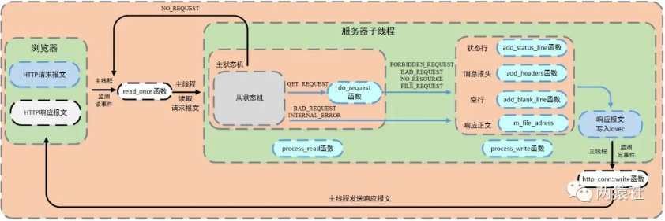

# `http`连接处理3 请求和发送

---

## 1. 聚集写

对指定的文件描述符，写入`iovec`，返回已写的字节数

```c++
#include <sys/uio.h>
ssize_t writev(int filedes, const struct iovec *iov, int iovcnt);

struct iovec {
    void      *iov_base;      // iov_base指向缓冲区
    size_t    iov_len;        // iov_len 表示数据的长度
};
```

`iovec`中`iov_base`向缓冲区，存放的是`writev`将要发送的数据，`iov_len`是实际写入的长度

---

## 2. 流程



- 浏览器发出`HTTP`请求报文，服务器端接收报文后调用`process`解析，根据解析结果`HTTP_CODE`，加入相应的逻辑和板块
- 服务器子线程完成报文的解析与响应
- 主线程检测读写事件，调用`read_once`和`http_conn:write`完成数据的读写和发送

---

## 3. `HTTP_CODE`

- `NO_REQUEST`：
  - 请求不完整，需要继续读取请求报文数据
  - 跳转主线程继续监测读事件
- `GET_REQUEST`：
  - 获得了完整的`HTTP`请求
  - 调用`do_request`完成请求资源映射
- `NO_RESOURCE`：
  - 请求资源不存在
  - 转`process_write`完成响应报文
- `BAD_REQUEST`：
  - `HTTP`请求报文有语法错误或请求资源为目录
  - 跳转`process_write`完成响应报文
- `FORBIDDEN_REQUEST`：
  - 请求资源禁止访问，没有读取权限
  - 跳转`process_write`完成响应报文
- `FILE_REQUEST`：
  - 请求资源可以正常访问
  - 跳转`process_write`完成响应报文
- `INTERNAL_ERROR`：
  - 服务器内部错误，该结果在主状态机逻辑`switch`的`default`下，一般不会触发

---

## 4. `do_request`

将网站根目录和`url`文件拼接

浏览器网址栏中的字符为`url`，可以抽象为`ip:port/xxx`，`xxx`通过`html`文件的`action`属性进行设置

`m_url`为请求报文中解析出的请求资源，以`/`开头：

- `/`：
  - `GET`请求，跳转到`judge.html`，即欢迎访问页面
- `/0`：
  - `POST`请求，跳转到`register.html`，即注册界面
- `/1`：
  - `POST`请求，跳转到`log.html`，登录界面
- `/2CGISQL.cgi`：
  - `POST`请求，进行登录校验
  - 检验成功，跳转到`welcome.html`，即资源请求成功页面
  - 验证失败，跳转到`logError.html`，即登录失败页面
- `/3CGISQL.cgi`：
  - `POST`请求，进行注册检验
  - 注册成功，跳转到`log.html`，即登录页面
  - 注册失败，跳转到`registerError.html`，即注册失败页面
- `/5`：
  - `POST`请求，跳转到`picture.html`，即图片请求页面  
- `/6`：
  - `POST`请求，跳转到`video.html`，即视频请求页面
- `/7`：
  - `POST`请求，调换到`fans.html`，即关注页面

```c++
http_conn::HTTP_CODE http_conn::do_request()
{
    strcpy(m_real_file, doc_root);
    int len = strlen(doc_root);
    //printf("m_url:%s\n", m_url);
    const char *p = strrchr(m_url, '/');

    //处理cgi
    if (cgi == 1 && (*(p + 1) == '2' || *(p + 1) == '3'))
    {

        //根据标志判断是登录检测还是注册检测
        char flag = m_url[1];

        char *m_url_real = (char *)malloc(sizeof(char) * 200);
        strcpy(m_url_real, "/");
        strcat(m_url_real, m_url + 2);
        strncpy(m_real_file + len, m_url_real, FILENAME_LEN - len - 1);
        free(m_url_real);

        //将用户名和密码提取出来
        //user=123&passwd=123
        char name[100], password[100];
        int i;
        for (i = 5; m_string[i] != '&'; ++i)
            name[i - 5] = m_string[i];
        name[i - 5] = '\0';

        int j = 0;
        for (i = i + 10; m_string[i] != '\0'; ++i, ++j)
            password[j] = m_string[i];
        password[j] = '\0';

        if (*(p + 1) == '3')
        {
            //如果是注册，先检测数据库中是否有重名的
            //没有重名的，进行增加数据
            char *sql_insert = (char *)malloc(sizeof(char) * 200);
            strcpy(sql_insert, "INSERT INTO user(username, passwd) VALUES(");
            strcat(sql_insert, "'");
            strcat(sql_insert, name);
            strcat(sql_insert, "', '");
            strcat(sql_insert, password);
            strcat(sql_insert, "')");

            if (users.find(name) == users.end())
            {
                m_lock.lock();
                int res = mysql_query(mysql, sql_insert);
                users.insert(pair<string, string>(name, password));
                m_lock.unlock();

                if (!res)
                    strcpy(m_url, "/log.html");
                else
                    strcpy(m_url, "/registerError.html");
            }
            else
                strcpy(m_url, "/registerError.html");
        }
        //如果是登录，直接判断
        //若浏览器端输入的用户名和密码在表中可以查找到，返回1，否则返回0
        else if (*(p + 1) == '2')
        {
            if (users.find(name) != users.end() && users[name] == password)
                strcpy(m_url, "/welcome.html");
            else
                strcpy(m_url, "/logError.html");
        }
    }

    if (*(p + 1) == '0')
    {
        char *m_url_real = (char *)malloc(sizeof(char) * 200);
        strcpy(m_url_real, "/register.html");
        strncpy(m_real_file + len, m_url_real, strlen(m_url_real));

        free(m_url_real);
    }
    else if (*(p + 1) == '1')
    {
        char *m_url_real = (char *)malloc(sizeof(char) * 200);
        strcpy(m_url_real, "/log.html");
        strncpy(m_real_file + len, m_url_real, strlen(m_url_real));

        free(m_url_real);
    }
    else if (*(p + 1) == '5')
    {
        char *m_url_real = (char *)malloc(sizeof(char) * 200);
        strcpy(m_url_real, "/picture.html");
        strncpy(m_real_file + len, m_url_real, strlen(m_url_real));

        free(m_url_real);
    }
    else if (*(p + 1) == '6')
    {
        char *m_url_real = (char *)malloc(sizeof(char) * 200);
        strcpy(m_url_real, "/video.html");
        strncpy(m_real_file + len, m_url_real, strlen(m_url_real));

        free(m_url_real);
    }
    else if (*(p + 1) == '7')
    {
        char *m_url_real = (char *)malloc(sizeof(char) * 200);
        strcpy(m_url_real, "/fans.html");
        strncpy(m_real_file + len, m_url_real, strlen(m_url_real));

        free(m_url_real);
    }
    else
        strncpy(m_real_file + len, m_url, FILENAME_LEN - len - 1);

    if (stat(m_real_file, &m_file_stat) < 0)
        return NO_RESOURCE;

    if (!(m_file_stat.st_mode & S_IROTH))
        return FORBIDDEN_REQUEST;

    if (S_ISDIR(m_file_stat.st_mode))
        return BAD_REQUEST;

    int fd = open(m_real_file, O_RDONLY);
    m_file_address = (char *)mmap(0, m_file_stat.st_size, PROT_READ, MAP_PRIVATE, fd, 0);
    close(fd);
    return FILE_REQUEST;
}
```

---

## 5. `process_write`

根据`do_request`的返回状态，服务器子线程调用`process_write`向`m_write_buf`中写入响应报文

- `add_status_line`函数，添加状态行：`http/1.1` 状态行 状态信息
- `add_headers`添加信息报头，内部调用`add_content_length`和`add_linger`函数
  - `content_length`记录响应报文长度，用于浏览器端判断服务器是否发送完
  - `connection`记录连接状态，用于告诉浏览器端保持长连接  
- `add_blank_line`添加空行

```c++
bool http_conn::add_response(const char *format, ...)
{
    if (m_write_idx >= WRITE_BUFFER_SIZE)
        return false;
    va_list arg_list;
    va_start(arg_list, format);
    int len = vsnprintf(m_write_buf + m_write_idx, WRITE_BUFFER_SIZE - 1 - m_write_idx, format, arg_list);
    if (len >= (WRITE_BUFFER_SIZE - 1 - m_write_idx))
    {
        va_end(arg_list);
        return false;
    }
    m_write_idx += len;
    va_end(arg_list);

    LOG_INFO("request:%s", m_write_buf);

    return true;
}
bool http_conn::add_status_line(int status, const char *title)
{
    return add_response("%s %d %s\r\n", "HTTP/1.1", status, title);
}
bool http_conn::add_headers(int content_len)
{
    return add_content_length(content_len) && add_linger() &&
           add_blank_line();
}
bool http_conn::add_content_length(int content_len)
{
    return add_response("Content-Length:%d\r\n", content_len);
}
bool http_conn::add_content_type()
{
    return add_response("Content-Type:%s\r\n", "text/html");
}
bool http_conn::add_linger()
{
    return add_response("Connection:%s\r\n", (m_linger == true) ? "keep-alive" : "close");
}
bool http_conn::add_blank_line()
{
    return add_response("%s", "\r\n");
}
bool http_conn::add_content(const char *content)
{
    return add_response("%s", content);
}
```

响应报文分为两种：

- 第一种：请求文件的存在，通过`io`向量机制`iovec`，说明两个`iovec`，第一个指向`m_write_buf`，第二个指向`mmap`的地址`m_file_address`
- 第二种：请求出错，只申请一个`iovec`，指向`m_write_buf`

```c++
bool http_conn::process_write(HTTP_CODE ret)
{
    switch (ret)
    {
    case INTERNAL_ERROR:
    {
        add_status_line(500, error_500_title);
        add_headers(strlen(error_500_form));
        if (!add_content(error_500_form))
            return false;
        break;
    }
    case BAD_REQUEST:
    {
        add_status_line(404, error_404_title);
        add_headers(strlen(error_404_form));
        if (!add_content(error_404_form))
            return false;
        break;
    }
    case FORBIDDEN_REQUEST:
    {
        add_status_line(403, error_403_title);
        add_headers(strlen(error_403_form));
        if (!add_content(error_403_form))
            return false;
        break;
    }
    case FILE_REQUEST:
    {
        add_status_line(200, ok_200_title);
        if (m_file_stat.st_size != 0)
        {
            add_headers(m_file_stat.st_size);
            m_iv[0].iov_base = m_write_buf;
            m_iv[0].iov_len = m_write_idx;
            m_iv[1].iov_base = m_file_address;
            m_iv[1].iov_len = m_file_stat.st_size;
            m_iv_count = 2;
            bytes_to_send = m_write_idx + m_file_stat.st_size;
            return true;
        }
        else
        {
            const char *ok_string = "<html><body></body></html>";
            add_headers(strlen(ok_string));
            if (!add_content(ok_string))
                return false;
        }
    }
    default:
        return false;
    }
    m_iv[0].iov_base = m_write_buf;
    m_iv[0].iov_len = m_write_idx;
    m_iv_count = 1;
    bytes_to_send = m_write_idx;
    return true;
}
```

---

## 6. `http_conn::write`

- 服务器子线程调用`process_write`完成响应报文，然后注册为`EPOLLOUT`事件。
- 服务器主线程检测写事件，并调用`http_conn::write`函数将响应报文发送给浏览器。

逻辑：

生成响应报文时初始化`byte_to_send`，包括头部信息和文件数据大小，通过`writev`函数循环发送响应报文数据，根据返回值更新`byte_have_send`和`iovec`结构体的指针和长度，并判断报文整体是否发送成功

- 若`writev`单次发送成功，更新`byte_to_send`和`byte_have_send`的大小，若响应报文整体发送成功，则取消`mmap`映射，并判断是否为长连接
  - 长连接重置`http`类实例，注册读事件，不关闭连接
  - 短连接直接关闭连接
- 若`writev`单次发送不成功，判断是否是写缓冲区满了
  - 若不是以为缓冲区满了而失败，取消`mmap`映射，关闭连接
  - 若`eagain`满了，更新`iovec`结构体的指针和长度，并注册写事件，等待下一个写事件触发（当写缓冲区从不可写变为可写，触发`EPOLLOUT`）

```c++
bool http_conn::write()
{
    int temp = 0;

    if (bytes_to_send == 0)
    {
        modfd(m_epollfd, m_sockfd, EPOLLIN, m_TRIGMode);
        init();
        return true;
    }

    while (1)
    {
        temp = writev(m_sockfd, m_iv, m_iv_count);

        if (temp < 0)
        {
            if (errno == EAGAIN)
            {
                modfd(m_epollfd, m_sockfd, EPOLLOUT, m_TRIGMode);
                return true;
            }
            unmap();
            return false;
        }

        bytes_have_send += temp;
        bytes_to_send -= temp;
        if (bytes_have_send >= m_iv[0].iov_len)
        {
            m_iv[0].iov_len = 0;
            m_iv[1].iov_base = m_file_address + (bytes_have_send - m_write_idx);
            m_iv[1].iov_len = bytes_to_send;
        }
        else
        {
            m_iv[0].iov_base = m_write_buf + bytes_have_send;
            m_iv[0].iov_len = m_iv[0].iov_len - bytes_have_send;
        }

        if (bytes_to_send <= 0)
        {
            unmap();
            modfd(m_epollfd, m_sockfd, EPOLLIN, m_TRIGMode);

            if (m_linger)
            {
                init();
                return true;
            }
            else
            {
                return false;
            }
        }
    }
}
```

---
