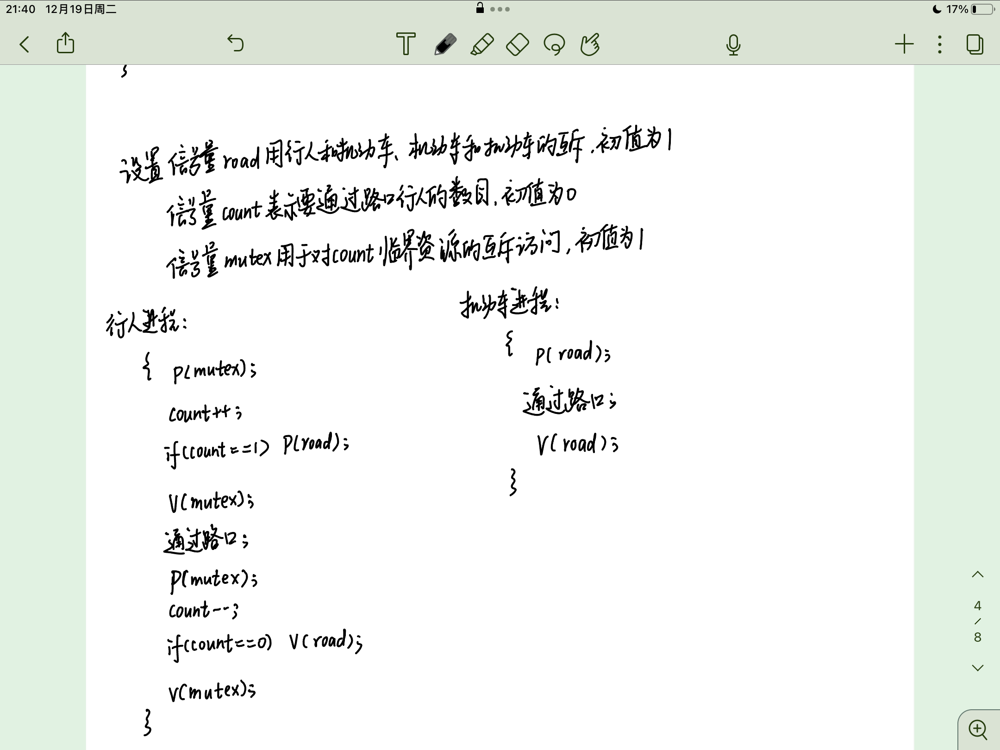
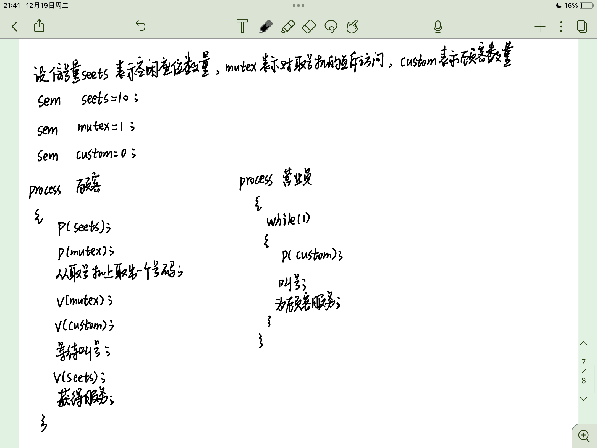
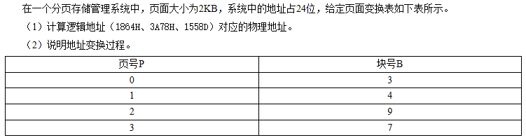

# 做答题

---

## 1. 5个进程P1、P2、P3、P4、P5几乎同时到达，预期运行时间分别为10、6、2、4、8个时间单位。各进程的优先级分别为3、5、2、1、4（数值越大，优先级越高）。请按下列调度算法计算任务的平均周转时间（进程切换开销可忽略不计）

```c++
1. 先来先服务（按P1、P2、P3、P4、P5顺序）算法。
2. 时间片轮转算法，假定时间片大小为2个时间单位。
3. 优先权调度算法
```


---

## 2. 作业调度算法的平均周转时间T和平均带权周转时间W


---

## 3. 资源分配情况


---

## 4. 有4个进程P1、P2、P3、P4。要求P1必须在P2、P3开始前完成，P2、P3必须在P4开始前完成，且P2和P3 不能并发执行。试写出这4个进程的同步互斥算法


---

## 5. 假设有一个路口，通行交通规则如下：只要没有机动车在通行，路口行人就可以通过，只有没有行人在通过路口且没有其他机动车在通过路口时该机动车才能通过。请用P、V操作描述行人和机动车通过路口的同步互斥过程



---

## 6. 系统中有多个生产者进程和消费者进程，共享用一个可以存1000个产品的缓冲区（初始为空），每个缓冲区大小完全一样。当缓冲区未满时，生产者进程可以放入1件其生产的产品，否则等待；当缓冲区不空时，消费者进程可以取走1件产品，否则等待。要求1个消费者进程从缓冲区连续取出10件产品后，其他消费者进程才可以取产品，请用信号量P，V（或wait()、signal()）操作实现进程间的互斥和同步，要求写出完整的过程；并指出所用信号量的含义和初值


---

## 7. 一组相互合作的进程P1、P2、P3、P4、P5、P6，其执行过程须满足如图所示的同步关系，请使用信号量机制对该组进程进行同步


---

## 8. 


---

## 9. 


---

## 10. 



---

## 11. 某系统采用动态分区分配方式管理内存，内存空间为640KB，高端40KB用来存放OS。在分配内存时，系统优先使用空闲区低端的空间。对下列的请求序列：作业1申请130KB、作业2申请60KB、作业3申请100KB、作业2释放60KB、作业4申请200KB、作业3释放100KB、作业1释放130KB、作业5申请140KB、作业6申请60KB、作业7申请50KB、作业6释放60KB，请分别画图表示出使用首次适应算法和最佳适应算法进行内存分配和回收后，内存的实际使用情况


---

## 12. 


---

## 13. 磁盘请求服务队列中要访问的磁道分别为38、6、37、100、14、124、65、67，磁头上次访问了20磁道，当前处于30磁道上，试按先来先服务、最短寻道时间优先和扫描算法，分别计算磁头移动的磁道数以及寻道花费的总时间。(假设磁头每移动一个磁道花费0.2ms)


---

## 14. 对于移动头磁盘，假设磁头现在位于25号磁道上（并向磁道号变小的方向移动），且基于磁道号的磁盘访问请求序列（按提出时间的先后次序排列）为39、62、18、28、100、130、90。?试采用最短寻道时间优先调度算法和电梯调度算法，分别给出相关磁盘访问请求处理的先后次序，并计算相应的平均寻道时间。(假设每移动一个磁道需要0.2ms)


---
