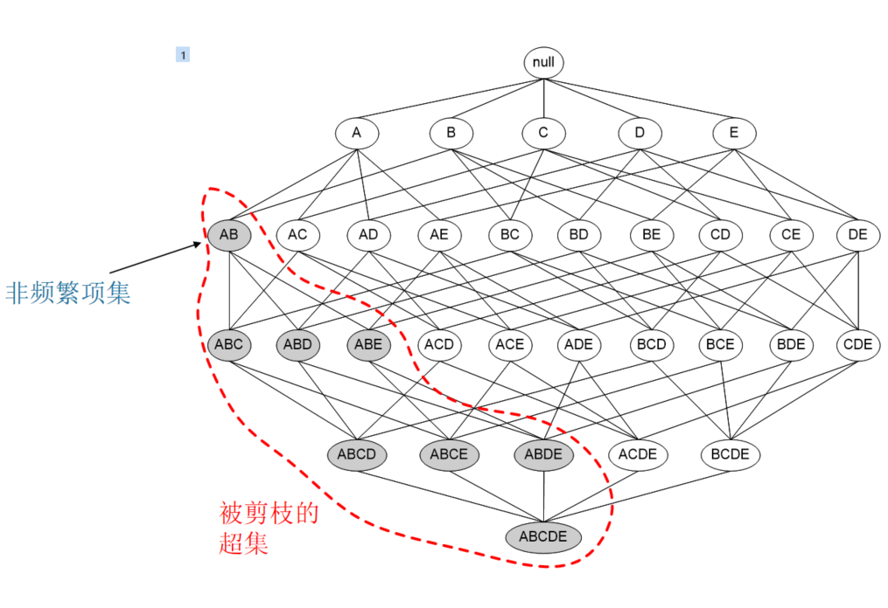
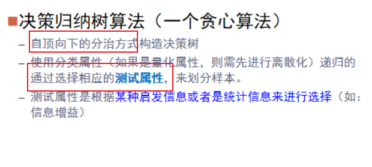

> 总结下ppt中出现“例子”的知识点

# 2-4.1 数据预处理-数据清理

例子：缺失值处理

# 2-4.2 数据预处理-数据集成-冗余数据处理-数值型-相关分析-标称数据-卡方检验

ppt p63-p67

例子 

# 2-4.3 数据预处理-数据归约-特征筛选-信息增益

简单总结：

> 熵：表示**随机变量的不确定性**
>
> 条件熵：表示在一个条件下 **随机变量的不确定性**
>
> 信息增益——熵-条件熵：表示在一个条件下 信息不确定性减少的程度。
>
> 举个例子
>
> > X(明天下雨)是一个随机变量，Y(明天阴天)也是随机变量。
> >
> > **X的熵**可以算出来，在**阴天情况下下雨**的信息熵我们如果也知道的话（此处需要知道其联合概率分布或是通过数据估计）即是**条件熵**。
> > ==信息增益===X的熵 - Y条件下的X的熵。
> >
> > 具体解释：原本明天下雨的信息熵（X也就是 下雨的熵）是2，条件熵是0.01（因为如果知道明天是阴天，那么下雨的概率很大，信息量少），这样**相减后为1.99**。
> >
> > 信息增益为1.99！——在获得阴天这个信息后（条件信息熵为0.01），下雨信息不确定性减少了很多，所以信息增益大。

包括 信息熵的例子

> 信息熵 刻画信息的混乱程度

条件信息熵的例子

信息增益的例子

> H(Y|X)如果很小 X的不确定性会减少很多
>
> 即为信息增益大很多

# 3-1 计算数据集中的支持度计数 支持度 

- 支持度计数 support count

求{Milk,Bread,Diaper}的支持度计数

为2

- 支持度

**包含项集的事务数**/**总事务数**

求{Milk,Bread,Diaper}的支持度

支持度计数/总事务数即可

support({Milk,Bread,Diaper})=2/5

# 3-1 衡量关联规则的强度-置信度、支持度的计算

这个支持度和上面略有些不同

当时做实验的时候就是！筛选条件定为 支持度大于xxx 来筛掉出现得比较少 没有代表性的项集

置信度>0.7 （我是这么设置的）来筛掉关心不强的 

最终获得的就是强关联的X Y（X与Y都代表项集 可以包含多个项哦~）

例子：

# 3-2.1 `Apriori`进行关联规则挖掘的准备知识

引入

## 挖掘关联规则一般步骤：

下面来看看

## `Apriori`算法的两个性质

具体举个例子呢

# 下面这两个例子必须自己跟着用手写着 走一遍！

# 3-2.2完整的一个`Apriori`算法例子

设置好最小支持度

## 算法重要细节

# 3-2.3 `Apriori算法` 例二

再举个例子

## 从频繁项集中产生关联规则

# 3-2.4  `Apriori算法` 例三 基于约束的关联规则挖掘

举个 `Apriori`算法的例子

来看看其基于约束的关联规则挖掘结果

# 3-3 FP增长算法

理解

p34-42

两个例子

优点：快

FP树生成的流程

# 3-4 关联模式的评估

关联分析算法往往产生大量的规则，而其中很大一部分可能是不感兴趣的。 因此，建立一组广泛接受的**评价关联模式质量的标准**是非常重要的。

下面来举个栗子

分析下这个例子

这个 茶-咖啡 的规则看起来是强关联的 喝茶的人就更倾向于与喝咖啡 （有75%）

但是！

不管你喝不喝茶 都有80%的倾向性去喝咖啡

嘶….

这规则 还强关联么？

引出兴趣因子 来计算 **规则置信度**和 **规则后件中项集的支持度 ** 之间的比率

# 4-2 经典分类算法-决策树 例一 高尔夫问题

Decision Tree 第一个例子 高尔夫问题

根据这些记录 可以画出决策树

根据不同的天气情况  可以得到不同的策略~

## 所以啥是决策树。

# 4-2 经典分类算法-决策树 

## 决策树构造

看一下决策树构造的具体流程

- 树以训练样本的单个节点开始

- 如果样本都在同一个类 则该节点成为树叶 并用该类标记

- 否则（样本在某个属性上有不同） 算法选择<u>**最有分类能力的属性**</u>作为决策树的当前节点

- 根据当前决策结点属性取值的不同 将训练样本数据集分为若干子集

  每个取值形成一个分枝 有几个取值形成几个分枝

  针对上一步得到的一个子集 重复进行先前步骤 递归形成每个划分样本上的决策树

  一单一个属性出现在一个节点上 就不必在该节点的任何后代考虑它

- 递归划分步骤仅在当下列条件之一成立时停止

- - 给定节点的所有样本属于同一类。
  - 没有剩余属性可以用来进一步划分样本。
  - 如果某一分枝，没有满足该分支中已有分类的样本，则以样本的多数类创建一个树叶。

## 属性选择度量

属性选择度量——

- 又称为：分裂规则 决定给定节点上的元组如何分裂
- 具有<u>**最好度量得分**</u>的属性选定为分裂属性

怎么选择“最有分类能力的属性”？

有三种度量！

### 信息增益及例子

- 信息增益(ID3算法)

参考了这个 [ID3 算法](https://blog.csdn.net/m0_37786726/article/details/79699972)

我们要<u>**选择具有最高信息增益（或最大熵压缩）的属性作为当前节点的测试属性。**</u>

信息增益 = 所有属性值的信息熵 - 某一个属性值的信息熵

这个值越大（即这一个属性值的信息熵很小） 说明<u>**这个属性值有更高的决策性 可以作为优先节点**</u>

所以要计算信息增益 需要先计算信息熵 

- - 信息熵：之前有学习过 再来复习下：

  至于信息熵 看到一篇很棒的文章 解释了信息熵的计算方式 一步步引出了决策树的分类算法 记录下：

  [一文看懂信息熵的本质——谈谈自己对信息熵的理解](https://blog.csdn.net/qq_35624030/article/details/105704098?ops_request_misc=%257B%2522request%255Fid%2522%253A%2522162269146916780366528626%2522%252C%2522scm%2522%253A%252220140713.130102334..%2522%257D&request_id=162269146916780366528626&biz_id=0&utm_medium=distribute.pc_search_result.none-task-blog-2~all~top_click~default-2-105704098.first_rank_v2_pc_rank_v29&utm_term=%E4%BF%A1%E6%81%AF%E7%86%B5&spm=1018.2226.3001.4187)

  

  - 其中 pi为D中的任一元组属于类 Ci概中元组分类需要的**信息熵率** 

  - (利用 A 分裂D 为v个部分后)分类D 需要的信息为:<!--即为条件信息熵-->
  - 以属性A分枝得到的**信息增益** 

  

# 4-2 【重要！必考~】决策树属性选择度量-信息增益-ID3算法

   X=s_comp=yes

  求用属性 `age` 将 数据进行划分 求信息增益的过程

  同理 另外的 `income student credit_rating`进行划分后 也是这么计算

  

  【1】先算数据整体的信息熵

 【2】 根据年龄做一个划分~

  

  计算对应的条件信息熵 即为

【3】计算出年龄这一属性的信息增益 

【4】同理 算出另外三个因素的信息增益

【5】得出结论 年龄这一属性的信息增益最大！选它为分裂属性

- 信息增益量（C4.5算法）

任何方法都有覆盖不到的地方

使用信息增益进行划分的一个极端情况：每个划分子集只有一个样本 即一个类

这时 Info(d)=0（整体的熵=0——太确定啦！没有任何其他的可能性）

C4.5算法（ID3算法的后继）使用了增益率来克服这个问题（规范化信息增益）

- Gini Index指标（CART算法）

# 5-3 聚类的划分方法-K均值算法

# 5-3 聚类的划分方法-DBSCAN算法
