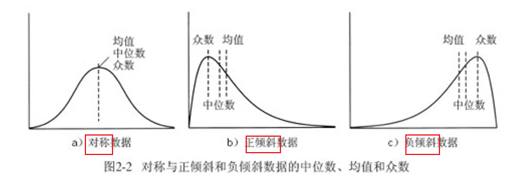
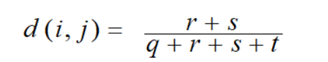
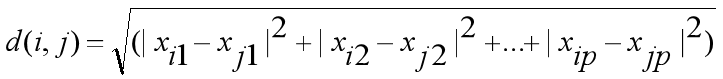
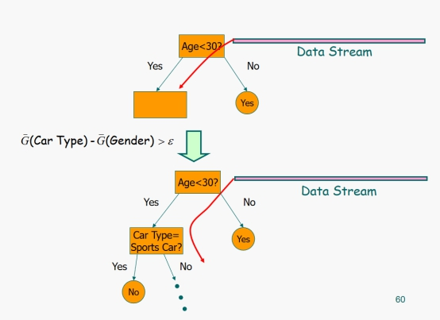

# 题型

- 选择题——单选、多选
- 大题——2道计算题 大部分是简答题 最后一题是综合题

> - 决策树的流程
> - 聚类有哪些类型
> - 数据挖掘的任务有哪些~
> - - 关联规则挖掘
>   - 分类/预测 与 回归
>   - 聚类分析
>   - 孤立点检测

# 第一章 数据挖掘与大数据简介


## 复习提纲

- 1.基本概念
- - 什么是大数据
  - 什么是数据挖掘
- 2.大数据4V特征
- 3.数据挖掘主要任务
- 4.KDD过程（数据挖掘是核心）
- 5.DM的挑战

## 1.基本概念

-  什么是大数据

无法在 <u>**一定时间内用常规软件工具**</u> 对其内容进行 <u>**抓取、管理、处理**</u> 的数据集合

是要更新处理模式才能具有更强的决策力、洞察发现力、流程优化能力 来适应海量、高增长率和多样化的信息资产

- 什么是数据挖掘

从<u>**大量**</u>的数据中挖掘那些 <u>**令人感兴趣的、有用的、隐含的、先前未知的、可能有用的 模式或知识**</u>。

关键是 “从大量的数据中挖掘令人感兴趣的模式或知识”

## 2.4V特征

大数据的4V指的是——

- <u>**Volume数据量大 **</u>
- <u>**Variety多样性 **</u>
- <u>**Value价值密度低**</u>
- <u>**实时性-Velocity速度快**</u>


## 3.数据挖掘主要任务

【1】<u>**关联（规则）分析 **</u> 如挖掘空气质量和气象条件之间的关系


【2】<u>**聚类分析**</u> 将数据归为不同的类 形成新的类别进行分析


【3】<u>**分类 预测 回归**</u> 找出描述和区分数据类或者概念的模型 让该模型可以预测未知的对象类标签


【4】<u>**离群点分析 **</u>分析孤立而原本会被当作噪音丢弃的数据 在欺骗检测中通过孤立点分析得到的结论


> 这些内容之后章节都会讲到！

## 4.【重要！】KDD过程（知识发现过程）

## 最后一道题 的 一个思路


KDD ： 从数据中获取知识

【1】数据清理：消除噪声和删除不一致数据

【2】数据集成：多种数据源可以组合在一起

【3】数据选择：从数据库中提取与分析任务相关的数据

【4】数据变换：把数据变换和统一成适合挖掘的形式

【5】<u>**数据挖掘**</u> ：核心步骤，**使用智能方法提取数据模式**

> 知识发现的核心！

【6】模式评估：根据兴趣度度量，识别代表知识的真正有趣的模式

【7】知识表示：使用可视化和知识表示技术，向用户提供挖掘的知识

> 注意 数据挖掘 是核心

## 5.数据挖掘的挑战

数据**容量** `Scale of Data` — VOLUMN

数据实时性 `Data Stream `  — VELOCITY

数据多样性 `Different format of data different sources ` — VARIETY

数据不确定性 `Uncertainty, missing value` 


# 第二章 认识数据与数据预处理


## 复习提纲

- 1.属性类型
- 2.数据的统计描述
- - 中心性
  - - 均值
    - 众数
    - 中位数
    - 中列数
  - 散度
  - - 极差
    - 最大
    - 最小
    - 四分位
    - 百分位
    - 方差
- 3.相似性度量
- - 标称 `d(i, j) = #不同/#总` 
  - 数值
  - - 欧式
    - 曼哈顿
  - 数据标准化/归化
  - - 最大最小法
    - Z-Score
  - 其他相似性
  - - 余弦
    - 马
    - 相关子数
    - KL散度
- 4.数据预处理
- 清理 -> 集成 ->归约 -> 变换 -> 离散化
- - 清理：缺值、噪声
  - 集成：冗余分析、卡方检验
  - 归约：采样 PCA/特征筛选（没太看懂
  - 变换：最大最小法

## 1.属性类型


- **<u>分类型</u>** 
- - 标称型 
  - 标称型目标变量的结果**只在有限目标集中取值**，比如真与假(标称型目标变量主要==用于分类==)
  - - 例: ID 号、眼球颜色、邮政编码
  - - 特殊：二元
  - 序数型
  - - 例: 军阶 、 GPA、用 {tall, medium, short}表示的高
- <u>**数值型**</u> 
- 数值型目标变量则可以**从无限的数值集合中取值**，如0.555，666.666等 (数值型目标变量主要用于==回归分析==)
- - 区间
  - - 例: 日历、摄氏或华氏温度.
  - 比率
  - - 例: 开氏温度、长度、计数
- **<u>标称属性</u>**的值是一些符号和事物的名称（比如头发的颜色）

> 标称：意味着“与名称相关”

- <u>**二元属性**</u> 是标称的一种 1代表有 0代表没有 

  如果是对称的说明无权重（例如男女性别）

  如果是非对称的说明有权重（例如检测结果为阴性/阳性）

数值属性：区间、比率


## 2.【重要！选填题】数据的统计描述

<u>**中心趋势度量**</u>：<u>**均值（中列数）、众数、中位数、**</u> —— （中心性描述）

<u>**数据的散布**</u>：<u>**极差、四分位数、四分位数极差、五数概括、盒图 **</u>—— （散布描述）

### 中心趋势度量

- 均值(mean)

均值 = 总和/个数

加权平均：考虑权重的均值

- - 中列数：

数据集的最大和最小值的平均值

- 中位数(median)

有序数据值的中间值。

大数据 ：近似值估计（线性插值方法）

- 众数：（mode）

在集合中出现最频繁的值。（一个数据集中可能有多个众数）

对于非对称的单峰数据,有以下经验关系：

`mean-mode ~ 3 * (mean-median) `即为 `均值 - 众数 近似等于 3*(均值 - 中间数)`



> 选填可能会考！


### 数据的散布

- 方差
- 标准差
- 极差

`max-min`

- 四分位数(quantile)
- 四分位数极差（距离）

 `IQR=Q3-Q1`

- 五数概括

[ min,Q1,median,Q3,max]


## 3.【重点 上机实习】（数据的）相似性度量

### 1.标称属性数据

标称变量是二元变量的拓广 它可以取多于两种状态值

相异性度量方法中 不匹配率为

`d（i，j）`=

计算方法为：`d（i，j）= (p - m) / p`

> m 状态取值匹配的变量数目 p 变量总数


### 2.二元变量属性数据


（2）对称的二元变量的相异度计算

<!--可能考计算题-->

> 对于对称属性，r+s是一个1一个0的总数和，q是两个1
>
> 如果是非对称则t被忽略



不对称的二元变量的相异度计算

> 二元变量的两个状态的输出不是同样重要


### 3.序数型变量数据


### 4.数值属性数据

<!--可能考计算题-->

使用**距离**来度量两个数据对象之间的<u>相似性/相异性</u>

- 闵可夫斯基(Minkowski) 距离


- ==曼哈顿距离==

> 一维  绝对值之和


- ==欧氏距离==

> 二维 开根号




- 数据标准化


### 5.混合型数据


### 6.相似性度量方式

<u>**余弦相似性（向量内积空间的夹角）**</u>

<u>**马氏距离（考虑数据局部分布）**</u>

<u>**相关系数 （皮尔森系数）**</u> 

<u>**KL散度（数据分布比较） 比较两个概率分布的接近程度**</u> 


## 4.【重点！】数据预处理

### 为什么要挖掘？

现实世界的数据是“肮脏的”

- 不完整的：有些感兴趣的属性缺少属性值，或仅包含聚集数据
- 含噪声的：包含错误或者“孤立点”
- 不一致的：在编码或者命名上存在差异


### 数据预处理的主要任务：

### 【重点】数据清理（数据的填充方法重点！）

> 【填充方法-重点】
>
> 人工填写空缺值：工作量大，可行性低
>
> - 使用一个全局变量填充空缺值：比如使用unknown或-∞替换
>
> - 使用属性的平均值填充空缺值
>
> - 使用最可能的值填充空缺值：使用像Bayesian公式或判定树这样预测的方法

> 空缺值 噪声数据 删除孤立点 解决不一致性

用均值或者用临近数

噪声使用过滤的方法（聚类、回归）

### 数据集成

> 将多个数据源中的数据整合到一个一致的存储中

集成多个数据库时，经常会出现冗余数据

**冗余分析**：相关分析，皮尔逊系数

卡方检验


### 数据归约

> 得到数据集的压缩表示，但可以得到相同或相近的结果

分为[1]维度规约和[2]数量规约 

还包括[3]数据压缩（非重点）

==维度规约==：PCA、小波分析、**特征筛选**

> **特征筛选：**
>
> 利用信息增益，信息熵等（信息增益越大越好）
>
> > 信息熵：刻画信息的混乱程度
> >
> > 
> >
> > 
>
> 

==数量规约==：回归、聚类、采样

### 数据变换

> 规范化和聚集
>
> 把数据变换和统一成适合挖掘的形式

### 数据离散化


  > 将连续数据进行离散处理

# 第三章 关联规则挖掘


## 复习提纲

- 1.定义
- - 关联规则挖掘
  - *频繁模式
  - *项集
  - *支持度/计数
  - *置信度
- 2.`Apriori`算法
- - 剪枝基本思想
  - `Apriori`流程、计算
  - 存在挑战及改进
- 3.FP-Growth算法
- - 如何构造FP树
  - 如何挖掘
- 4.评估方法
- - 支持度
  - 置信度
  - 兴趣因子

## 1.定义以及一些概念

- 关联数据挖掘的目的：在事务、关系数据库中的项集和对象中发现<u>**频繁模式**</u>、<u>**关联规则**</u>、<u>**相关性**</u>或者<u>**因果结构**</u>
- - 频繁模式：数据库中频繁出现的项集

- 支持度 `support`

  置信度 `confidence`

这两个标准来衡量事物关联规则的强度

- 支持度 support (X -> Y): 确定项集的频繁程度

包含项集的事务数与总事务数的比值

- 置信度
- 项集
- 频繁项集
- 置信度计算公式


## 2.Apriori算法

通过对数据的多次扫描来计算项集的支持度，发现所有的频繁项集从而生成关联规则。

剪枝基本思想：

**<u>性质一：如果一个项集是频繁的，则它的所有子集一定也是频繁的</u>**

**<u>性质二：相反，如果一个项集是非频繁的，则它的所有超集也一定是非频繁的</u>**

```
提高Apriori算法的方法

Hash-based itemset counting（散列项集计数），压缩候选k项集

Transaction reduction（事务压缩），删除不可能对寻找频繁项集有用的事务

Partitioning（划分），分而治之

Sampling（采样），选取原数据库的一个样本, 使用Apriori 算法在样本中挖掘频繁模式
```

## 3.FP-growth算法

优点：<u>**快**</u>。

该算法不同于Apriori算法的“产生-测试”范型。而是使用一种称作FP树的紧凑数据结构组织数据，并**<u>直接从该结构中提取频繁项集</u>**。

**基本思想：**

首先：将<u>**代表频繁项集的数据库**</u>压缩到FP树上

其次：将FP树划分为一组条件数据库（每个数据数据库关联一个频繁项或“模式段 ”），挖掘每个条件数据库获取频繁项集

#### 如何构造FP树？

1. 支持度排序

2. 构建FP树


## 4 支持度、置信度及兴趣因子


-


# 第四章 分类/回归

重点中的重点~


### 复习提纲

- 1.基本概念
- - 监督/无监督
  - 生成/判别
  - 分类 vs 回归
- 2.分类算法
- - 【很重要！】决策树
  - - 构造过程
    - 属性选择基本准则
    - 信息增益/率
    - 基尼指数
  - 【重要！】过拟合问题
  - - 如何避免
    - 决策树中xx
  - 【重要！】KNN
  - - 基本思想
    - 优缺点
  - `Naive Bayes`朴素贝叶斯
  - - 贝叶斯理论（优点）
  - 【重要！】SVM 支持向量机
  - - 支持向量/小样本/泛化能力
    - 基本思想
    - 非线性问题：核函数
  - 人工神经网络
- 3.集成学习
- - 学习准则
  - - 准确性
    - 多样性
  - 集成策略
  - - RF
    - Ada Boost
    - Stacking
- 4.评估
- - 准确度
  - 轻度
  - 吕四率？
  - F1？
  - 类不平衡：灵敏度、特效性


## 1.基本概念

## 监督学习 VS 无监督学习

- 监督学习

分类、预测等

> “告诉机器怎么学”


- 无监督学习

关联规则挖掘 聚类分析 都是无监督学习~

> “不告诉机器怎么学”


## 【重要！】模型分类


### 生成模型

希望从数据中<u>**学习/还原出原始的真实数据生成模型**</u>。

> 朴素贝叶斯  隐马尔可夫模型

### 判别模型：

 从数据中<u>**学习到**</u>不同类概念的<u>**区别从而进行分类**</u>。

> KNN SVM ANN 决策树

### 二者的区别

- 生成模型： 

- - 容量大时 生成模型容易接近真实模型
  - 能处理具有**隐含变量**的情景

- 判别模型
- - 速度快
  - 准确率较高

 

分类和回归

分类：根据训练数据集和类标号属性，构建模型来分类现有数据，并用来分类新数据

预测：建立连续函数值模型，预测未来的情况比如预测空缺值

## 2.决策树（DT）

## 【重要！】决策树的优缺点

优点

- 容易转化成分类规则
- 计算量相对较小 所以速度较快
- 准确性高 （挖掘出来的分类规则准确性高 便于理解）

缺点

- 容易过拟合
- 忽略了属性之间的相关性

## 【重要！】构建决策树的方法

构造方式：

 

## 【重要！】**属性选择基本准则：**

具有最好度量得分的属性（对分出的数据类别越“纯”）选定为分裂属性

三种度量：信息增益、信息增益率、Gini指标

### 【重要！】信息增益（ID3）：

 

信息增益：原来的信息与分裂后的信息只差，说明我们通过划分得到了多少信息

### 【重要！】信息增益率（C4.5）：

信息增益倾向于有大量不同取值的属性，但是每个划分只有一个类的时候info=0

C4.5 (ID3 后继) 使用增益率来克服这一问题(规范化信息增益)

公式为 信息增益/根据当前那个类利用信息熵公式算出来的值，越大越好

 

### Gini指数（CART）

Gini指数度量数据元组的不纯度，越小越好

 

 

如果是三个属性，要进行二元分裂，那么两两为一组，计算加权后的Gini指数

## 3.【重要！】过拟合问题和解决

- 过拟合：为了得到一致假设而使<u>**假设变得过度复杂**</u>称为过拟合。

- 过拟合是监督学习中普遍存在的一个问题，
- - 原因：因为训练样本<u>**只是**</u>真实情况下的<u>**一个抽样集**</u>
  - 结果：**泛化能力不强**


### 过拟合的解决策略

1. **增加样本集** 
2. **噪声去除**
3. **降低模型复杂度**
4. **模型选择正确**：正则项等（例如选择VC维）

## 【重要！】在决策树中如何避免过拟合

一棵归纳的树可能过分拟合训练数据 造成——

> - 分枝太多，某些反映训练数据中的异常，噪音/孤立点
> - 对未参与训练的样本的低精度预测

- 限制决策树的层数来限制树的生长
- 设定每个节点必须包含的最少记录数 节点个数小于这个最少记录数就停止分隔
- 树剪枝
- - 先剪枝 <u>**提前终止树构造**</u>
  - 后剪枝 <u>**从完全生长的树中剪去树枝**</u>（但是后剪枝的计算量代价比先剪枝方法大很多！尤其是大样本集中）（小样本中 后剪枝要好~）

## 4.【重要！】KNN

## 【重要！】KNN的优点和缺点

### 基本思想

算法步骤：

1.算距离：给定测试对象，计算它与训练集中的每个对象的距离；

2.找邻居：圈定距离最近的k个训练对象，作为测试对象的近邻；

3.做分类：根据这k个近邻归属的主要类别，来对测试对象分类。

### 优缺点

优点：简单，易于理解，易于实现，无需估计参数，无需训练

准确率一般较高
适合对稀有事件进行分类，特别适合于多分类问题

 

缺点：懒惰算法，对测试样本分类时的计算量大，内存开销大，评分慢

当类不平衡的时候，倾向于将类全部归类为大类
可解释性较差，无法给出决策树那样的规则。对噪声非常敏感

## 5.朴素贝叶斯

 

关注分子：

 

哪个更大

 

找更大的y（y是类别）

优点：概率输出，对文本分类效果较好

## 6.【重要！】SVM支持向量机

## 【重要！】SVM的优缺点

40min

### 什么是支持向量？


在<u>**分界线上的点**</u>称为支持向量

SVM的优点 ：

- 可以处理小样本
- 泛化能力强

## 7.人工神经网络

人工神经网络（ANN，Artificial Neural Networks）是在人类对大脑神经网络认识理解的基础上，人工构造的能够实现某种功能的神经网络。

它是理论化的人脑神经网络的数学模型，是基于模仿大脑神经网络结构和功能而建立起来的一种信息处理系统。

是一个多输入单输出的非线性阈值器件。

## 8.集成学习

（考的可能性不大 因为ppt里都没有~）

集成学习：通过<u>构建并结合多个学习器</u>来完成学习任务，个体学习器要有一定的“<u>**准确性**</u>”，并且要有“<u>**多样性**</u>”，即学习器间具有差异

> 多样性是核心~

## 9.分类评价指标

- **<u>准确度：Accuracy = (TP + TN)/All</u>**
- 精度


A代表实际，PR代表预测，左上角和右下角是预测正确的

**<u>准确度：Accuracy = (TP + TN)/All</u>**

**<u>误差率: 1 – accuracy</u>**

**<u>错误率 = （FP+FN）/ALL,(左下和右上为错误）</u>**

**<u>精度：被分类器预测为正确的占所有实际正确的比例TP/(TP+FP)</u>**

**<u>召回率：在所有实际正确的类别中被识别为正确的比例TP/(TP+FN)</u>**

#  10.练习题


# 第五章 聚类分析和噪声检测


## 复习提纲

- 1.什么是聚类？
- 2.聚类算法分类
- 3.KMeans DBSCAN算法
- 4.什么是离群点？
- 5.离群点种类
- 6.LOF

## 1.什么是聚类

无监督学习的一种，就是将数据分为多个簇(Clusters)，使得在同一个簇内对象之间具有较高的相似度，而不同簇之间的对象差别较大。


目的是寻找数据中<u>**潜在的自然分组结构**</u> ，<u>**让一个簇内的数据尽可能相似，不同簇的数据尽可能不同**</u>

## 2.聚类算法分类

一般而言，从<u>**不同的角度出发**</u>可以将各种聚类算法分成不同的类型。如按照聚类的基本思想可主要分为：

- 基于==划分方法==

给定一个有n个对象的数据集，划分聚类技术将构造数据k个划分，每一个划分就代表一个簇

对于给定的k，算法首先给出一个初始的划分方法，以后<u>**通过反复迭代的方法改变划分，使得每一次改进之后的划分方案都较前一次更好**</u>。经典的算法有：K-Means（K-均值）, K-Medoids（K-中心点）等

- 基于==层次==的方法

层次聚类方法对给定的数据集进行层次的分解，直到某种条件满足为止

<u>**凝聚的层次聚类**</u>一种自底向上的策略，首先将每个对象作为一个簇，然后合并这些原子簇为越来越大的簇，直到某个终结条件被满足。AGNES算法

<u>**分裂的层次聚类**</u>采用自顶向下的策略，它首先将所有对象置于一个簇中，然后逐渐细分为越来越小的簇，直到达到了某个终结条件。DIANA算法


- 基于==密度==的方法 

密度聚类方法的指导思想是，只要一个区域中的点的密度大于某个阈值，就把它加到与之相近的聚类中去。

这类算法<u>**能克服基于距离的算法只能发现“类圆形”的聚类的缺点**</u>，可发现任意形状的聚类，<u>**且对噪声数据不敏感**</u>

- 基于==网格==的方法

将对象空间量化为有限数目的单元，形成一个网格结构，所有的聚类都在这个网格结构中上进行。


## 3.【重要！】KMEANS 


- KMEANS

- - 选取 K 个点作为初始的类中心点，这些点一般都是从数据集中随机抽取的；
  - 将每个点分配到最近的类中心点，这样就形成了 K 个类，然后重新计算每个类的中心点；（一般用欧几里得距离公式算最近， 用每个维度的平均值重新计算每个类的中心点）
  - 重复第二步，直到类不发生变化，或者你也可以设置最大迭代次数，这样即使类中心点发生变化，但是只要达到最大迭代次数就会结束。


## 【*】KMEANS优缺点

优点：速度快，相对可伸缩和高效率

缺点：对K值敏感，对初值敏感，<u>**不适合非球形的簇**</u>，对于孤立点和噪声敏感

## 3.【重要！】DBSCAN

DBSCAN算法处理后的聚类样本点分为：核心点（core points），边界点（border points）和噪声点（noise），这三类样本点的定义如下： 

核心点：对某一数据集D，若样本p的-领域内至少包含MinPts个样本（包括样本p)，那么样本p称核心点。

边界点：对于非核心点的样本b，若b在任意核心点p的-领域内，那么样本b称为边界点。

噪声点：对于非核心点的样本n，若n不在任意核心点p的-领域内，那么样本n称为噪声点。

假设MinPts=4，如下图的核心点、非核心点与噪声的分布：

- 算法步骤：

- - 1）找到每个样本的-邻域内的样本个数，若个数大于等于MinPts，则该样本为核心点；
  - 2)找到每个核心样本密度直达和密度可达的样本，且该样本亦为核心样本，忽略所有的非核心样本；
  - 3）若非核心样本在核心样本的-邻域内，则非核心样本为边界样本，反之为噪声。

## 【*】缺点

缺点：

- 对参数EPS和Minspt非常敏感，但是这两个参数的选取主要依靠主观判断 

- 数据库比较大的话 会有比较大的IO开销


## 4.什么是离群点

“离群点是一个数据对象，它显著不同于其它数据对象，好像它是被不同的机制产生的一样。”

> 异常数据具有<u>**特殊的意义和很高的实用价值**</u> ，异常数据虽然有时候会作为离群点被排斥掉，但是却也有可能给我们新的视角，比如——
>
> - 在欺诈检测中，异常数据可能意味欺诈行为的发生
>
> - 在入侵检测中，异常数据可能意味入侵行为的发生。 

## 5.离群点种类

- 全局离群点    和别的点一点关系都没有
- 局部离群点    对全局来说不是离群点，但是对某个簇来说是离群点
- 集体离群点     某一个集体和其他不同

## 6.LOF 离群（异常/孤立）点检测

- 基于统计学的孤立点检测

- 基于距离的孤立点挖掘算法
- 基于偏离的孤立点检测
- 基于密度判断：

对象p的局部可达密度(Local Reachable Distance) 

对象p的局部可达密度为对象p与它的MinPts-邻域的平均可达距离的倒数。 

 

对象p的局部异常因子(Local Outlier Factor) 


Lrd是局部密度，所以孤立点的密度小，分子大，分母小，所以最终结果大

对象p的局部异常因子表示p的异常程度，局部异常因子愈大，就认为它更可能异常；反之则可能性小。


# 第六章 大数据分析

## 复习提纲

- 1.哈希技术
- - Mini Hash 最小哈希-签名矩阵的计算
  - LSH 局部敏感哈希
  - 其中 签名矩阵的计算 与 局部敏感哈希近似
- 2.数据流挖掘
- - 数据流挑战
  - 概念漂移（PCC(x)改变) 检测方法
  - 分类（VFDT —— > Hoe(fdig bound？)
  - 聚类 ： 线上 + 线下 
  - - 线上：数据抽象：微簇
    - 线下：`KMeans` `DBSCAN` 

## 1.哈希技术

 

## 【重点】Min哈希（最小哈希）

步骤

**1.计算签名矩阵** 

## 【重点！】会算签名矩阵！

2.通过签名矩阵寻找相似的签名

3.检测签名相似的是否真的相似（可选）.

主要思想：
把每一列转换成一个更小的签名矩阵C，让C足够小能放到内存里面，让C1和C2能表征原式数据的相似性

相似性用雅阁比距离来表征：a/a+b+c  a为两者都是1，b和c表示一0一个1

 

最小哈希定义：

首次出现1的行号

 

 

举个例子：

初始矩阵为

 

 

第一次遍历每一列的初始1，得到3 1 1 2

之后改变行的顺序重复算法，例如改成7654321后得到 2 2 1 3

再改变一次随机， 得到1 5 3 2

得到签名矩阵如下：

 

 

原理，可以证明有`sim（c1,c2）= pr(h(c1)=h(c2))`,但是实际可能会有一点出入

计算×5

签名矩阵计算，注意在签名矩阵是否更替的时候看原来位置是否为0

 

## 【重要】LSH（局部敏感哈希）

###  原因：

想要比较两个文档，一一校对是非常困难的，提出LSH

### 哈希的思想：

不一一匹配，把数据放在桶里，**每个桶里面的东西都非常相似**

将列向量划分为b块，对每一块进行映射，如果是相似的，那么至少有一块会映射到一个桶子中

将签名矩阵划分为几块，对每一块进行映射，候选对是至少散列到一个桶的对

 

 

概率随比例变化

将每一列划分为b个bands，然后每个bands分别放到桶里

如果相似性很大（超过0.5），至少有一个band全部放到一个桶里，就可以放在一起

 

## **2.** 数据流挖掘

## 【重点】如何检测概念漂移

数据流：<u>**持续的依次到达的对象**</u>，<u>**无穷长**</u>，<u>**有概念漂移**</u>（模式在发生漂移）

挑战：

**单程处理** **内存限制** **低时间复杂度** **概念漂移**

***\*概念飘移\****： 

 

在预测分析和机器学习中，概念漂移意味着模型试图预测的目标变量的统计特性随着时间以不可预见的方式改变。

条件概率发生变化

如下图，中间是真正的概念漂移，右边是虚假的，如果是P（x）变化整体不会变

 

 

***\*如何去检测数据漂移？\****

 

1. 使用分布

用于检测突变的概念漂移

对相同时间间隔（窗口）检测P(C|X)，如果检测到变化就说明发生了

问题：

1. 窗口大小不好确定 2. 学习漂移慢 3. 虚假的概念飘逸

 

ADWIM：处理当前数据，发生显著性变化就用新的代替老的

 

2. 错误率（error rate）

如果错误率突然变大，那么说明有概念漂移

缺点：1 对噪声敏感 2 对缓慢变化的数据难以处理 3 取决于学习模型的健壮性

 

***\*分类\****

传统静态不适用 ， 每一次输入一个数据后快速进行分类

 

 

方法：快速决策树 (VFDT)

动态地构造决策树，利用小部分数据构造

算法：

假如新来的数据满足关系，那么就划分一次


 

一个例子如下：

 

 

如果错误变多了，那么可以认为是发生了概念漂移，使用新的节点

 

 

***\*聚类\****

数据流抽象，分为在线和离线

线上把数据用合适的数据结构处理，线下用传统方式去进行聚类

 

 

 

 

 

微簇：用一个点表示几个相近的点

动态变化，线上（重要），如何去线上整出这些微簇

 

***\*簇特征（重要）\****：

CF = (N,LS,SS) N是点的个数，LS是横坐标之和，SS是横坐标平方和

为什么需要做处理？

\1. 可以计算这些点的中心和半径  2. 可以支持动态增量式计算

因为数据连续不断的进入，只需要加新增点的数据就可以（可加性、可减性）

 

 

 

## **3.** 【重点】Hadoop/spark的基本概念！


***\*什么是Hadoop/spark？\****

先说Hadoop：

Hadoop是一个软件框架，用于跨大型计算机集群对大型数据集进行分布式处理 TB PB 级别

后来Spark：

一个统一的完整的引擎

 

***\*Hadoop设计准则\****

需要处理大数据

需要跨数千个节点并行计算，大量廉价机器并行计算

分而治之

1.自动并行化 2.容错和自动恢复 3.给用户提供接口

 

***\*Hadoop生态\****

 

MapReduce（计算）和HDFS（存储） ZooKeeper用来协调

 

 

***\*HDFS怎么存储？\****

分而治之，分为很多块

Namenode和Datanode

用namenode去存哪一块放到哪个机器里面，存储数据原信息

 

Datanode存储实际数据，文件被存在各个节点里，拥有时钟机制，每隔几秒发送一次汇报工作，如果过了很久还没发送，那么默认你已经挂掉，重新创建节点存储被挂掉节点存储的数据

可以存储大数据

 

 

 

***\*MapReduce Vs Spark\****

Mapreduce 适用于一次操作，对多次操作不适用，共享机制落后，花费大量时间IO

 

Spark是用于推广reduce去支持同一引擎的新应用，拥有RDD支持内存计算，提供多种的API

 

 

***\*RDD 弹性分布式数据集\****

只读，便于内存计算

操作方式：

\1. Transformation

它从现有数据集创建一个新数据集,所有操作都是懒惰的

\2. Action

它在对数据集运行计算之后向驱动程序返回一个值

 