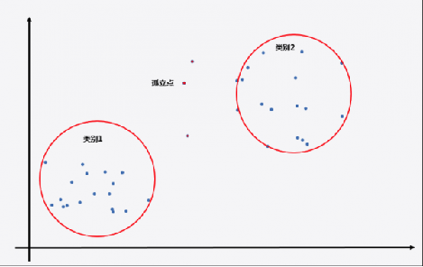
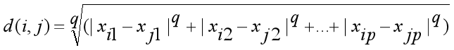
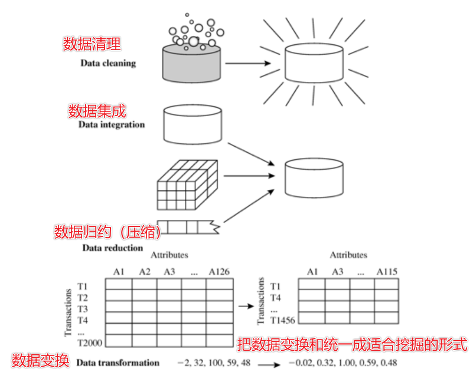
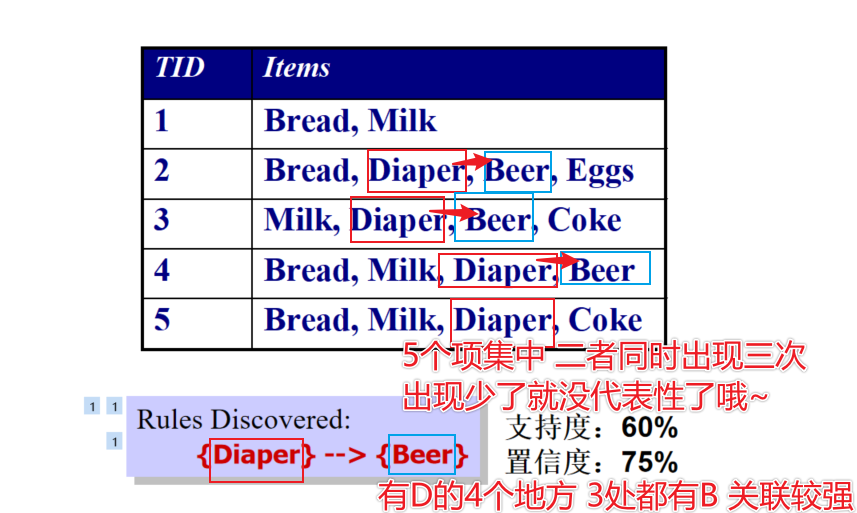
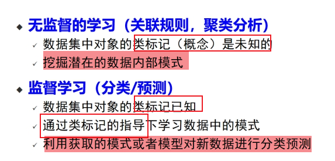
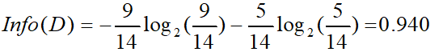
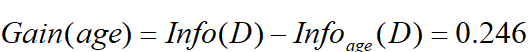
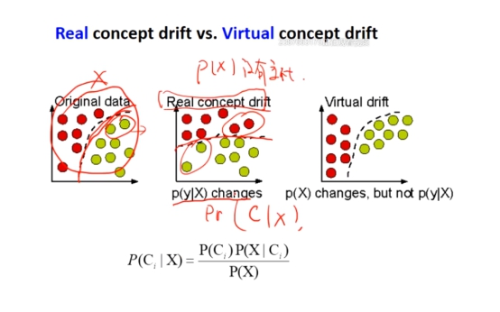

# 题型

- 选择题——单选、多选
- 大题——2道计算题 大部分是简答题 最后一题是综合题

> - 决策树的流程
> - 聚类有哪些类型
> - 数据挖掘的任务有哪些~
> - - 关联规则挖掘
>   - 分类/预测 与 回归
>   - 聚类分析
>   - 孤立点检测

# *1 什么是大数据

<u>**无法在一定时间内用常规软件工具**</u>对其内容进行 <u>**抓取、管理、处理**</u> 的数据集合

# *1 什么是数据挖掘

**从大量的数据中**挖掘那些<u>**==令人感兴趣的==**</u>、<u>**隐含的**</u>、<u>**有用的**</u>、<u>**可能有用的**</u>、<u>**先前未知的**</u> ==模式或知识==

# *1 数据挖掘主要任务

【1】<u>**关联（规则）分析 **</u> 如挖掘空气质量和气象条件之间的关系

【2】<u>**聚类分析**</u> 将数据归为不同的类 形成新的类别进行分析

【3】<u>**分类 预测 回归**</u> 找出描述和区分数据类或者概念的模型 让该模型可以预测未知的对象类标签

【4】<u>**离群点分析 **</u>分析孤立而原本会被当作噪音丢弃的数据 在欺骗检测中通过孤立点分析得到的结论

# ***1 知识发现过程 KDD

最后一道综合题可能会用到！

【1】数据清洗

消除噪声和删除不一致数据

【2】数据集成

多种数据源可以组合在一起

【3】数据选择

从数据库中提取与分析任务相关的数据

【4】数据变换

把数据变换和统一成<u>**适合挖掘**</u>的形式

【5】==数据挖掘==

核心步骤，使用智能方法提取数据模式

【6】**模式**评估

根据兴趣度度量，识别代表知识的真正有趣的模式

【7】**知识**表示

使用可视化和知识表示技术，==向用户提供挖掘的知识==

# *1 数据挖掘的挑战

- 数据容量
- 数据实时性
- 数据多样性
- 数据不确定性

# *2  属性类型-标称型数据、数值型数据

- ==标称型目标变量==的结果**只在有限目标集中取值**，比如真与假(标称型目标变量主要==用于分类==)
  - 例: ID 号、眼球颜色、邮政编码
- ==数值型目标变量==则可以**从无限的数值集合中取值**，如0.555，666.666等 (数值型目标变量主要用于==回归分析==)
  - - 区间
    - - 例: 日历、摄氏或华氏温度.
    - 比率
    - - 例: 开氏温度、长度、计数

# **2 数据的统计描述-中心趋势度量

选填可能考这些概念！

- 均值 mean

- ==中列数==

- 中位数

- 众数

> 对于非对称的单峰数据,有以下经验关系：
>
> `mean-mode ~ 3 * (mean-median) `即为 ==`均值 - 众数 近似等于 3*(均值 - 中间数)`==
>
> 

# **2 数据的统计描述-数据的散布

- 极差

max-min

- 四分位数
- 四分位数极差（距离）

IQR = Q3 - Q1

- 方差
- 标准差
- 五数概括

[ min,Q1,median,Q3,max]

# **2 数据的相似性度量-方法

m:状态取值匹配的变量数目,  p: 变量总数

==计算不匹配率==

相当于：不相同/总数

# *2 数据的相似性度量-计算二元变量的相似度

【1】获取列联表

【2】变量如果是对称的（两个状态的输出同等重要） 计算方法：简单匹配

变量如果是不对称的（两个状态的输出不是同等重要）

计算方法 忽略负匹配数目t

再举个栗子

# *2 数据的相似性度量-数值属性计算

使用**距离**来度量两个数据对象之间的<u>相似性/相异性</u>

- 闵可夫斯基(Minkowski) 距离

- ==曼哈顿距离==

走实线距离

> 一维  绝对值之和

- ==欧氏距离==

就是AB间直线距离

> 二维 开根号

# ***2 数据预处理-数据清洗-如何处理缺失值

- ==忽略元组==

- 人工填写空缺值

工作量大，可行性低

- 使用==一个全局变量==填充空缺值

**使用unknown或-∞替换**

- 使用==属性的平均值==填充空缺值
- 使用与给定元组属同一类的所有样本的平均值
- 使用最可能的值填充空缺值

# ***2 数据预处理-数据集成-冗余数据处理

- 标称数据——卡方检验

如下：计算一下~

- 数值型——相关分析

计算相关系数（皮尔逊相关系数）

# ***2 数据预处理-数据集成-卡方检验

# ***2 数据预处理-数据归约-策略

- ==维度归约==

小波分析、PCA、特征筛选

> 特征筛选利用了 信息增益、信息熵（信息增益越大越好）

- ==数量归约==

回归、聚类、采样、数据立方体聚集

- ==数据压缩==

使用变换~

# **2 数据预处理-数据归约-特征筛选

利用信息增益、信息熵等

信息增益越大越好~

# *3 数据集中的支持度计数 支持度 

- ==支持度计数 support count==

求{Milk,Bread,Diaper}的支持度计数

为2

- ==支持度==

**包含项集的事务数**/**总事务数**

求{Milk,Bread,Diaper}的支持度

支持度计数/总事务数即可

support({Milk,Bread,Diaper})=2/5

# **3 衡量关联规则的强度-置信度、支持度的计算

这个支持度和上面略有些不同

当时做实验的时候就是！筛选条件定为 支持度大于xxx 来筛掉出现得比较少 没有代表性的项集

置信度>0.7 （我是这么设置的）来筛掉关心不强的 

最终获得的就是强关联的X Y（X与Y都代表项集 可以包含多个项哦~）

例子：

# **3 关联规则挖掘的一般步骤

【1】产生频繁项集

【2】产生规则

# *3 `Apriori`算法的两个性质

具体举个例子呢

# **3  `Apriori`算法步骤

【1】自连接

【2】剪枝

# **3 `Apriori`算法从频繁项集中挖掘关联规则

【1】将项集Y分为两个非空子集 X Y-X 

【2】让  X -> Y-X  满足置信度阈值

# **3 FP-growth增长算法

可以直接从FP树结构中提取频繁项集

==构造方法：==

【1】支持度排序

【2】构建FP树

# ***3 `FP-growth` 和 `Apriori` 算法的异同：

相同：

都是关联规则挖掘，目的是==寻找频繁项==集

不同：

范式（）不同——

- `FP-growth算法`更快！ 但是内存消耗较大，实现难度较大
- `Apriori算法` 效率较低 但是内存消耗小 实现难度小

# ***3 关联规则评估 支持度、置信度、兴趣因子

关联分析算法往往产生大量的规则，而其中很大一部分可能是不感兴趣的。 因此，建立一组广泛接受的**评价关联模式质量的标准**是非常重要的。

下面来举个栗子

分析下这个例子

这个 茶-咖啡 的规则看起来是强关联的 喝茶的人就更倾向于与喝咖啡 （有75%）

但是！

不管你喝不喝茶 都有80%的倾向性去喝咖啡

嘶….

这规则 还强关联么？

引出兴趣因子 来计算 **规则置信度**和 **规则后件中项集的支持度 ** 之间的比率

# **4 监督与非监督学习

- 监督学习

==分类、预测==等

> “告诉机器怎么学”

- 无监督学习

==关联规则挖掘 聚类分析== 都是无监督学习~

> “不告诉机器怎么学”

# ***4 模型分类

- 生成模型

希望从数据中<u>**学习/还原出原始的只是数据生成模型**</u>

常见的方法：学习数据的联合概率分布

> 朴素贝叶斯  隐马尔可夫模型

- 判别模型

从数据中<u>**学习到**</u>不同类概念的<u>**区别从而进行分类**</u>

> KNN 决策树 SVM 人工神经网络

# ***4 生成模型与判别模型的区别

生成模型

- 容量大时 生成模型容易接近真实模型
- 能处理具有隐含变量的情景

判别模型

- 速度快
- 准确率较高

# **4 过拟合

过拟合：为了得到一致假设而使<u>**假设变得过度复杂**</u>称为过拟合。

过拟合是监督学习中普遍存在的一个问题，

原因：

- 训练样本只是真实情况下的一个抽样集

结果：

- 泛化能力不强

# ***4 过拟合的解决策略

- 增加样本集
- 噪声去除
- 降低模型复杂度
- 模型选择正确

# ***4 在决策树中如何避免过拟合

- 限制层高
- 设定每个节点必须包含的最少记录数 节点个数小于这个记录就停止分隔
- 树剪枝
- - 先剪枝 提前终止树构造
  - 后剪枝 从完全生长的树中剪去树枝

> 大样本 后剪枝计算量太大！
>
> 小样本选择后剪枝

# *4 泛化能力

机器学习算法对新鲜样本的适应能力

学习的目的是学到隐含在数据背后的规律

再通俗一点

泛化能力就是==训练后的得到的模型对未知数据的预测能力==

> 训练集训练之后的模型
>
> 对测试集的表现如何~

像如果训练的时候出现过拟合的话 模型的泛化能力就会很差！

# *4 结构风险，经验风险

结构风险

- 在经验风险的基础上加上表示模型复杂度的正则项（罚项）。

经验风险

- 机器学习模型关于训练数据集的平均损失称为经验风险
- 度量平均意义下模型预测效果的好坏。

# **4 决策树构造的流程

【1】决策树的构造规则

自顶向下构造

【2】划分样本方法

使用==分类属性==进行划分

# *4 决策树划分样本用三种度量方式选择分类属性

- 信息增益（ID3算法）：
- 信息增益率（C4.5算法）：
- Gini指数（==CART算法==）

# ***4 【重要！必考~】决策树属性选择度量-信息增益-ID3算法

 X=s_comp=yes

>   用属性 `age` 将 数据进行划分 求信息增益的过程
>

  同理 另外的 `income; student; credit_rating`进行划分后 也是这么计算

  

  【1】先算数据整体的信息熵

 【2】 根据年龄做一个划分~

  

  计算对应的条件信息熵 即为

【3】计算出年龄这一属性的信息增益 

【4】同理 算出另外三个因素的信息增益

【5】得出结论 年龄这一属性的信息增益最大！选它为分裂属性

# ***4 决策树的优缺点

优点：

- ==可解释性强==
- 容易转化成分类规则
- 准确性高 （挖掘出来的==分类规则准确性高== 便于理解）

缺点：

- ==容易过拟合==
- ==忽略了属性之间的相关性==

# ***4 KNN算法步骤

监督学习 分类算法 

【1】算距离

给你个测试对象，计算它与训练集中的每个对象的距离

【2】找邻居

**** 作为测试对象的近邻

【3】做分类

根据这k个近邻归属的主要类别 来对测试对象分类

# ***4 KNN算法优缺点

优点：

- 简单 易于理解 ==易于实现==

- ==无需估计参数 无需训练==

- 准确度一般较高
- 特别==适合于多标签问题==

缺点：

- ==懒惰算法 预测慢==
- 类不平衡性问题
- ==可解释性差==——无法给出决策树那样的规则
- ==对噪声很敏感==

# **4 什么是支持向量？

分界线上的点称为支持向量

# *4  线性可分与不可分问题

一般的，如果一个线性函数能够将样本完全正确的分开，就称这些数据是线性可分的，否则称为非线性可分的。

# *4 支持向量机间隔最大化的思想

# *5 什么是聚类？

把数据分为多个簇

**要求<u>同一个簇内对象之间有较高的相似度</u>&<u>不同簇之间对象的差别较大</u>**

# **5 聚类算法的四大类型

- 基于划分的方法 partitioning method

经典算法： **<u>K均值 K中心点算法</u>**

- 基于层次的方法 hierachical method

经典算法：<u>**AGNES自底向上凝聚算法 DIANA自顶向下分裂算法**</u>

- 基于密度的方法 density-based method

经典算法：<u>**DBSCAN算法**</u>

- 基于网格的方法 grid-based method

经典算法：<u>**STING算法 高维数据空间基于网格和密度的聚类方法**</u>

# 【重点！】5 Kmeans聚类 

# 【理解】5 DBSCAN算法步骤&缺点

算法步骤：

1）找到每个样本的-邻域内的样本个数，若个数大于等于MinPts，则该样本为核心点；

2）找到每个核心样本密度直达和密度可达的样本，且该样本亦为核心样本，忽略所有的非核心样本；

3）若非核心样本在核心样本的-邻域内，则非核心样本为边界样本，反之为噪声。

> DBSCAN算法处理后的聚类样本点分为：==核心点==（core points），==边界点==（border points）和==噪声点==（noise）

## 【*】缺点

缺点：

- 对参数EPS和Minspt非常敏感，但是这两个参数的选取主要依靠主观判断 

- 数据库比较大的话 会有比较大的IO开销

# *5 离群点的意义

“离群点是一个数据对象，它显著不同于其它数据对象，好像它是被不同的机制产生的一样。”

> 异常数据具有<u>**特殊的意义和很高的实用价值**</u> ，异常数据虽然有时候会作为离群点被排斥掉，但是却也有可能给我们新的视角，比如——
>
> - 在欺诈检测中，异常数据可能意味欺诈行为的发生
>
> - 在入侵检测中，异常数据可能意味入侵行为的发生。 

# **5 离群点类型

- 全局离群点 和别的点一点关系都没有
- 局部离群点 对全局来说不是离群点，但是对某个簇来说是离群点
- 集体离群点 某一个集体和其他不同

# *6 最小哈希步骤&定义

【1】计算签名矩阵

【2】通过签名矩阵寻找类似的签名

【3】检测签名相似是否真的相似（可选）

**主要思想：**
把每一列转换成一个更小的签名矩阵C，让C足够小能放到内存里面，让C1和C2能表征原式数据的相似性

相似性用雅阁比距离来表征：a/a+b+c  a为两者都是1，b和c表示一0一个1

**最小哈希定义：**

首次出现1的行号

# **【重要】6 最小哈希例子-签名矩阵的计算

初始矩阵为

第一次遍历每一列的初始1，最小哈希得到3 1 1 2

之后改变行的顺序重复算法，例如改成7654321后得到 2 2 1 3

再改变一次随机， 得到1 5 3 2

==得到签名矩阵如下==：

 

# 6 LSH局部敏感哈希

原因：想要比较两个文档，一一校对是非常困难的，提出LSH

哈希的思想：不一一匹配，把数据放在桶里，每个桶里面的东西都非常相似

将列向量划分为b块，对每一块进行映射，如果是相似的，那么至少有一块会映射到一个桶子中

# 6 数据流挖掘-如何检测概念漂移

预测分析和机器学习中 概念漂移意味着模型**试图预测的目标变量的统计特性**随时间**以不可预见的方式改变**

【1】使用分布

用于检测突变的概念漂移

对相同时间间隔（窗口）检测P(C|X)，如果检测到变化就说明发生了

> 缺点
>
> - 窗口大小不好确定
> - 学习漂移慢
> - 虚假的概念漂移

【2】错误率

如果错误率突然变大，那么说明有概念漂移

> 缺点
>
> - 对噪声敏感
> - 对缓慢变化的数据难以处理
> - 取决于学习模型的健壮性

如下图，中间是真正的概念漂移，右边是虚假的，如果是P（x）变化整体不会变

# ***6 Hadoop/spark的基本概念

Hadoop是一个软件框架 用于<u>**跨大型计算机集群**</u>对 <u>**大型数据集进行分布式处理**</u>

spark是后来的一个统一的完整的引擎