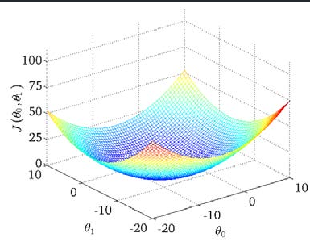

# 单变量线性回归

- [单变量线性回归](#单变量线性回归)
  - [1. 模型](#1-模型)
    - [1.1 符号标准](#11-符号标准)
    - [1.2  模型](#12--模型)
  - [2. cost function](#2-cost-function)
  - [3. gradient descent](#3-gradient-descent)
  - [4. batch gradient descent](#4-batch-gradient-descent)
  - [5. 实现代码](#5-实现代码)

---

## 1. 模型

### 1.1 符号标准

$m$ 代表训练集中实例的数量

$x$  代表特征/输入变量

$y$ 代表目标变量/输出变量

$\left( x,y \right)$ 代表训练集中的实例

$({{x}^{(i)}},{{y}^{(i)}})$ 代表第$i$ 个观察实例

$h$  代表学习算法的解决方案或函数也称为假设（**hypothesis**）

### 1.2  模型


---

## 2. cost function

loss function and cost function


当你改变w，获得不同的J，最终要使J最小


J与w，b的实际形状，如下为squared error cost函数下的:

 

---

## 3. gradient descent

梯度下降求J(w,b)的最小值，在有多个最优解情况下  

演示图：


梯度下降公式：


其中w,b为同时更新

a是学习率（learning rate），它决定了我们沿着能让代价函数下降程度最大的方向向下迈出的步子有多大

学习率过小或过大都会有影响


化简后的公式：


根据导数的概率得出化简后的公式：
例如w化简后：


---

## 4. batch gradient descent


**Repeat {**

​                ${\theta_{0}}:={\theta_{0}}-a\frac{1}{m}\sum\limits_{i=1}^{m}{ \left({{h}_{\theta }}({{x}^{(i)}})-{{y}^{(i)}} \right)}$

​                ${\theta_{1}}:={\theta_{1}}-a\frac{1}{m}\sum\limits_{i=1}^{m}{\left( \left({{h}_{\theta }}({{x}^{(i)}})-{{y}^{(i)}} \right)\cdot {{x}^{(i)}} \right)}$

​               **}**

---

## 5. 实现代码

```python
import numpy as np
import pandas as pd
import matplotlib.pyplot as plt


# 计算cost function值
# 求J的公式
def computeCost(X, y, theta):
    inner = np.power(((X * theta.T) - y), 2)  # 计算平方
    return np.sum(inner) / (2 * len(X))


# 梯度下降，求最小的J
def gradientDescent(X, y, theta, alpha, iters):
    temp = np.matrix(np.zeros(theta.shape))
    parameters = int(theta.ravel().shape[1])  # 函数变量个数
    cost = np.zeros(iters)
    # 循环迭代
    for i in range(iters):
        error = (X * theta.T) - y  # 误差

        # 求w, b的梯度
        for j in range(parameters):
            term = np.multiply(error, X[:, j])
            temp[0, j] = theta[0, j] - ((alpha / len(X)) * np.sum(term))  # 对应到公式中z

        # 更新
        theta = temp
        # 记录每次迭代的cost
        cost[i] = computeCost(X, y, theta)

    return theta, cost


path = "ex1data1.txt"
data = pd.read_csv(path, header=None, names=['Population', 'Profit'])

# 绘制数据的散点图
data.plot(kind='scatter', x='Population', y='Profit', figsize=(12, 8))
plt.show()

# 插入一列 全为1， 用于向量化， 比如求cost function时
data.insert(0, 'ones', 1)

cols = data.shape[1]  # 行数
X = data.iloc[:, 0: cols - 1]  # 读取所有行，去除去除最后一列
y = data.iloc[:, cols - 1: cols]  # 读取最后一列

# 转化为np数组
X = np.matrix(X.values)
y = np.matrix(y.values)
theta = np.matrix(np.array([0, 0]))  # theta为一行两列

print(computeCost(X, y, theta))  # theta初始为0

alpha = 0.01  # 学习率
iters = 1000  # 迭代次数

# 获得最好的w,b
g, cost = gradientDescent(X, y, theta, alpha, iters)

# 最小cost
computeCost(X, y, g)

# 绘制拟合函数
x = np.linspace(data.Population.min(), data.Population.max(), 100)
f = g[0, 0] + (g[0, 1] * x)  # g[0, 0] 为b g[0, 1] 为w

fig, ax = plt.subplots(figsize=(12, 8))
ax.plot(x, f, 'r', label="Prediction")
# 绘制散点图
ax.scatter(data.Population, data.Profit, label="Training Data")
ax.legend(loc=2)
ax.set_xlabel("Population")
ax.set_ylabel("Profit")
ax.set_title("Prodiction Profit vs. Population Size")
plt.show()

# 绘制cost图像
fig, ax = plt.subplots(figsize=(12, 8))
ax.plot(np.arange(iters), cost, 'r')
ax.set_xlabel("Iterations")
ax.set_ylabel("Cost")
ax.set_title("Error vs. Training Epoch")
plt.show()

```
