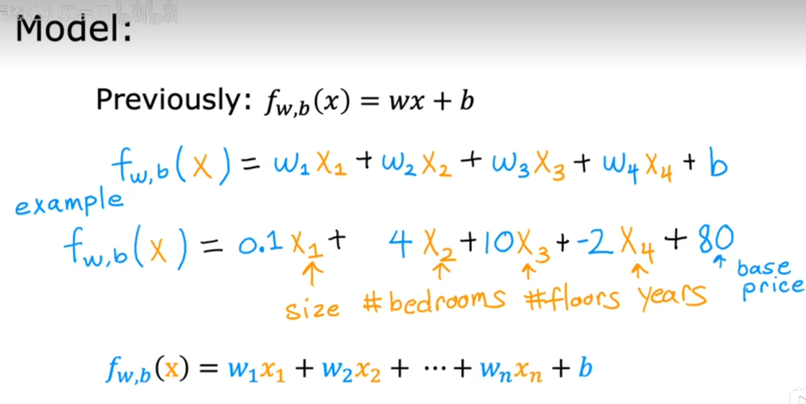
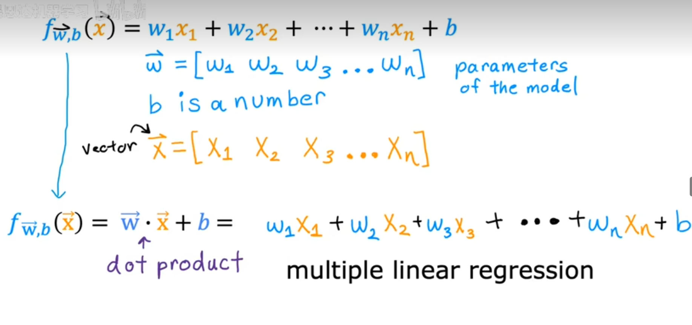
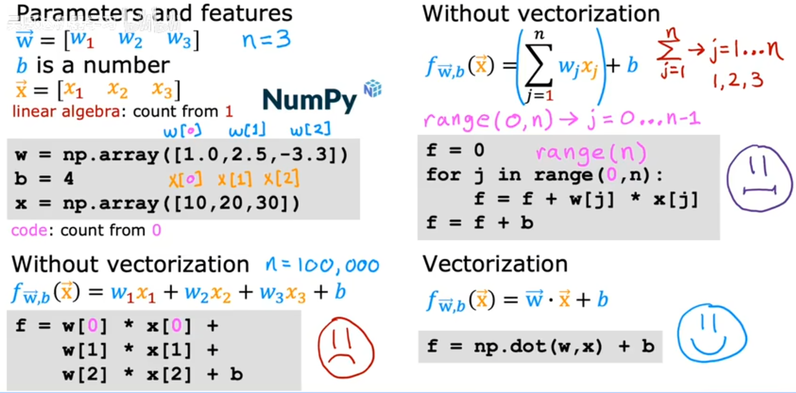
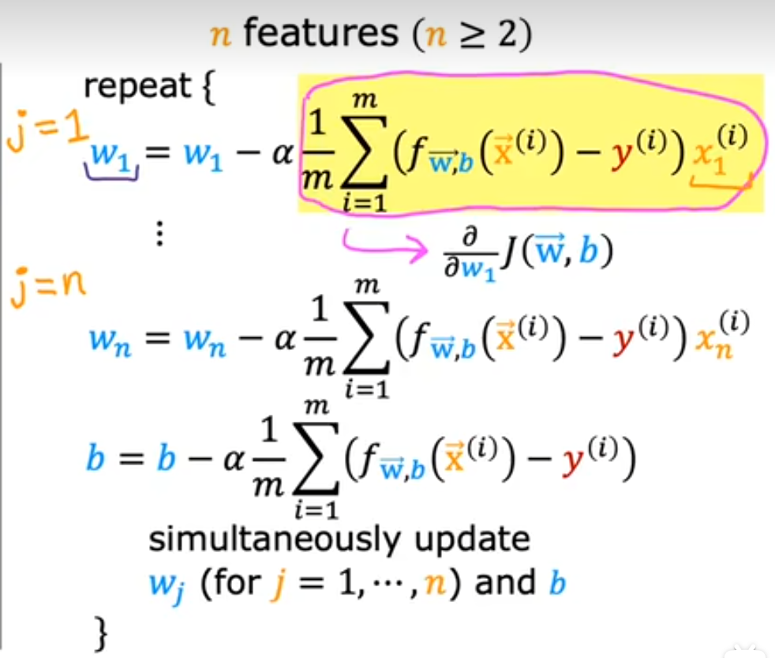
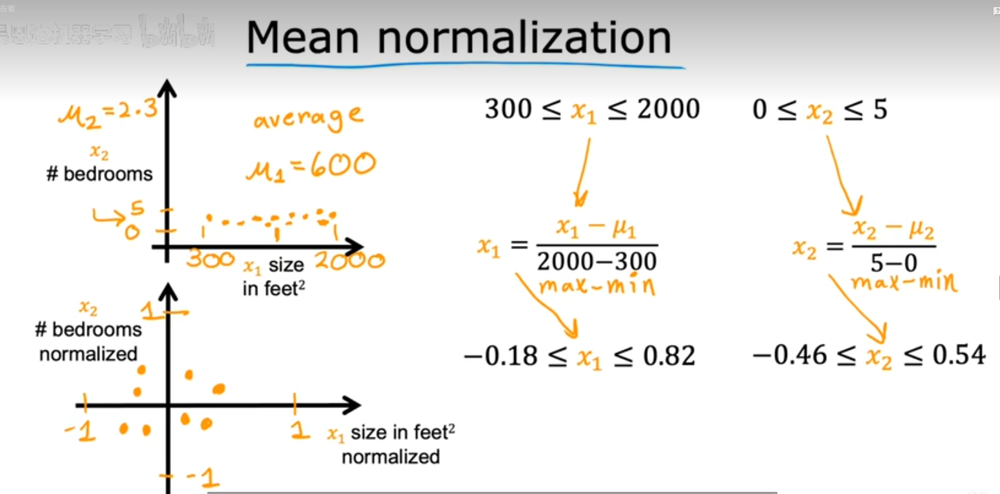
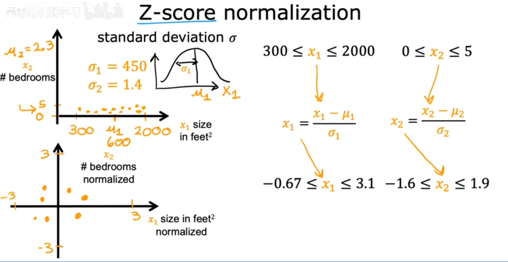
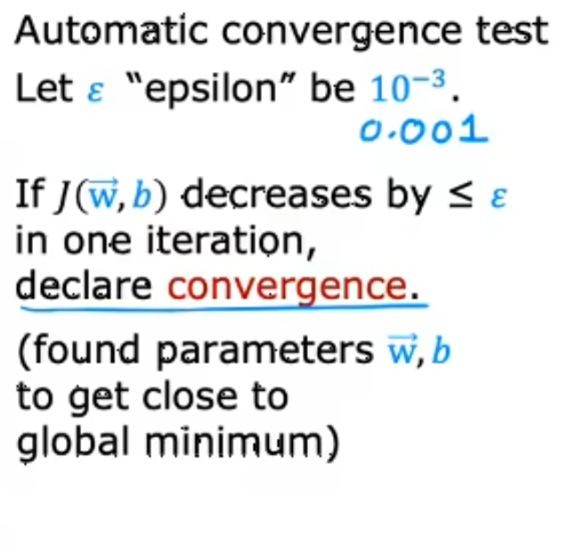
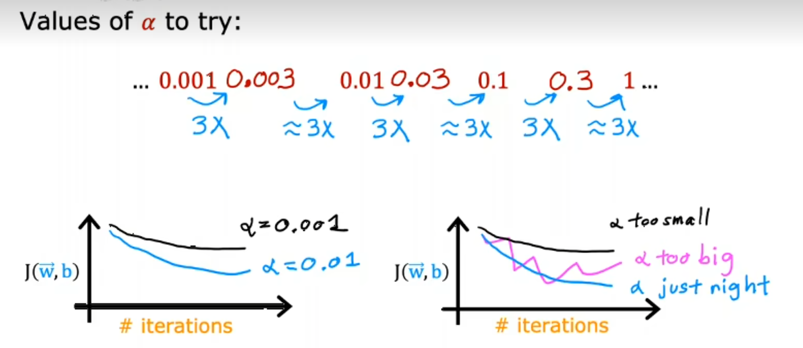
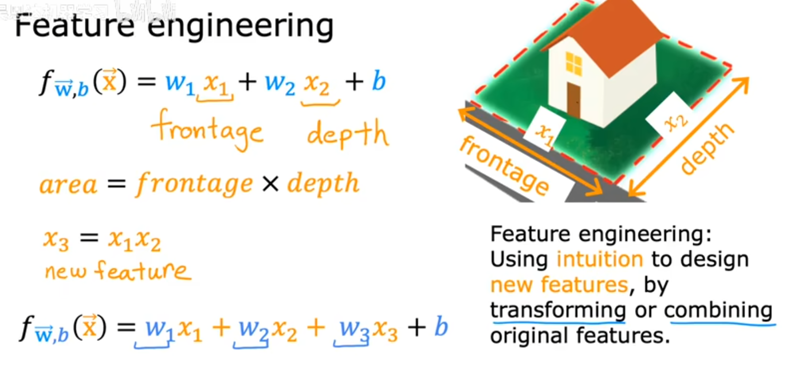
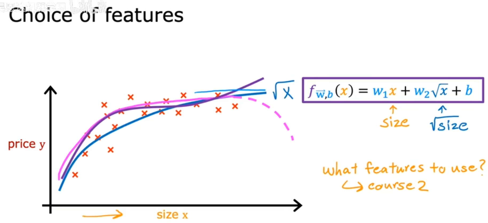

# 多变量线性回归

- [多变量线性回归](#多变量线性回归)
  - [1. model](#1-model)
  - [2. 矢量化](#2-矢量化)
  - [3. gradient descent](#3-gradient-descent)
  - [4. 特征缩放(rescale)](#4-特征缩放rescale)
    - [4.1 Mean normalization](#41-mean-normalization)
    - [4.2 Z-score normalization](#42-z-score-normalization)
  - [5. Automatic convergence](#5-automatic-convergence)
  - [6. Learning rate](#6-learning-rate)
  - [7. Feature engineering](#7-feature-engineering)
  - [8. 多项式回归(Polynomial regression)](#8-多项式回归polynomial-regression)
  - [9. code](#9-code)

---

## 1. model



其中w为向量



---

## 2. 矢量化



矢量化后运行效率更高

---

## 3. gradient descent



---

## 4. 特征缩放(rescale)

### 4.1 Mean normalization



### 4.2 Z-score normalization



---

## 5. Automatic convergence



---

## 6. Learning rate

选择正确的learning rate, 尝试使用不同的learning rate去测试



---

## 7. Feature engineering



--

## 8. 多项式回归(Polynomial regression)

 

---

## 9. code

```python
import numpy as np
import pandas as pd
from matplotlib import pyplot as plt
from mpl_toolkits.mplot3d import Axes3D

# 计算cost function值
# 求J的公式
def computeCost(X, y, theta):
    inner = np.power(((X * theta.T) - y), 2)  # 计算平方
    return np.sum(inner) / (2 * len(X))


# 梯度下降，求最小的J
def gradientDescent(X, y, theta, alpha, iters):
    temp = np.matrix(np.zeros(theta.shape))
    parameters = int(theta.ravel().shape[1])  # 函数变量个数
    cost = np.zeros(iters)
    # 循环迭代
    for i in range(iters):
        error = (X * theta.T) - y  # 误差

        # 求w, b的梯度
        for j in range(parameters):
            term = np.multiply(error, X[:, j])
            temp[0, j] = theta[0, j] - ((alpha / len(X)) * np.sum(term))  # 对应到公式中z

        # 更新
        theta = temp
        # 记录每次迭代的cost
        cost[i] = computeCost(X, y, theta)

    return theta, cost


# 读取文件
path = "ex1data2.txt"
data = pd.read_csv(path, header=None, names=['Size', 'Bedrooms', 'Price'])

fig = plt.figure(figsize=(12, 8))
ax = plt.axes(projection="3d")
ax.scatter3D(data.Size, data.Bedrooms, data.Price, color="green")
plt.title("3D")

plt.show()

# 特征归一化
data = (data - data.mean()) / data.std()

fig = plt.figure(figsize=(12, 8))
ax = plt.axes(projection="3d")
ax.scatter3D(data.Size, data.Bedrooms, data.Price, color="green")
plt.title("3D")

# 插入一列方便向量化
data.insert(0, 'Ones', 1)

cols = data.shape[1]
# x
X = data.iloc[:, 0:cols - 1]
# y
y = data.iloc[:, cols - 1:cols]

# 矩阵化
X = np.matrix(X.values)
y = np.matrix(y.values)
theta = np.matrix(np.array([0, 0, 0]))

alpha = 0.001
iters = 1000

# 梯度下降
g, cost = gradientDescent(X, y, theta, alpha, iters)

print(g)

# 计算下的cost
print(computeCost(X, y, g))

# 绘制cost图像
fig, ax = plt.subplots(figsize=(12, 8))
ax.plot(np.arange(iters), cost, 'r')
ax.set_xlabel("Iterations")
ax.set_ylabel("Cost")
ax.set_title("Error vs. Training Epoch")
plt.show()
```