# 逻辑回归

- [逻辑回归](#逻辑回归)
  - [1. 使用线性回归来分类](#1-使用线性回归来分类)
  - [2. Sigmoid function](#2-sigmoid-function)
  - [3. Model](#3-model)
  - [4. Output](#4-output)
  - [5. Decision boundary](#5-decision-boundary)
    - [5.1 Linear decision boundary](#51-linear-decision-boundary)
    - [5.2 Non-linear decision boundary](#52-non-linear-decision-boundary)
  - [6. Cost function](#6-cost-function)
    - [6.1 Training set](#61-training-set)
    - [6.2 Loss function](#62-loss-function)
    - [6.3 Cost function](#63-cost-function)
  - [7. Gradient descent](#7-gradient-descent)

---

## 1. 使用线性回归来分类

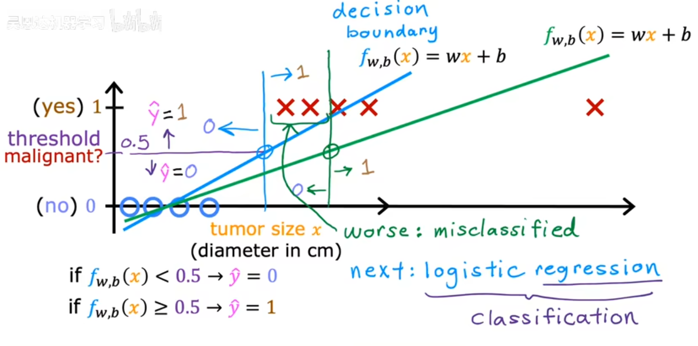

---

## 2. Sigmoid function

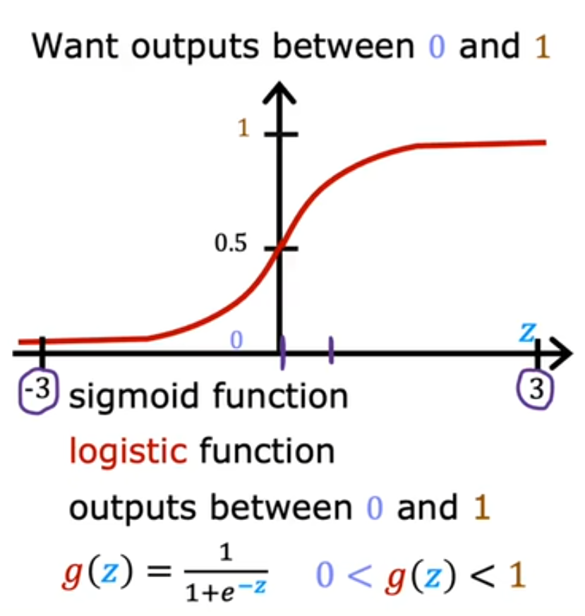

---

## 3. Model

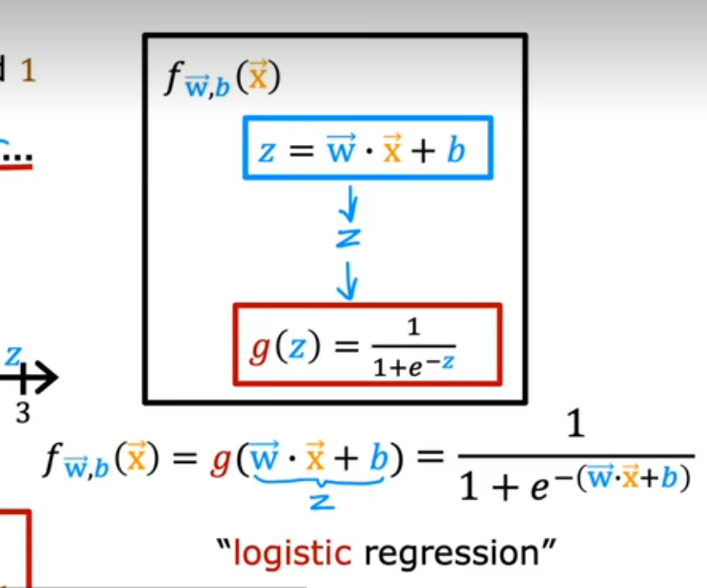

---

## 4. Output

当f大与阈值时y为1，小于阈值时y为0

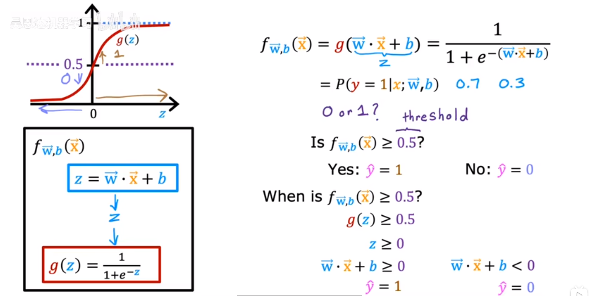

---

## 5. Decision boundary

### 5.1 Linear decision boundary

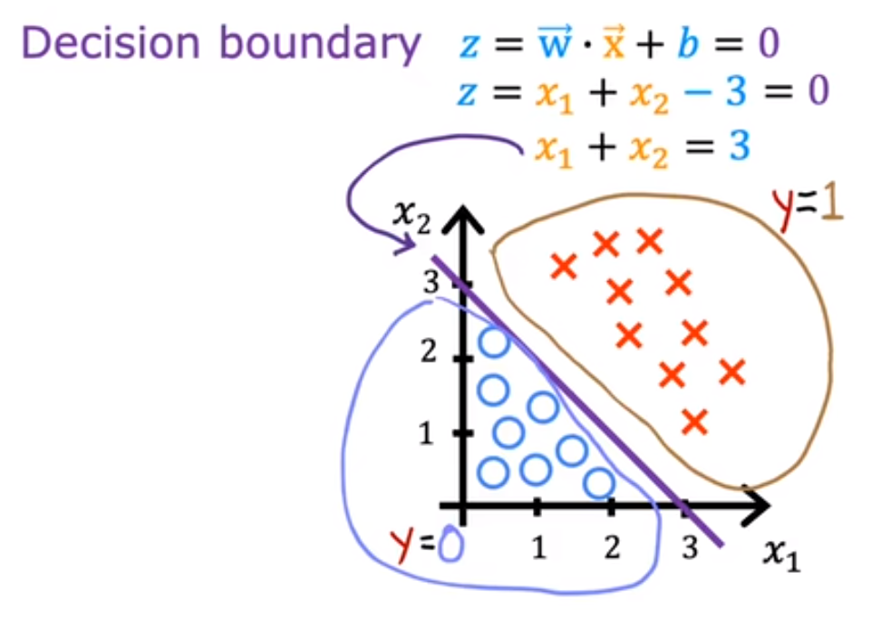

### 5.2 Non-linear decision boundary

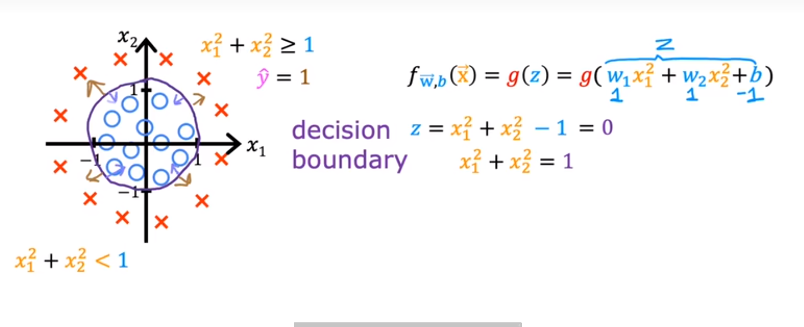

---

## 6. Cost function

### 6.1 Training set

tumor patient

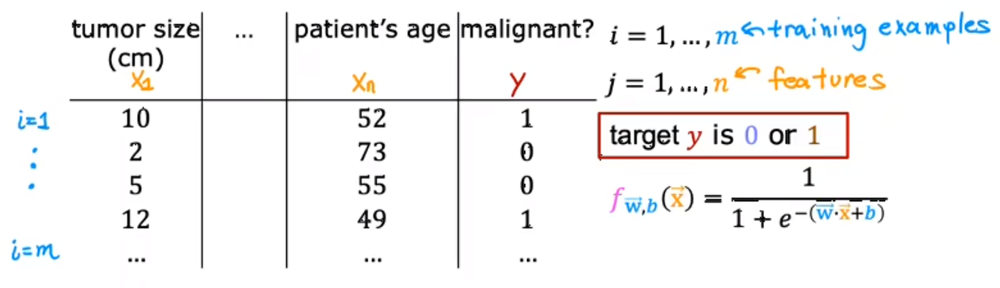

### 6.2 Loss function

使用均方误差不再合适

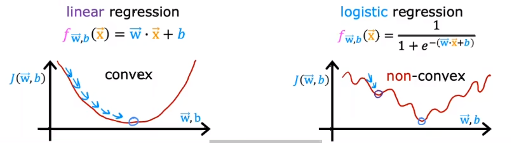

使用logistic loss function

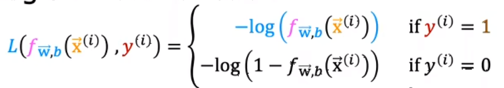

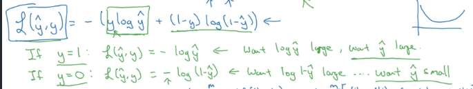

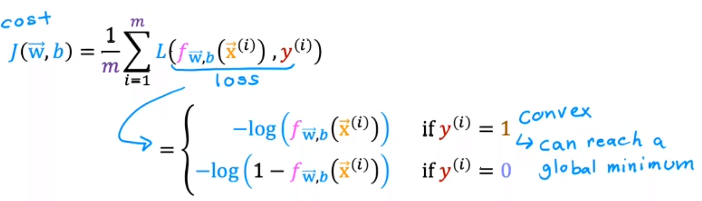

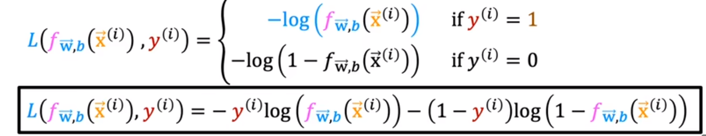

### 6.3 Cost function

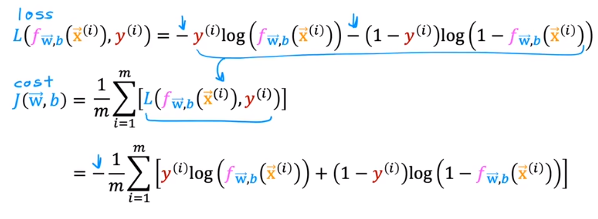

---

## 7. Gradient descent

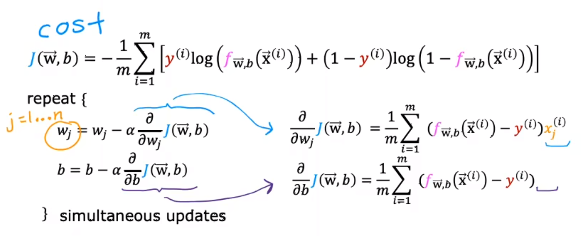

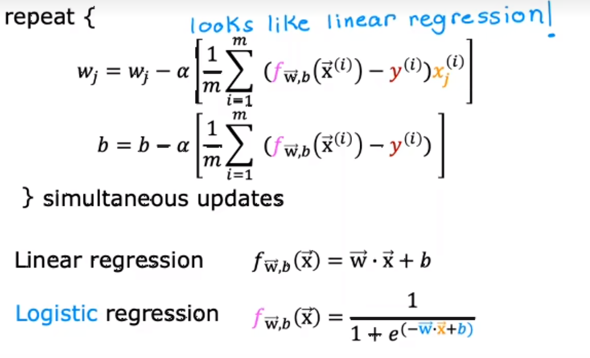

---
