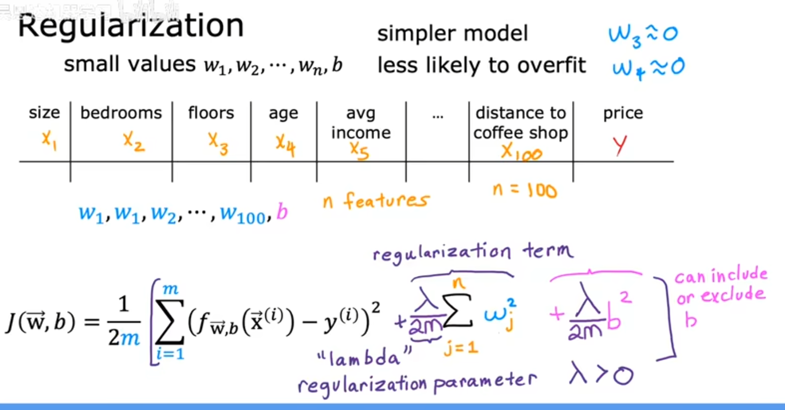

# 过拟合(Overfit)

- [过拟合(Overfit)](#过拟合overfit)
  - [1. example](#1-example)
    - [1.1. Regression example](#11-regression-example)
    - [1.2. Classification example5](#12-classification-example5)
  - [2. Address](#2-address)
    - [2.1 Collect more training examples](#21-collect-more-training-examples)
    - [2.2 Select features to include/exclude](#22-select-features-to-includeexclude)
    - [2.3 Regularization](#23-regularization)
  - [3. Regularization cost function](#3-regularization-cost-function)
  - [4. Regularized Linear Regression](#4-regularized-linear-regression)
    - [4.1 Gradient descent](#41-gradient-descent)
    - [4.2 Get the derivation term](#42-get-the-derivation-term)
  - [5. Regularized  logical regression](#5-regularized--logical-regression)

---

## 1. example

### 1.1. Regression example

对训练样本过于拟合，但对于预测样本表现不好

### 1.2. Classification example5

---

## 2. Address

### 2.1 Collect more training examples

### 2.2 Select features to include/exclude

### 2.3 Regularization

Reduce the size of parameters w[j]，惩罚w[j]参数

---

## 3. Regularization cost function

用lambda来惩罚w参数，也可以惩罚b参数，一般不好惩罚b参数

---

## 4. Regularized Linear Regression

### 4.1 Gradient descent

### 4.2 Get the derivation term

---

## 5. Regularized  logical regression

---
