# Neural Networks: Representation

- [Neural Networks: Representation](#neural-networks-representation)
  - [1. 需求预测](#1-需求预测)
    - [1.1 单个神经元](#11-单个神经元)
    - [1.2 多个神经元](#12-多个神经元)
    - [1.3 多个隐藏层](#13-多个隐藏层)
  - [2. Face recognition](#2-face-recognition)
  - [3. Car classification](#3-car-classification)
  - [4. Neural network layer](#4-neural-network-layer)
    - [4.1 layer 1](#41-layer-1)
    - [4.2 layer 2](#42-layer-2)
    - [4.3 output layer](#43-output-layer)
  - [5. More complex neural network](#5-more-complex-neural-network)
  - [6. forword propagation](#6-forword-propagation)
  - [5. Model for digit classification](#5-model-for-digit-classification)
  - [6. Tensorflow](#6-tensorflow)
    - [6.1 layer 1](#61-layer-1)
    - [6.2 layer 2](#62-layer-2)
    - [6.3 Build network architecture](#63-build-network-architecture)
  - [7. Forward prop](#7-forward-prop)
  - [8. Forward prop in numpy](#8-forward-prop-in-numpy)
  - [9. loops vs vectorization](#9-loops-vs-vectorization)
  - [10. Dense layer vectorized](#10-dense-layer-vectorized)

---

## 1. 需求预测

### 1.1 单个神经元

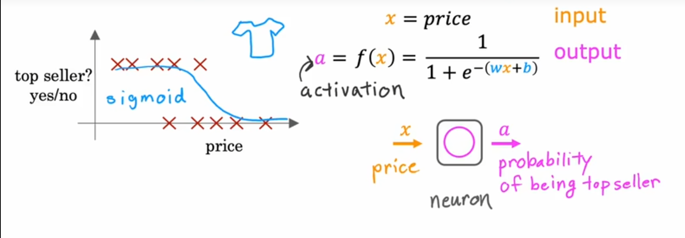

### 1.2 多个神经元

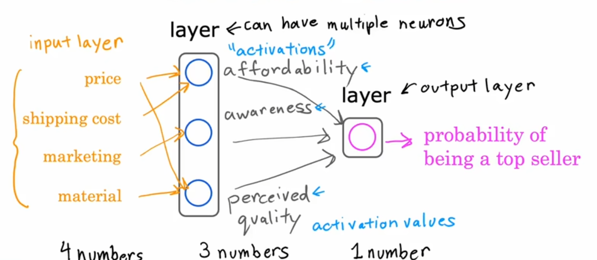

### 1.3 多个隐藏层

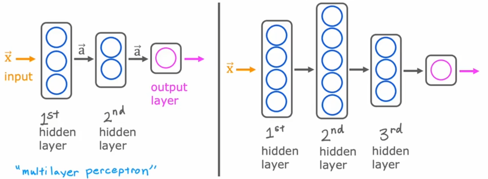

---

## 2. Face recognition

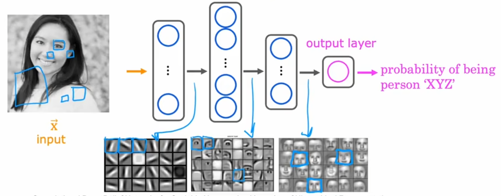

---

## 3. Car classification

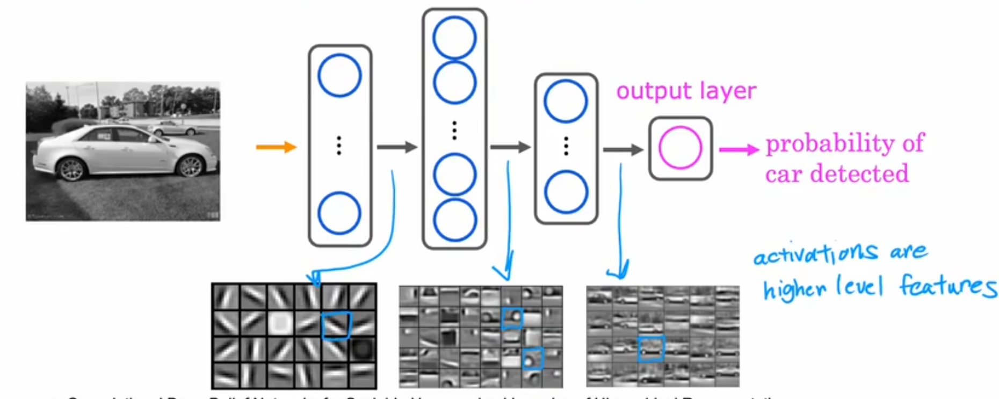

---

## 4. Neural network layer

### 4.1 layer 1

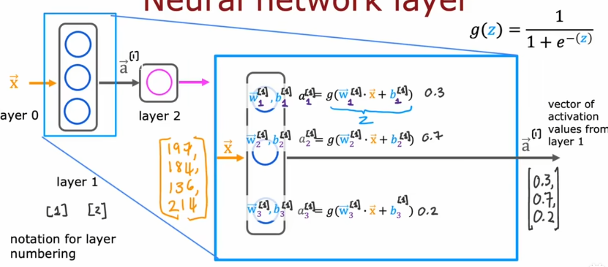

### 4.2 layer 2

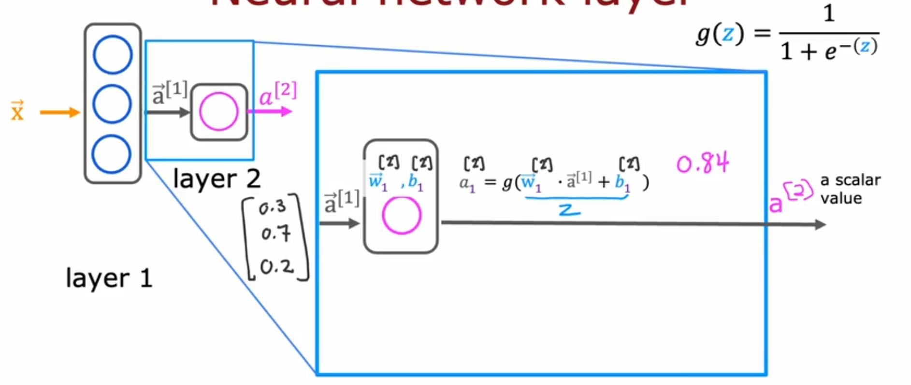

### 4.3 output layer

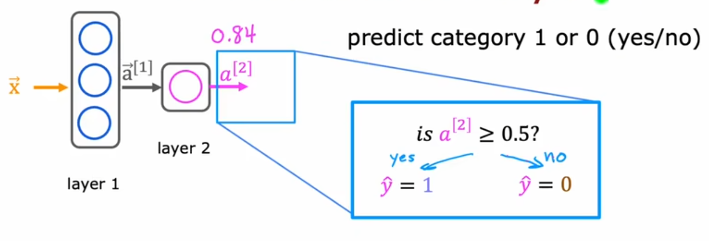

---

## 5. More complex neural network

activation function and activation value

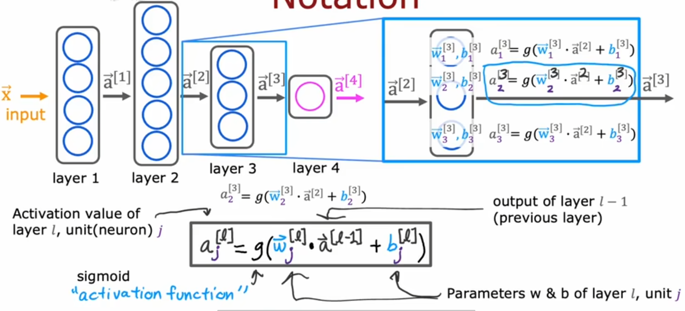

---

## 6. forword propagation

向前求a1, a2, a3, 为前向传播

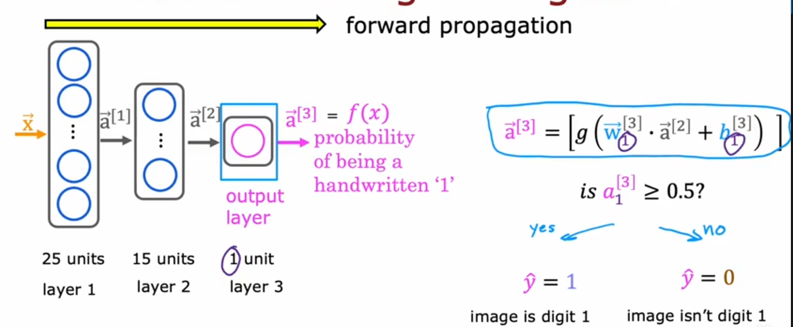

---

## 5. Model for digit classification

使用Tensorflow框架

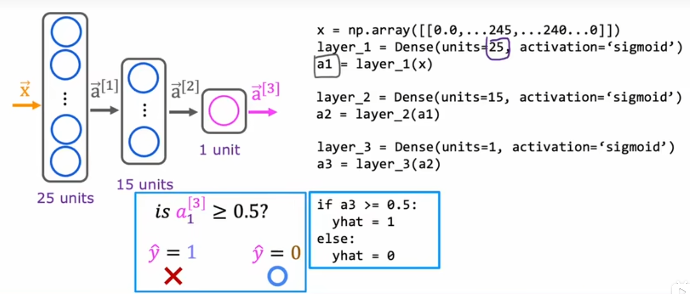

---

## 6. Tensorflow

### 6.1 layer 1

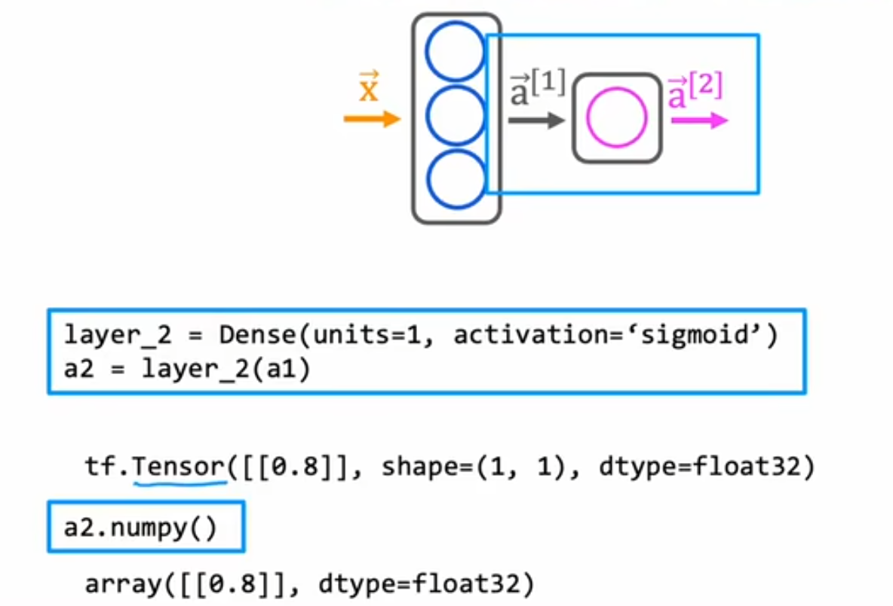

### 6.2 layer 2

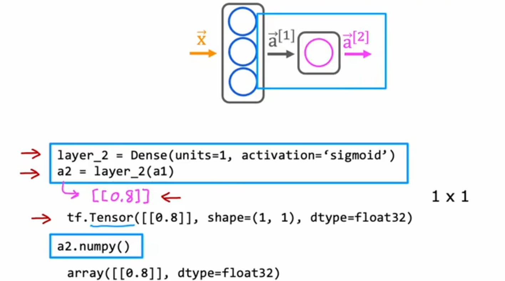

### 6.3 Build network architecture

使用Sequential函数

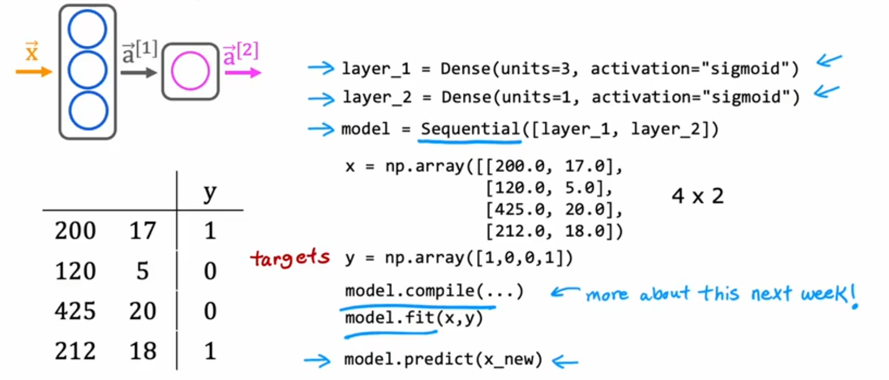

---

## 7. Forward prop

计算a1, 分别计算a1_1, a1_2, a1_3

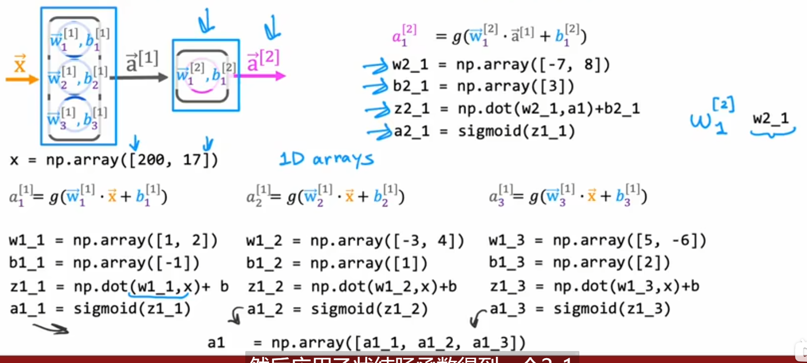

---

## 8. Forward prop in numpy

dense function

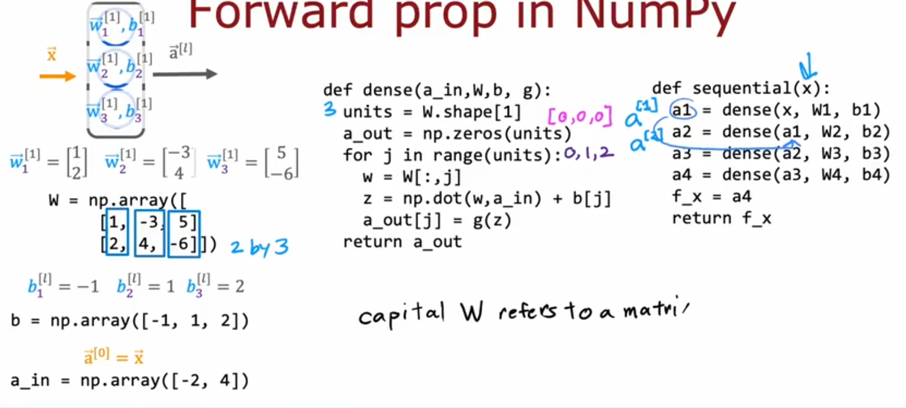

---

## 9. loops vs vectorization

用矩阵乘法代替循环计算，矢量化实现

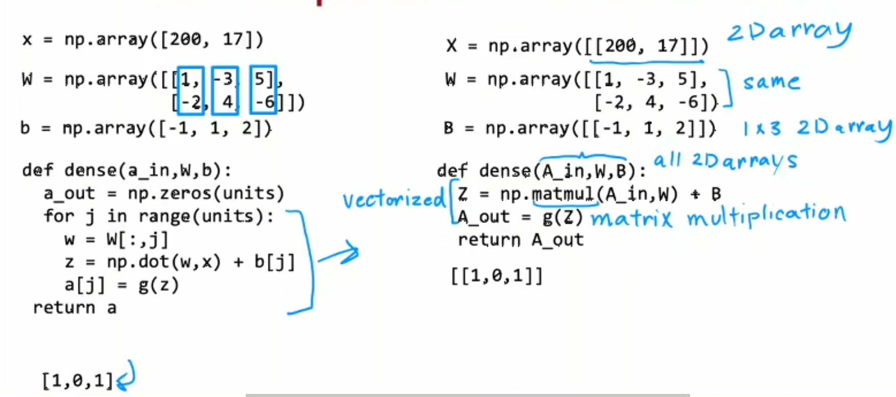

---

## 10. Dense layer vectorized

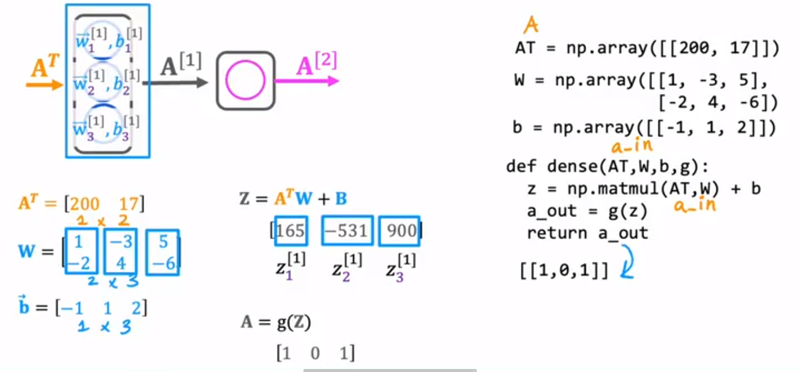

---
