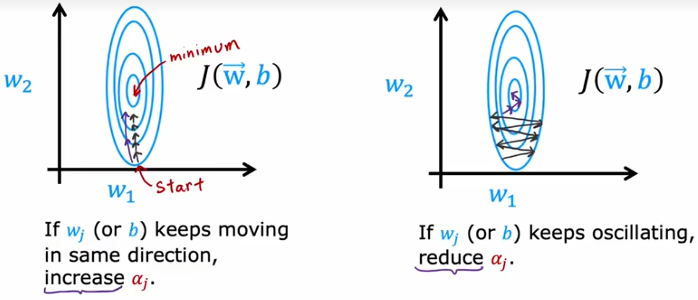

# 神经网络的学习(Neural Networks: Learning)

- [神经网络的学习(Neural Networks: Learning)](#神经网络的学习neural-networks-learning)
  - [1. Train a neural Network in Tensorflow](#1-train-a-neural-network-in-tensorflow)
  - [2. Model training steps](#2-model-training-steps)
    - [2.1 Create the model](#21-create-the-model)
    - [2.2 Loss and cost functions](#22-loss-and-cost-functions)
    - [2.3 Gradient descent](#23-gradient-descent)
  - [3. Activation function](#3-activation-function)
    - [3.1 Choose activation function](#31-choose-activation-function)
    - [3.2 Why we need activation function](#32-why-we-need-activation-function)
  - [4. Multiclass classification](#4-multiclass-classification)
    - [4.1 Example](#41-example)
    - [4.2 Softmax](#42-softmax)
  - [5. Multi-label classification](#5-multi-label-classification)
  - [6. 高级优化方法](#6-高级优化方法)

---

## 1. Train a neural Network in Tensorflow

---

## 2. Model training steps

### 2.1 Create the model

### 2.2 Loss and cost functions

### 2.3 Gradient descent

---

## 3. Activation function

### 3.1 Choose activation function

二分类问题使用sigmoid，回归模型选择Linear，ReLU，取决于y

output layer

Hidden Layer

更多选择ReLU，ReLU计算更快，其次只有一边是平坦的，梯度下降时更快

### 3.2 Why we need activation function

---

## 4. Multiclass classification

### 4.1 Example

### 4.2 Softmax  

cost functions

Neural Network with Softmax output

more accurate

---

## 5. Multi-label classification

可以用3个神经网络，或者1个神经网络

---

## 6. 高级优化方法

Adam algorithm intuition

对每个参数使用不同的学习率

increase or reduce

---
