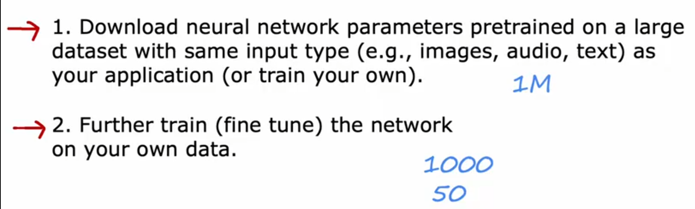

# 机器学习系统设计

---

## 1. Evaluate model

划分训练集和测试集

Train/Test procedure for linear regression(with squared error cost)

Train/Test procedure for classification problem

---

## 2. Model selection and Training/cross validation/test set

选择合适的模型

将数据集分为训练集，交叉验证集，测试集

choosing a neural network architecture

---

## 3. diagnosing bias and variance

多项式的项数与J的关系

high bias 在训练集上不佳，high variance 在交叉集上不佳

---

## 4. Linear regression with regularization

选择合适的参数

不同的参数和J的关系

---

## 5. Establishing a baseline level of performance

Bias/variance examples

---

## 6. Learning curves

High bias

High variance

---

## 7. Debugging a learning algorithm

---

## 8. Error analysis

随机抽取100个查看，得出错误分析

---

## 9. Adding data

### 9.1 Data augmentation

旋转，放缩，失真，增加噪声等

使照片扭曲

增加噪声等

### 9.3 Data synthesis

using artificial data inputs to create a new training example

通过计算机创建一些数据出来，例如生成不同的字体

---

## 10. Transfer learning

下载已经训练好的神经网络参数使用，进一步训练或微调

---

## 11 误差指标(Precision/Recall)

True positive，True negative，False positive，False negative

precision/recall

\

当你把threshold提升到0.7时，Precision higher，Recall lower
              下降到0.3时，Precision lower，Recall higher

precision 和 recall的关系

使用F1比较不同的precision/recall，使用F1 score高的

---
