# Decision trees model

- [Decision trees model](#decision-trees-model)
  - [1. Decision Tree](#1-decision-tree)
  - [2. Decision Tree Learning](#2-decision-tree-learning)
    - [2.1 Decision problem](#21-decision-problem)
    - [2.2 Measuring purity](#22-measuring-purity)
  - [3. Choosing a split](#3-choosing-a-split)
  - [4. 流程](#4-流程)
  - [5. 回归树](#5-回归树)
  - [6. 使用多颗决策树](#6-使用多颗决策树)
  - [7. XGboost](#7-xgboost)
  - [8. When to use decision trees](#8-when-to-use-decision-trees)

---

## 1. Decision Tree

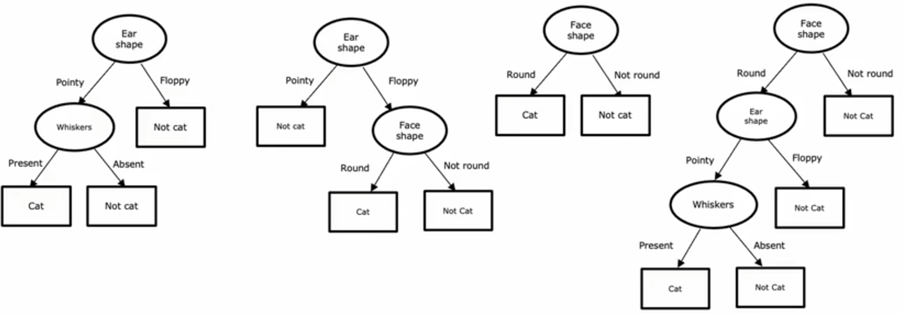

---

## 2. Decision Tree Learning

### 2.1 Decision problem

- Decision 1: How to choose what feature to split on at each node?
  - Maximize purity or minimize impurity
- Decision 2: when do you stop splitting?
  - 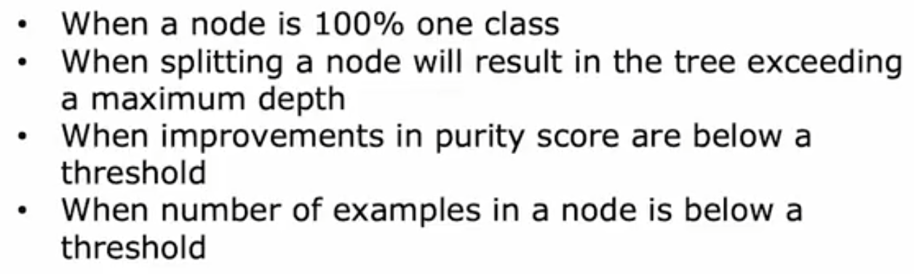
  
### 2.2 Measuring purity

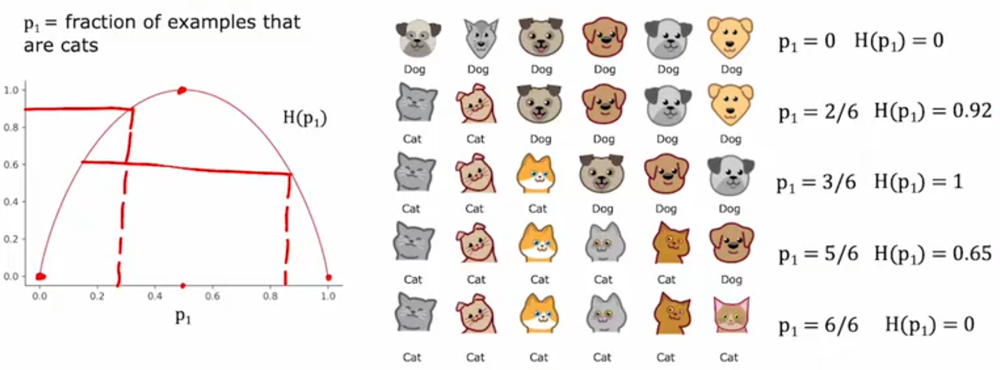

entropy function

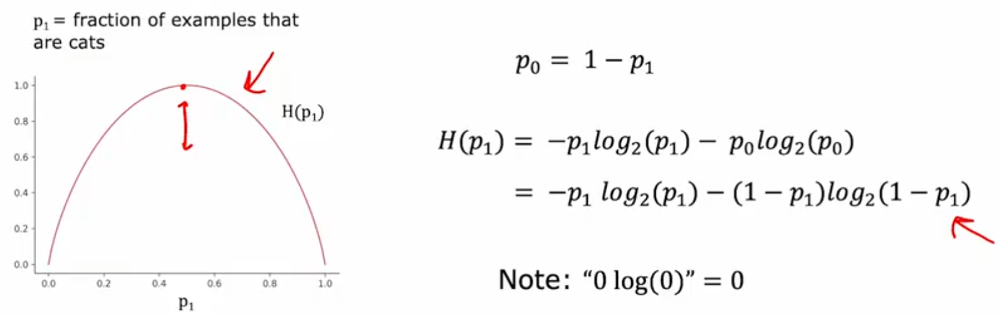

---

## 3. Choosing a split

计算信息增益

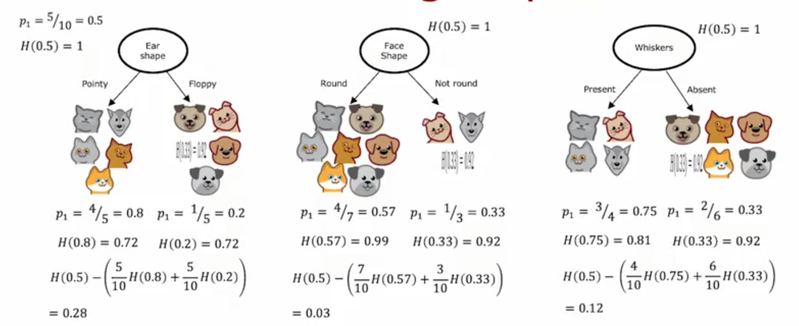

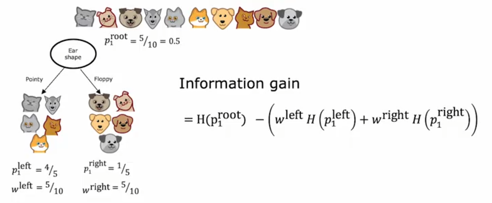

---

## 4. 流程

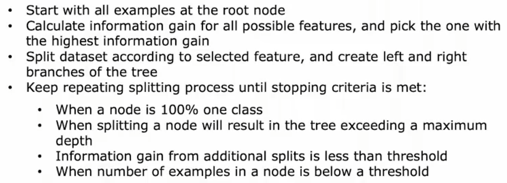

递归实现

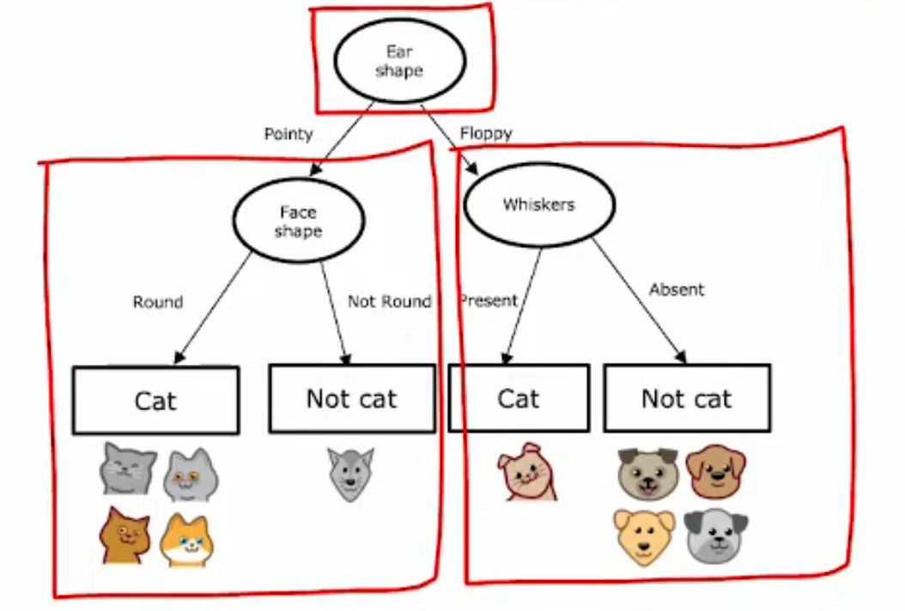

splitting on a continuous variable，尝试不同的阈值

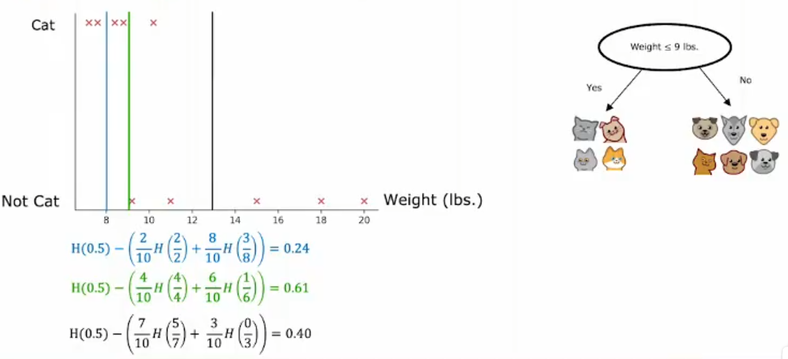

---

## 5. 回归树

回归树的信息增益，计算方差作为权重，找方差减少最大的作为分裂节点

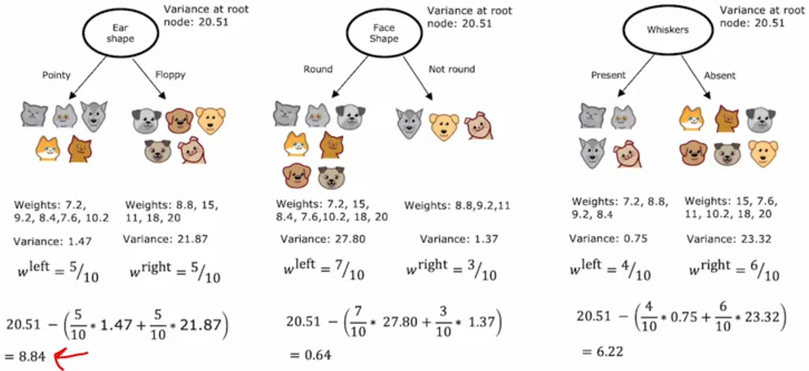

---

## 6. 使用多颗决策树

建立多颗决策树，分别进行预测，对结果进行投票

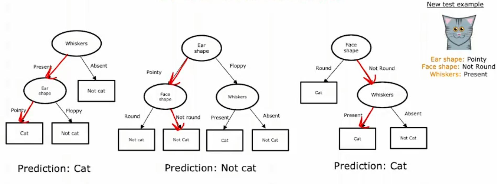

---

## 7. XGboost

用于增强决策树

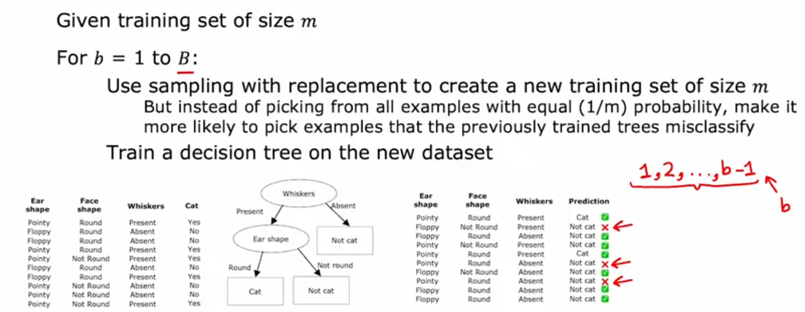

XGBoost(eXtreme Gradient Boosting)

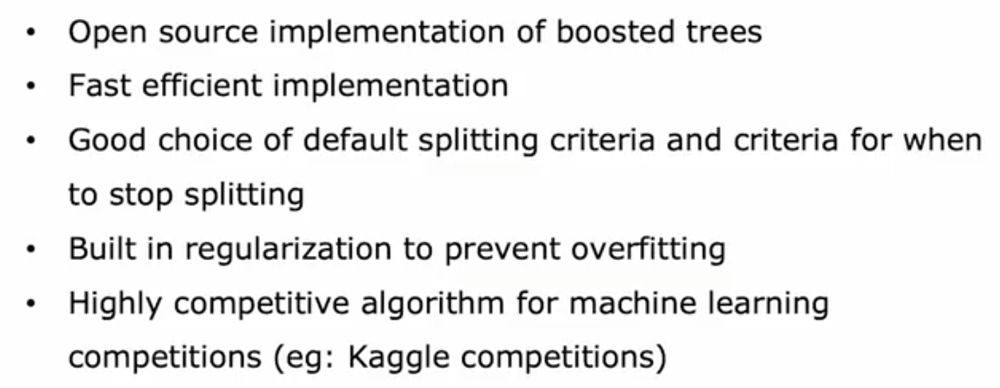

---

## 8. When to use decision trees

决策树适用于结构化数据，例如表格之类的，不适合图像等非结构化数据。

Decision Trees vs Neural Networks

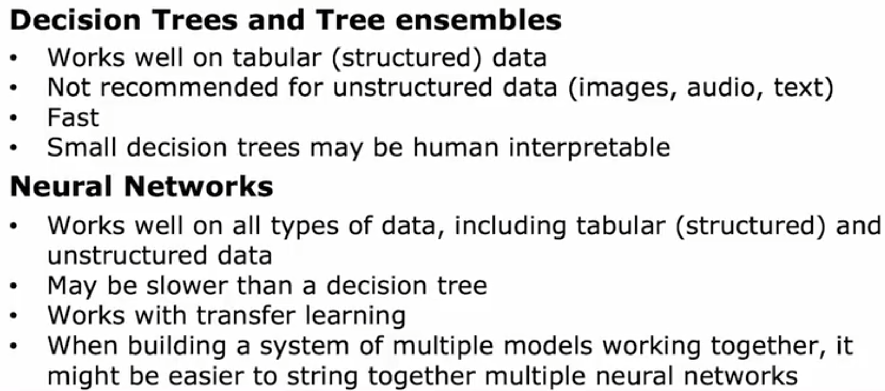

---
