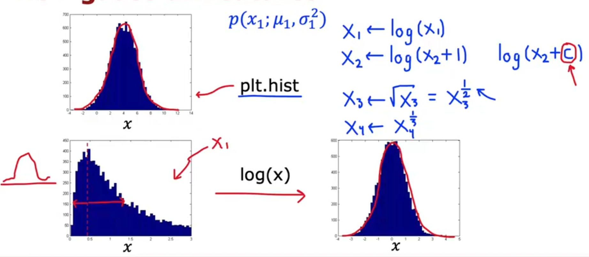

# Unsupervised Learning

- [Unsupervised Learning](#unsupervised-learning)
  - [1. Clustering(聚类)](#1-clustering聚类)
    - [1.1 K-means算法](#11-k-means算法)
    - [1.2 K-means optimization objective](#12-k-means-optimization-objective)
    - [1.3 Choosing the value of K](#13-choosing-the-value-of-k)
  - [2. Anomaly Detection](#2-anomaly-detection)
    - [2.1 Finding unusual events](#21-finding-unusual-events)
    - [2.2 Gaussian(Normal) distribution](#22-gaussiannormal-distribution)
    - [2.3 algorithm](#23-algorithm)
    - [2.4 开发和评估异常检测系统](#24-开发和评估异常检测系统)
    - [2.5 Anomaly detection vs. Supervised Learning](#25-anomaly-detection-vs-supervised-learning)
    - [2.6 choosing features](#26-choosing-features)

---

## 1. Clustering(聚类)

### 1.1 K-means算法

1. 随机选择k个中心点;
2. 遍历所有点计算离自己最近的中心点后归为一类；
3. 求类中的均值作为新的中心点，回到第二步，找到中心点不再变化。

### 1.2 K-means optimization objective

Cost function for K-means

多次随机初始化,通过计算J判断最优解

### 1.3 Choosing the value of K

根据purpose来选择

---

## 2. Anomaly Detection

### 2.1 Finding unusual events

用于检测引擎之类的

### 2.2 Gaussian(Normal) distribution

### 2.3 algorithm

算法流程

Anomaly detection example

### 2.4 开发和评估异常检测系统

### 2.5 Anomaly detection vs. Supervised Learning

不同应用

### 2.6 choosing features

Non-Gaussian features

Error analysis for anomaly detection

创建新的特性

---
