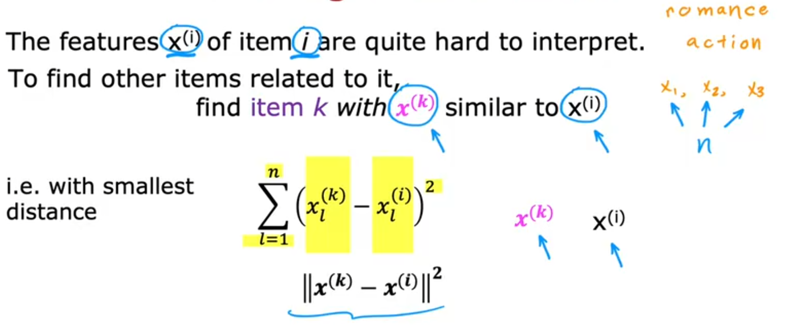

# Recommender System

- [Recommender System](#recommender-system)
  - [1. using per-item features](#1-using-per-item-features)
  - [2. Collaborative filtering algorithm(协同过滤算法)](#2-collaborative-filtering-algorithm协同过滤算法)
  - [3. Mean normalization](#3-mean-normalization)
  - [4. Tensorflow实现](#4-tensorflow实现)
  - [5. Finding related items](#5-finding-related-items)
  - [6. Collaborative filtering vs Content-based filtering](#6-collaborative-filtering-vs-content-based-filtering)
  - [7. Content-based filtering(基于内容推荐)](#7-content-based-filtering基于内容推荐)
  - [8. 从大目录中推荐](#8-从大目录中推荐)
  - [9. Tensorflow实现Content-based filtering](#9-tensorflow实现content-based-filtering)

---

## 1. using per-item features

cost function

计算all users

---

## 2. Collaborative filtering algorithm(协同过滤算法)

cost function

Collaborative filtering 协同过滤

Gradient Descent

Binary labels

cost function

---

## 3. Mean normalization

---

## 4. Tensorflow实现

使用Tensorflow实现自动求导,进行梯度下降

---

## 5. Finding related items

---

## 6. Collaborative filtering vs Content-based filtering

---

## 7. Content-based filtering(基于内容推荐)

Content-based filtering:Learning to match

deep-Learning for Content-based filtering

neural network architecture

cost function

To find movies similar to movie i:

---

## 8. 从大目录中推荐

其中Retrieval step中:

---

## 9. Tensorflow实现Content-based filtering

---
