# 浅层神经网络的实现

- [浅层神经网络的实现](#浅层神经网络的实现)
  - [1. Neural Network Respresentation](#1-neural-network-respresentation)
  - [2. Computing a Neural Network's output](#2-computing-a-neural-networks-output)
  - [3. Vectorizing across multiple examples（多样本向量化）](#3-vectorizing-across-multiple-examples多样本向量化)
  - [4. Activation functions](#4-activation-functions)
  - [5. why need a nonlinear activation function?](#5-why-need-a-nonlinear-activation-function)
  - [6. Derivatives of activation functions](#6-derivatives-of-activation-functions)
    - [6.1 sigmoid activation function](#61-sigmoid-activation-function)
    - [6.2 Tanh activation function](#62-tanh-activation-function)
    - [6.3 ReLU and leaky ReLU activation function](#63-relu-and-leaky-relu-activation-function)
  - [7. Gradient descent for Neural Network](#7-gradient-descent-for-neural-network)
    - [7.1 前向传播和反向传播的方程](#71-前向传播和反向传播的方程)
    - [7.2 推出反向传播的方程](#72-推出反向传播的方程)
  - [8. Random initialize](#8-random-initialize)

---

## 1. Neural Network Respresentation

2层神经网络，不同符号表示

---

## 2. Computing a Neural Network's output

计算隐藏层

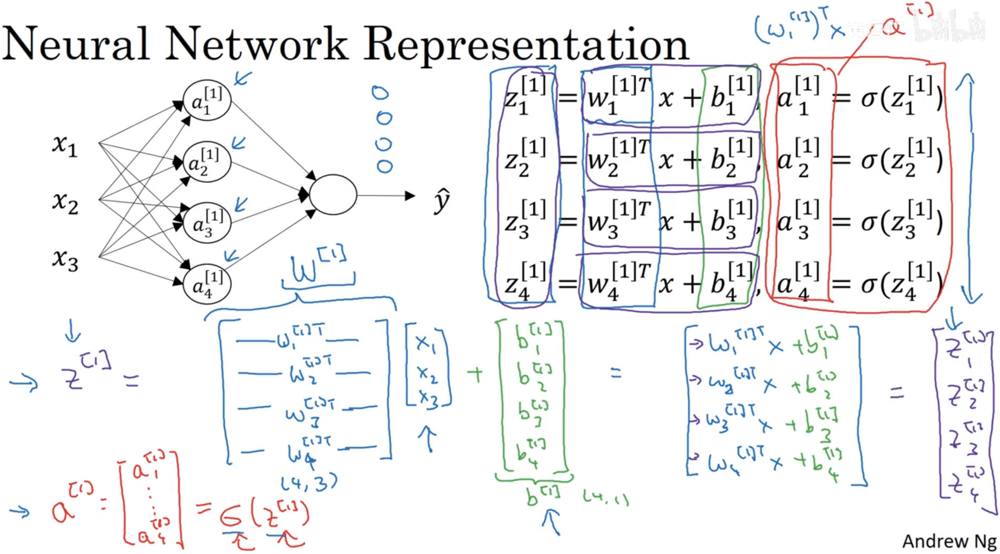

输入x，用4个等式计算，向量化

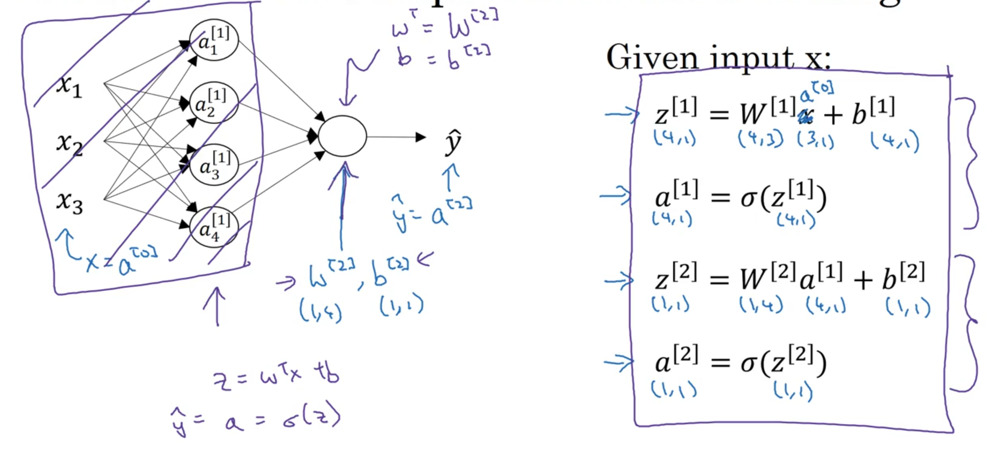

---

## 3. Vectorizing across multiple examples（多样本向量化）

多个样本

将m个样本横向堆叠，进行向量化运算

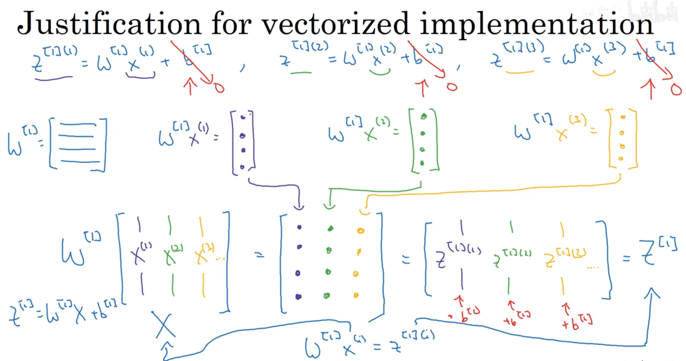

---

## 4. Activation functions

sigmoid适用于二分类输出层，tanh使用于隐藏层，Relu,leaky Relu更快

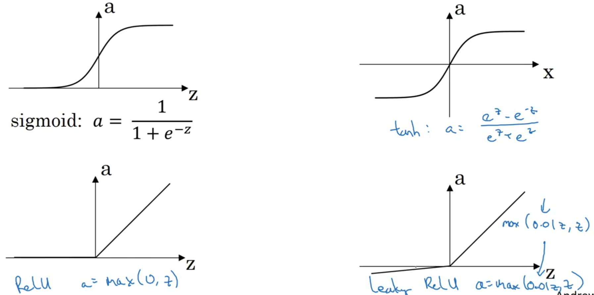

---

## 5. why need a nonlinear activation function?

使用线性激活函数相当于没有隐藏层

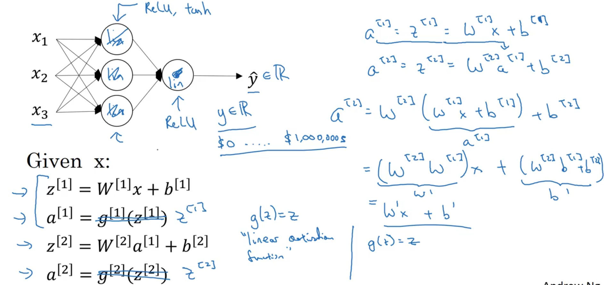

---

## 6. Derivatives of activation functions

### 6.1 sigmoid activation function

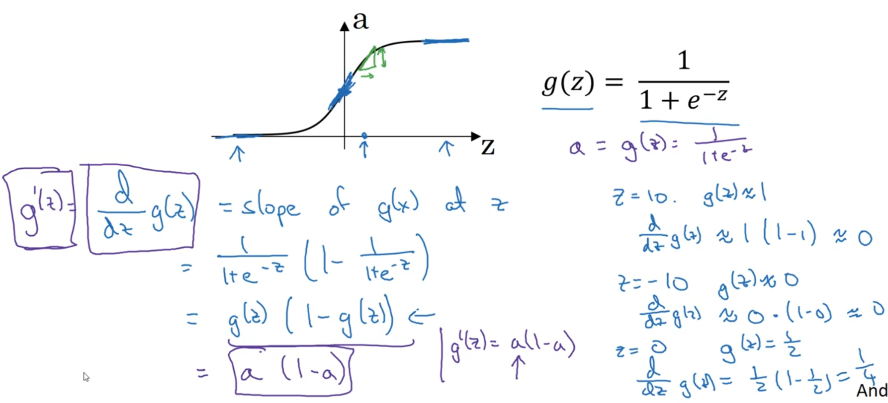

### 6.2 Tanh activation function

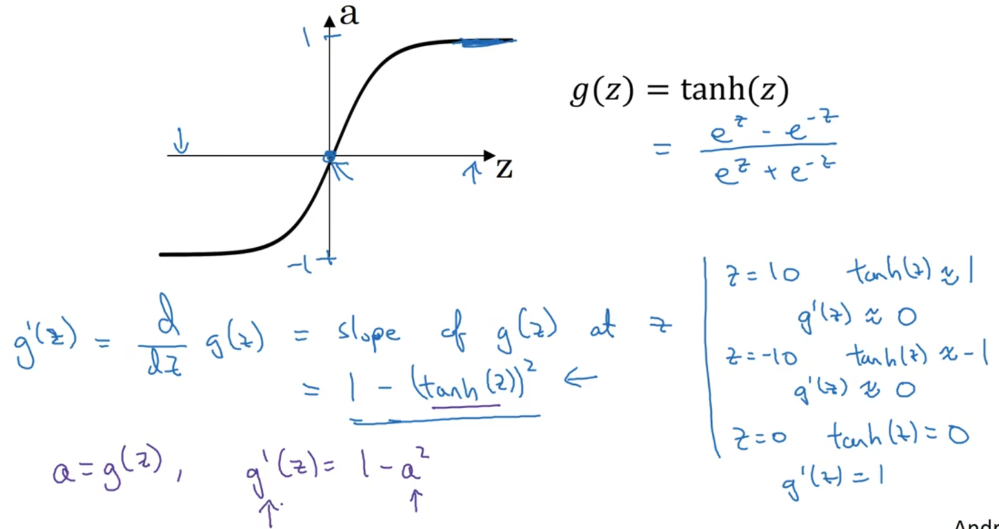

### 6.3 ReLU and leaky ReLU activation function

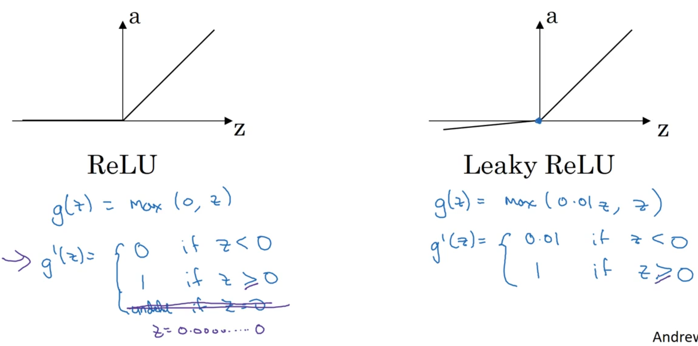

---

## 7. Gradient descent for Neural Network

### 7.1 前向传播和反向传播的方程

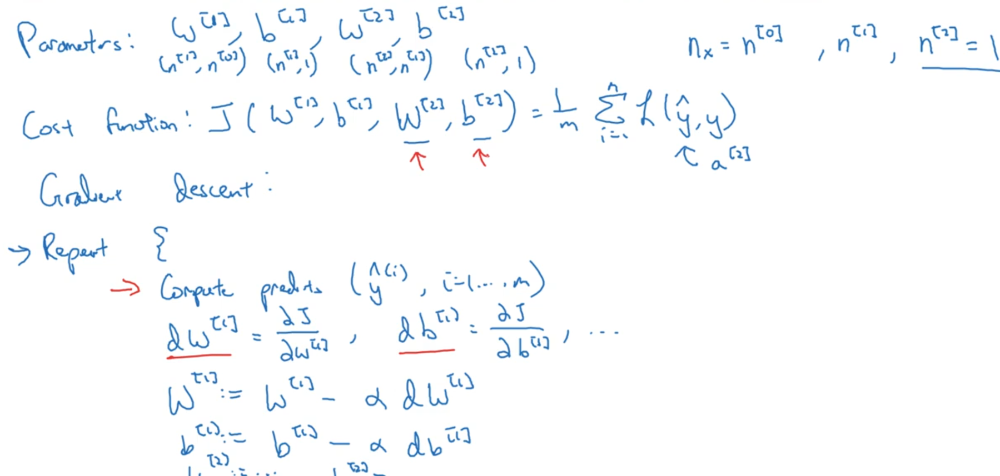

前向传播4个方程，反向传播6个方程

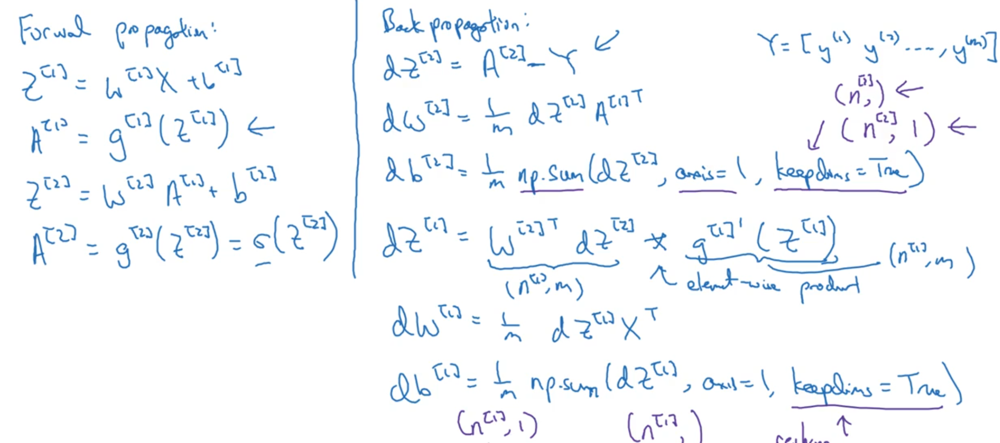

### 7.2 推出反向传播的方程

Logistic regression 反向传播的方程

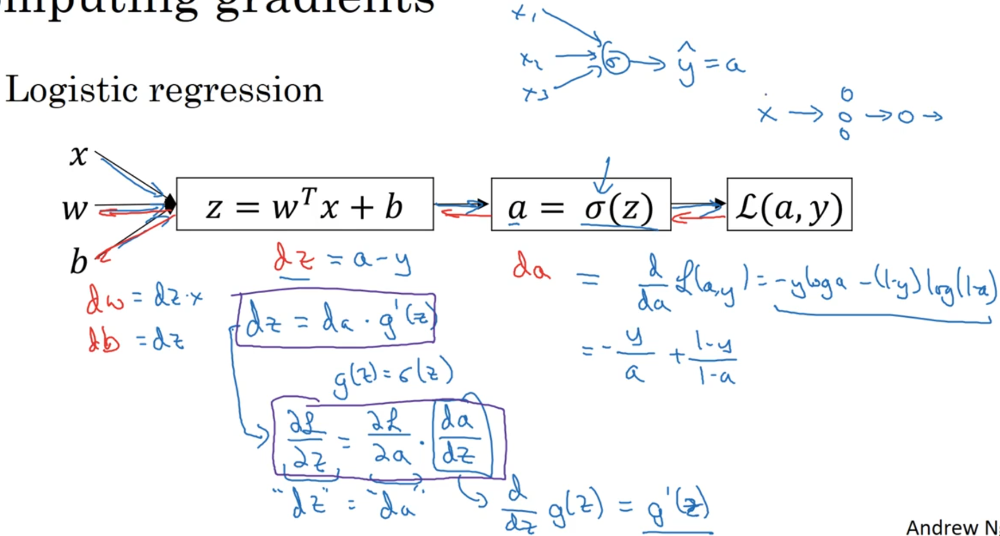

$dz = a- y $
$dw = dz \cdot x$
$db = dz$

两层神经网络要算两步

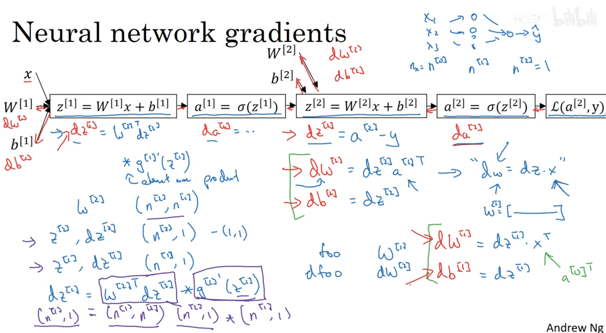

Summary of gradient descent

右边为多样本

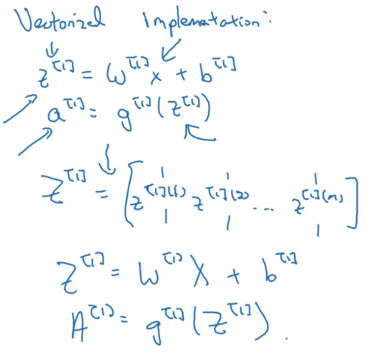

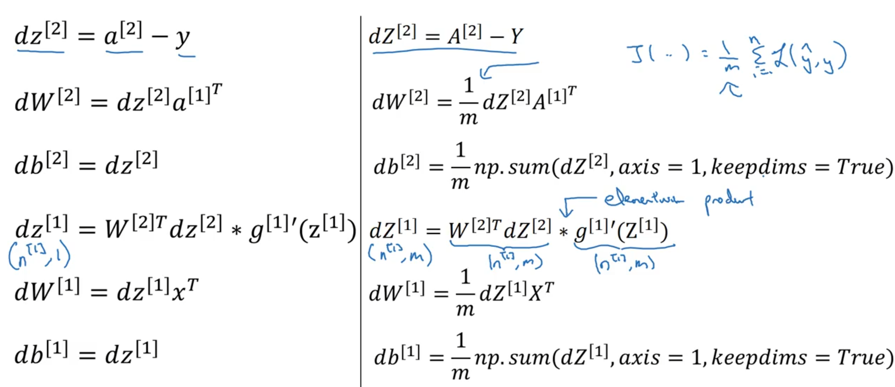

---

## 8. Random initialize

如果刚开始w[1]，b[1]都为0，那隐藏层单元计算一样且变化一样

初始化参数一般都很小

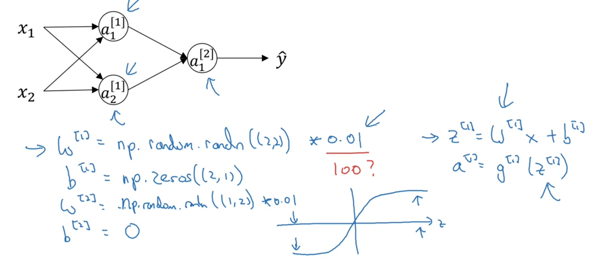

---
