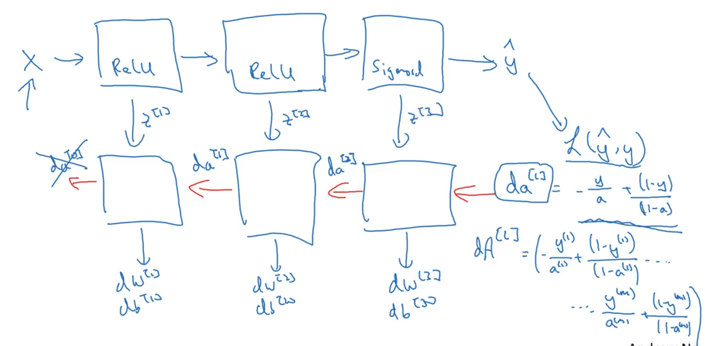

# 深层神经网络

- [深层神经网络](#深层神经网络)
  - [1. Deep L-layer neural network](#1-deep-l-layer-neural-network)
    - [1.1 Deep neural network notation(对应符号)](#11-deep-neural-network-notation对应符号)
  - [2. Forward and backward propagation](#2-forward-and-backward-propagation)
    - [2.1 Forward propagation for layer l](#21-forward-propagation-for-layer-l)
    - [2.2 Backward propagation for layer l](#22-backward-propagation-for-layer-l)
    - [2.3 Summary](#23-summary)
  - [3. Forward propagation in a Deep Network](#3-forward-propagation-in-a-deep-network)
  - [4. Getting your matrix dimensions right(使维度正确)](#4-getting-your-matrix-dimensions-right使维度正确)
  - [5. Building blocks of deep neural networks(构建神经网络块)](#5-building-blocks-of-deep-neural-networks构建神经网络块)
    - [5.1 Forward and backward functions](#51-forward-and-backward-functions)
  - [6. Parameters vs Hyperparameters(参数VS超参数)](#6-parameters-vs-hyperparameters参数vs超参数)
  - [7. 实现深层神经网络](#7-实现深层神经网络)

---

## 1. Deep L-layer neural network

### 1.1 Deep neural network notation(对应符号)


---

## 2. Forward and backward propagation

### 2.1 Forward propagation for layer l

对l层进行前向传播
右边为多个样本


### 2.2 Backward propagation for layer l

对l层进行反向传播


### 2.3 Summary



---

## 3. Forward propagation in a Deep Network

使用for循环计算所有层的前向传播


---

## 4. Getting your matrix dimensions right(使维度正确)

每一层的W,b,dw,db的维度时有规律的


向量化前后w,b的维度不变

$$
\begin{array}{l}
\omega^{[l]}:\left(n^{[l]}, n^{[l-1]}\right) \\
b^{[l]}:\left(n^{[l]}, 1\right)\\
dw^{[l]}:\left(n^{[l]}, n^{[l-1]}\right)\\
db^{[l]}:\left(n^{[l]}, 1\right)
\end{array}
$$

多个样本向量化后会发生变化，Z，A的维度发生变化


$$
\begin{array}{l}
z^{[l]},a{[l]}:\left( n^{[l]},1\right) \\
向量化后：\\
Z^{[l]}, A^{[l]}:\left(n^{[l]}, m\right) \\
l=0 \quad A^{[0]}= X=\left(n^{[0]}, m\right) \\
d Z^{[l]}, d A^{[l]}:\left(n^{[l]}, m\right)
\end{array}
$$

---

## 5. Building blocks of deep neural networks(构建神经网络块)

### 5.1 Forward and backward functions


$$
layer[l]：w^{[l]}, b^{[l]}\\
Forward：input：a^{[l-1]}  ，output：a^{[l]}，cache：z^{[l]}\\
backward：input：da^{[l]}，cache：z^{[l]}，output：da^{[l-1]}，dw^{[l]}，db^{[l]}
$$

计算流程


---

## 6. Parameters vs Hyperparameters(参数VS超参数)

参数有：w，b
超参数有：learning rate，iterations，hidden layers l，hidden units等


---

## 7. 实现深层神经网络

```python
def initialize_parameters_deep(layers_dims):  # 初始化每一层的W，b
    ...
    return parameters 
def L_model_forward(X, parameters):  # 前向传播计算每一层的caches， 最有一层的A
    ...  ## 包含linear_forward(), linear_activation_forward()
    return AL, caches
def compute_cost(AL, Y):  # 计算J
    ...
    return cost
def L_model_backward(AL, Y, caches):  # 反向传播计算每一层的dW,db,dA[l-1]
    ...  ## 包含linear_backward()，linear_activation_backward()
    return grads
def update_parameters(parameters, grads, learning_rate):  # 根据每一层的dW,db来更新W，b
    ...
    return parameters
```

```python
1. 初始化参数
2. 进入for的n次迭代循环：
   1. L_model_forward(X, parameters)得到AL，caches(每一层的cache 包含A_prev, W, b, Z)
   2. 计算cost
   3. L_model_backward(AL, Y, caches)计算grads
   4. update_parameters(parameters, grads, learning_rate)更新参数
   5. 每一百层记录一下cost的值
3. 画出cost的梯度下降图
```

---
