# 深度学习的实用层面

- [深度学习的实用层面](#深度学习的实用层面)
  - [1. 训练，验证，测试集（Train / Dev / Test sets）](#1-训练验证测试集train--dev--test-sets)
  - [2. 偏差，方差（Bias /Variance）](#2-偏差方差bias-variance)
  - [3. Basic recipe for machine learning](#3-basic-recipe-for-machine-learning)
  - [3. 正则化（Regularization）](#3-正则化regularization)
    - [3.1 Logistic regression](#31-logistic-regression)
    - [3.2 Neural network](#32-neural-network)
    - [3.3 为什么正则化有利于预防过拟合呢？（Why regularization reduces overfitting?）](#33-为什么正则化有利于预防过拟合呢why-regularization-reduces-overfitting)
    - [3.4 dropout 正则化（Dropout Regularization）](#34-dropout-正则化dropout-regularization)
    - [3.5 理解 dropout（Understanding Dropout）](#35-理解-dropoutunderstanding-dropout)
    - [3.6 其他正则化方法（Other regularization methods）](#36-其他正则化方法other-regularization-methods)
      - [3.6.1 Data augmentation（数据增强）](#361-data-augmentation数据增强)
      - [3.6.2 Early stopping](#362-early-stopping)
  - [4. 加快训练速度](#4-加快训练速度)
    - [4.1 标准化（归一化）输入（Normalizing inputs）](#41-标准化归一化输入normalizing-inputs)
    - [4.2 梯度消失/梯度爆炸（Vanishing / Exploding gradients）](#42-梯度消失梯度爆炸vanishing--exploding-gradients)
    - [4.3 神经网络的权重初始化（Weight Initialization for Deep NetworksVanishing /Exploding gradients）](#43-神经网络的权重初始化weight-initialization-for-deep-networksvanishing-exploding-gradients)
      - [4.3.1 Single neuron example](#431-single-neuron-example)
  - [5. 梯度检验（Gradient checking）](#5-梯度检验gradient-checking)
    - [5.1 梯度检验（Gradient checking）](#51-梯度检验gradient-checking)
    - [5.2 梯度检验应用的注意事项（Gradient Checking Implementation Notes）](#52-梯度检验应用的注意事项gradient-checking-implementation-notes)

---

## 1. 训练，验证，测试集（Train / Dev / Test sets）

训练集一般较大

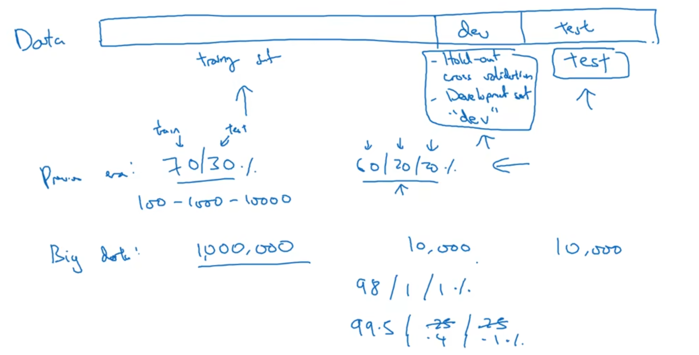

---

## 2. 偏差，方差（Bias /Variance）

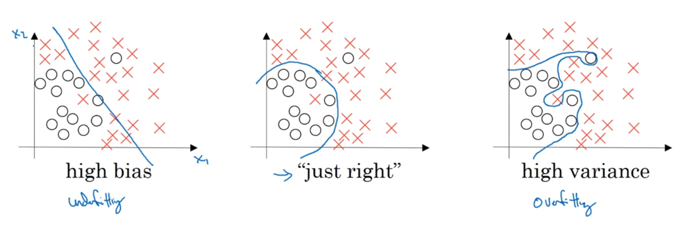

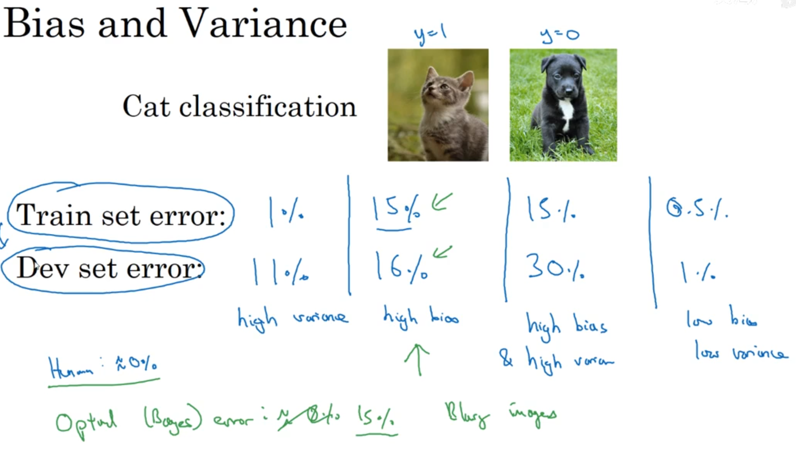

---

## 3. Basic recipe for machine learning

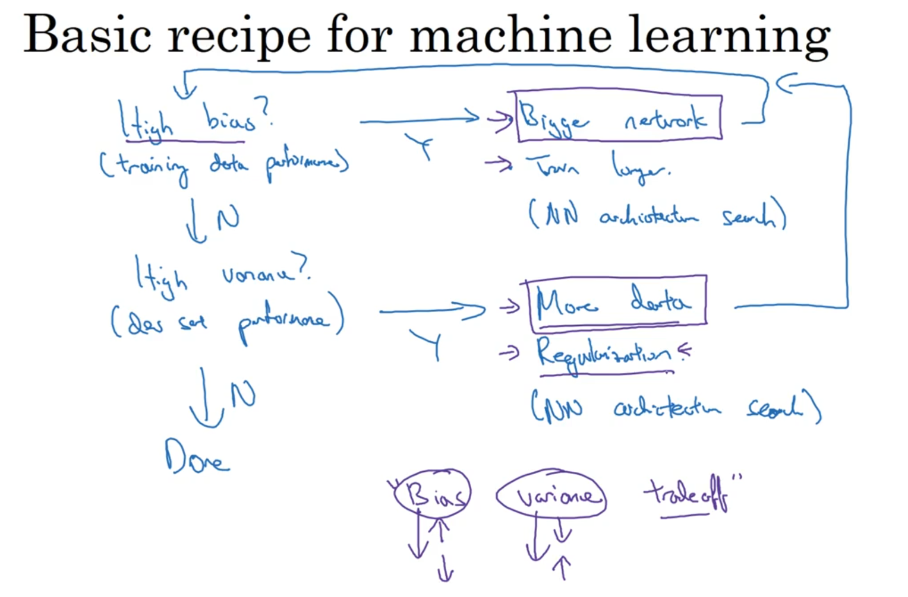

---

## 3. 正则化（Regularization）

防止过拟合，减少网络误差

### 3.1 Logistic regression

逻辑回归中使用到正则化，其中讲到L1正则化，L2正则化

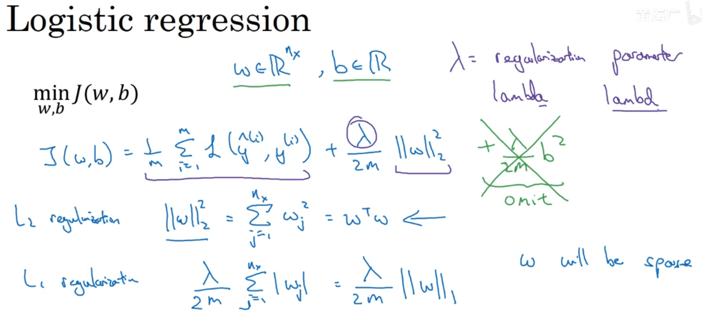

L1正则化：
$$J = -\frac{1}{m} \sum\limits_{i = 1}^{m} \large{(}\small  y^{(i)}\log\left(a^{[L](i)}\right) + (1-y^{(i)})\log\left(1- a^{[L](i)}\right) \large{)} \tag{1}$$
To:
$$J_{regularized} = \small \underbrace{-\frac{1}{m} \sum\limits_{i = 1}^{m} \large{(}\small y^{(i)}\log\left(a^{[L](i)}\right) + (1-y^{(i)})\log\left(1- a^{[L](i)}\right) \large{)} }_\text{cross-entropy cost} + \underbrace{\frac{1}{m} \frac{\lambda}{2} \sum\limits_l\sum\limits_k\sum\limits_j |W_{k,j}^{[l]}|}_\text{L2 regularization cost} \tag{2}$$

L1反向传播：
$$
\frac{d}{dW} \left( \frac{\lambda}{m} |W| \right) =
\begin{cases} 
\frac{\lambda}{m}, & W > 0 \\
-\frac{\lambda}{m}, & W < 0 \\
0, & W = 0
\end{cases}
$$
$$dW += (lambda / m) * np.sign(W)$$

L2正则化:
$$J = -\frac{1}{m} \sum\limits_{i = 1}^{m} \large{(}\small  y^{(i)}\log\left(a^{[L](i)}\right) + (1-y^{(i)})\log\left(1- a^{[L](i)}\right) \large{)} \tag{1}$$
To:
$$J_{regularized} = \small \underbrace{-\frac{1}{m} \sum\limits_{i = 1}^{m} \large{(}\small y^{(i)}\log\left(a^{[L](i)}\right) + (1-y^{(i)})\log\left(1- a^{[L](i)}\right) \large{)} }_\text{cross-entropy cost} + \underbrace{\frac{1}{m} \frac{\lambda}{2} \sum\limits_l\sum\limits_k\sum\limits_j (W_{k,j}^{[l]2}) }_\text{L2 regularization cost} \tag{2}$$

L2反向传播：
$$\frac{d}{dW} ( \frac{1}{2}\frac{\lambda}{m}  W^2) = \frac{\lambda}{m} W$$
$$dW += (lambda / m) * W$$

### 3.2 Neural network

神经网络的的L2正则化又称Frobenius norm

正则化又称权重衰减

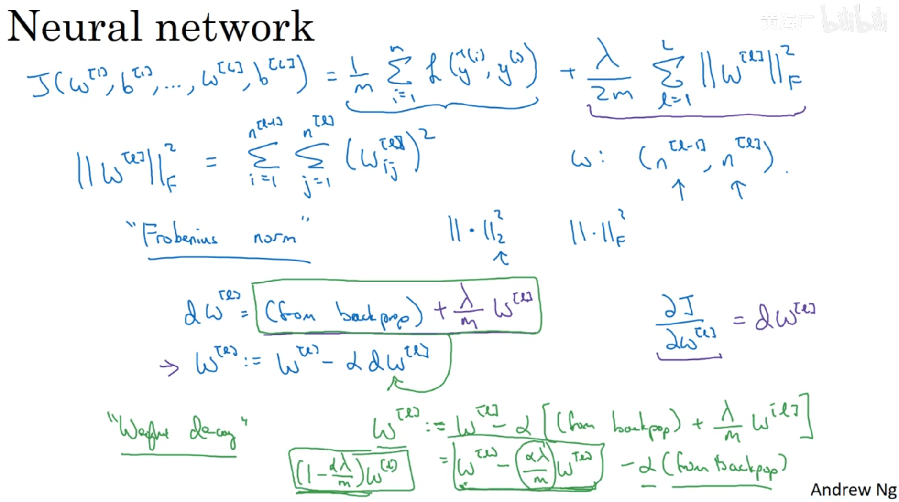

### 3.3 为什么正则化有利于预防过拟合呢？（Why regularization reduces overfitting?）

正则化参数越大，对权重的削减越大，从而防止了过拟合

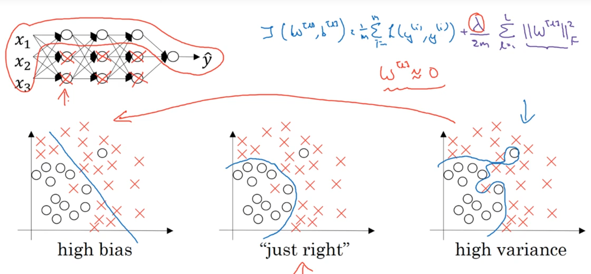

当$\lambda $变大，$w^{[l]}$就会减小，$z^{[l]} = w{[l]}a^{[l-1]} + b^{[l]}$，$w^{[l]}$很小，即$Z^{[l]}$很小，$g(z)$就为线性，即每一层都为线性变化，整个神经网络就为线性，即防止过拟合

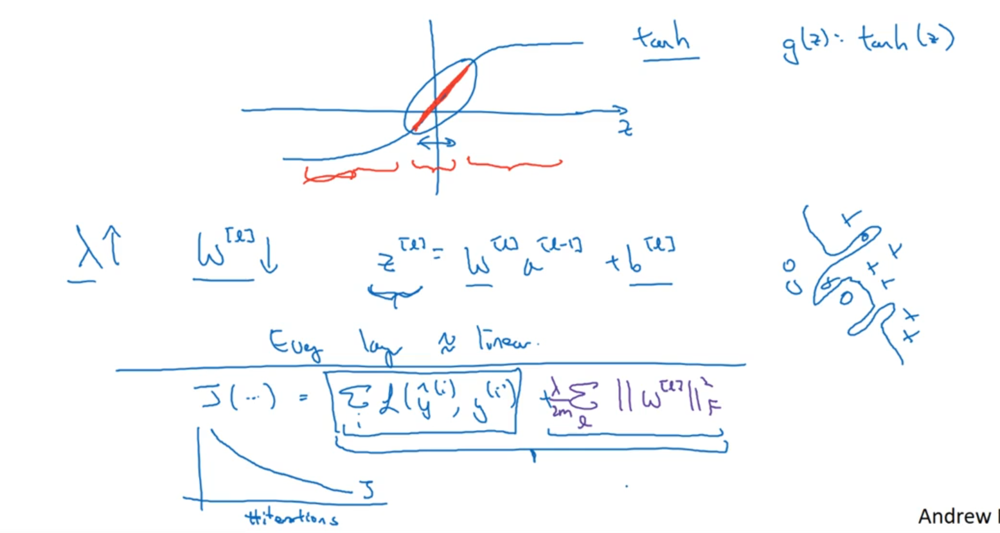

### 3.4 dropout 正则化（Dropout Regularization）

常见的正则化除了L1，L2正则化还有dropout正则化

dropout 正则化是每一层随机设置概率，减小某些节点的权重，删除某些节点

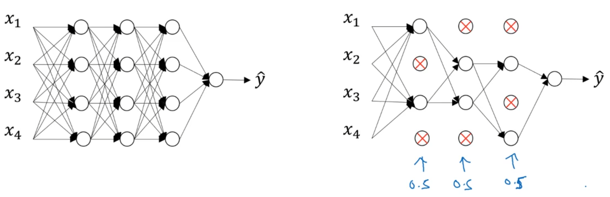

通过keep-prob来获得随机矩阵，通过inverted dropout（反向随机失活）来实现dropout正则化

```python
前向传播：
步骤：
# Step 1: initialize matrix D1 = np.random.rand(..., ...)
D1 = np.random.rand(*A1.shape)
# Step 2: convert entries of D1 to 0 or 1 (using keep_prob as the threshold)  
D1 = D1 < keep_prob
# Step 3: shut down some neurons of A1  
A1 = A1 * D1 
 # Step 4: scale the value of neurons that haven't been shut down
A1 = A1 / keep_prob
Z2 = np.dot(W2, A1) + b2

反向传播：
步骤：
dA1 = np.dot(W2.T, dZ2)
# Step 1: Apply mask D1 to shut down the same neurons as during the forward propagation
dA1 = dA1 * D1                   
# Step 2: Scale the value of neurons that haven't been shut down
dA1 = dA1 / keep_prob
dZ1 = np.multiply(dA1, np.int64(A1 > 0))
dW1 = 1./m * np.dot(dZ1, X.T)
db1 = 1./m * np.sum(dZ1, axis=1, keepdims = True)      
```

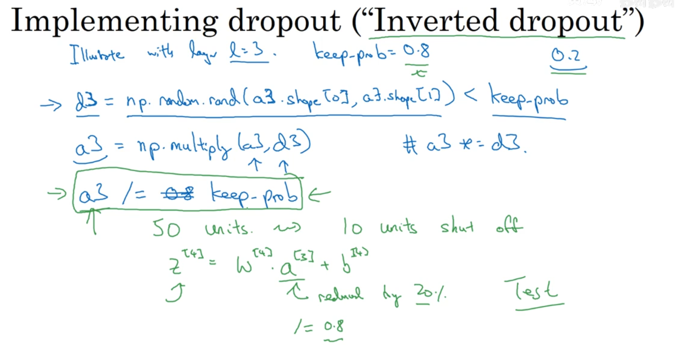

训练的时候用，测试的时候不要用
在正向传播和反向传播中都要用

### 3.5 理解 dropout（Understanding Dropout）

适用于计算机视觉

缺点：每次迭代都会随机移除一些节点，导致代价函数J不再被明确定义，很难确定是否下降

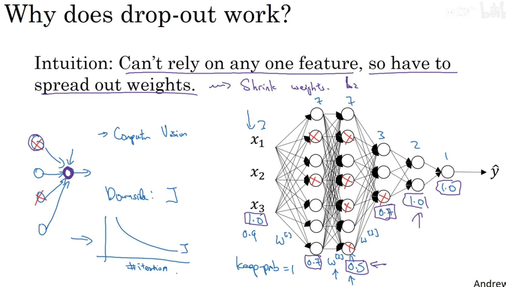

### 3.6 其他正则化方法（Other regularization methods）

#### 3.6.1 Data augmentation（数据增强）

图片翻转，随机裁剪等

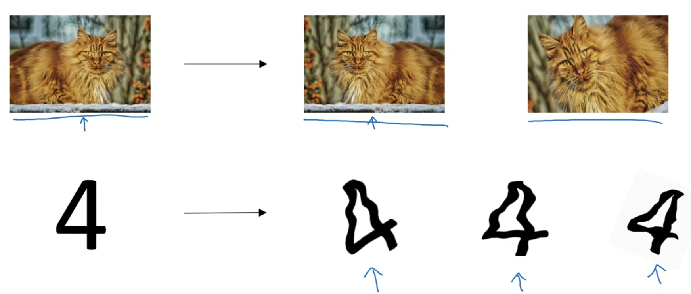

#### 3.6.2 Early stopping

提前结束迭代，缺点是无法同时进行优化J和防止过拟合

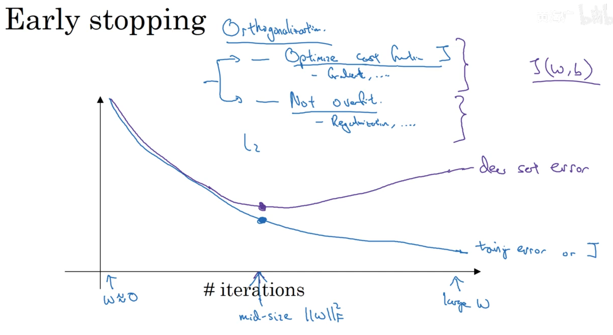

---

## 4. 加快训练速度

### 4.1 标准化（归一化）输入（Normalizing inputs）

- 两步：
  - subtract mean(零均值化)
  - normal variance(归一化方差)
  
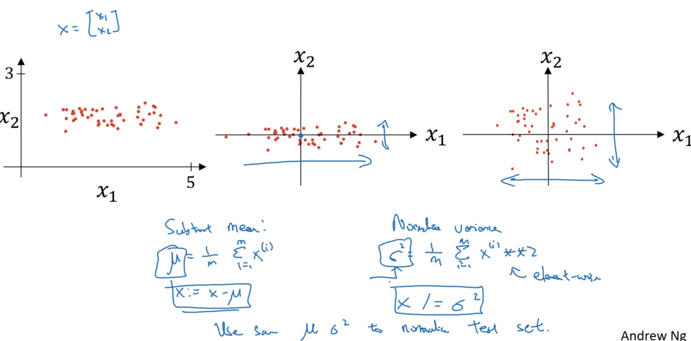

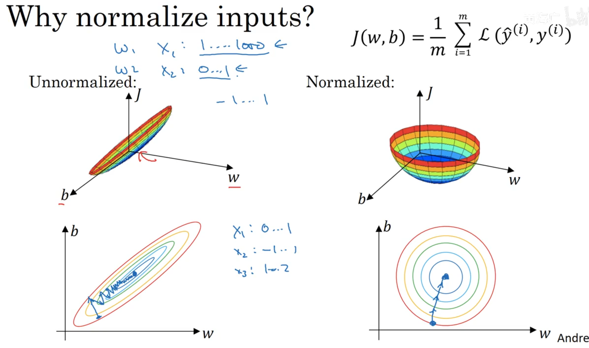

### 4.2 梯度消失/梯度爆炸（Vanishing / Exploding gradients）

梯度指数级减小或助长，他们的值就会很小或很大，导致训练困难，梯度下降的步长会很小

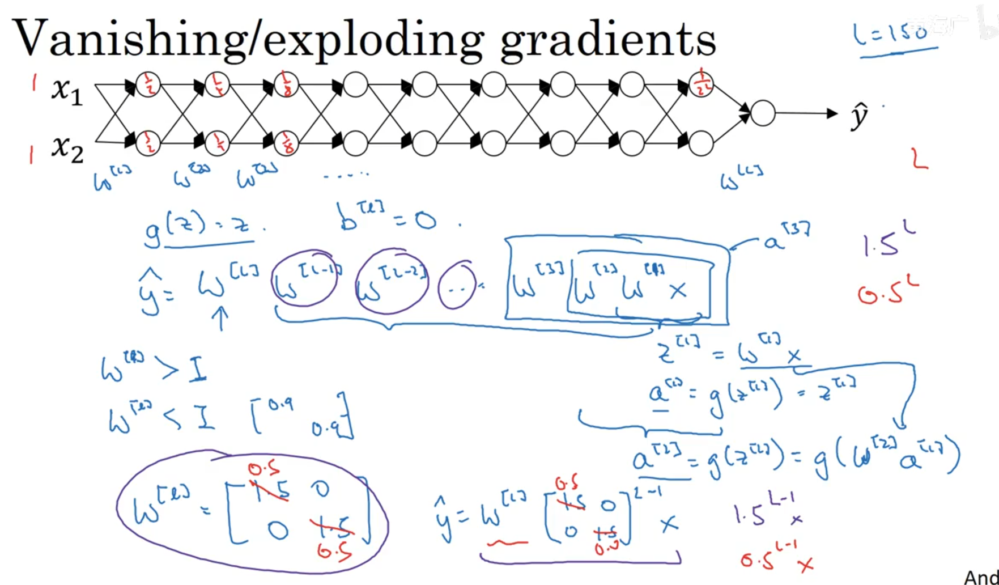

### 4.3 神经网络的权重初始化（Weight Initialization for Deep NetworksVanishing /Exploding gradients）

用于解决梯度消失/梯度爆炸

#### 4.3.1 Single neuron example

其中讲到不同的层的激活函数使用到的不同初始权重矩阵的初始化，包含tanh, Relu

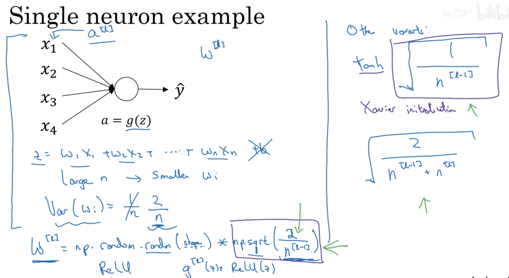

---

## 5. 梯度检验（Gradient checking）

### 5.1 梯度检验（Gradient checking）

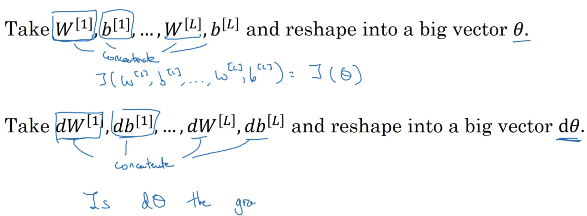

可以通过梯度检验得到的值的大小查看是否神经网络有无bug

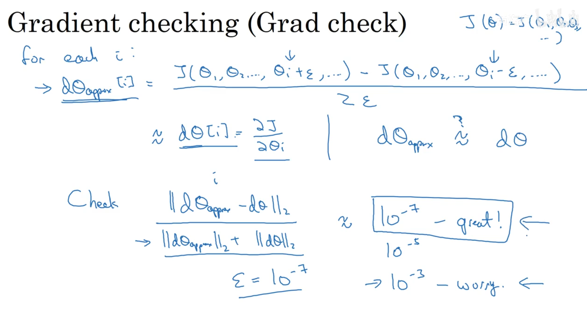

- To compute `J_plus[i]`:
    1. Set $\theta^{+}$ to `np.copy(parameters_values)`
    2. Set $\theta^{+}_i$ to $\theta^{+}_i + \varepsilon$
    3. Calculate $J^{+}_i$ using to `forward_propagation_n(x, y, vector_to_dictionary(`$\theta^{+}$ `))`.     
- To compute `J_minus[i]`: do the same thing with $\theta^{-}$
- 总的来说：输入参数向量$𝜃$和小的扰动$𝜀$
    1. $\theta^{+} = \theta + \varepsilon$
    2. $\theta^{-} = \theta - \varepsilon$
    3. $J^{+} = J(\theta^{+})$
    4. $J^{-} = J(\theta^{-})$
    5. $gradapprox = \frac{J^{+} - J^{-}}{2  \varepsilon}$
- 计算$grad$
- 计算$difference$
  - $$ difference = \frac {\mid\mid grad - gradapprox \mid\mid_2}{\mid\mid grad \mid\mid_2 + \mid\mid gradapprox \mid\mid_2}$$

### 5.2 梯度检验应用的注意事项（Gradient Checking Implementation Notes）

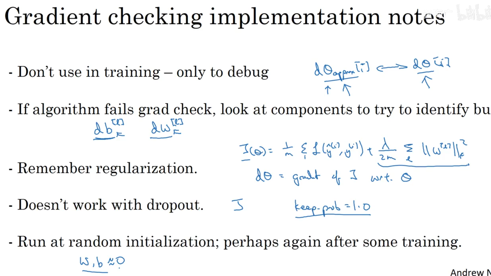

---
