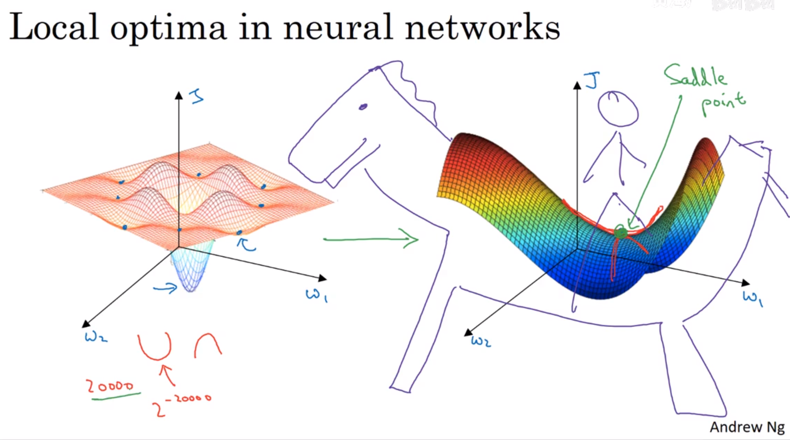

# 优化算法(Optimization algorithms)

- [优化算法(Optimization algorithms)](#优化算法optimization-algorithms)
  - [1. Mini-batch 梯度下降（Mini-batch gradient descent）](#1-mini-batch-梯度下降mini-batch-gradient-descent)
    - [1.1 Mini-batch 梯度下降对比](#11-mini-batch-梯度下降对比)
    - [1.2  理解Mini-batch 梯度下降（Understanding Mini-batch gradient descent）](#12--理解mini-batch-梯度下降understanding-mini-batch-gradient-descent)
  - [2. 指数加权平均（Exponentially weighted averages）](#2-指数加权平均exponentially-weighted-averages)
    - [2.1 指数加权平均（Exponentially weighted averages）](#21-指数加权平均exponentially-weighted-averages)
    - [2.2 理解指数加权平均（Understanding Exponentially weighted averages）](#22-理解指数加权平均understanding-exponentially-weighted-averages)
    - [2.3 指数加权平均的偏差修正（Bias correction in exponentially weighted averages）](#23-指数加权平均的偏差修正bias-correction-in-exponentially-weighted-averages)
  - [3. momentum梯度下降（Gradient descent with momentum）](#3-momentum梯度下降gradient-descent-with-momentum)
  - [4. RMSprop——root mean square prop（RMSprop）](#4-rmsproproot-mean-square-proprmsprop)
  - [5. Adam优化算法（Adam optimization algorithm）](#5-adam优化算法adam-optimization-algorithm)
  - [6. 学习率衰减（Learning rate decay）](#6-学习率衰减learning-rate-decay)
  - [7. 局部最优问题（The problem of local optima）](#7-局部最优问题the-problem-of-local-optima)

---

## 1. Mini-batch 梯度下降（Mini-batch gradient descent）

### 1.1 Mini-batch 梯度下降对比

将几百万的数据集分为多份，分别进行梯度下降，然后进行参数更新


### 1.2  理解Mini-batch 梯度下降（Understanding Mini-batch gradient descent）

损失图像


```python
if mini_batch size = m : Bath gradient descent
if mini_batch size = 1 : Stochastic gradient descent（SGD）(随机梯度下降) 每一个样本都为一个mini_batch
```

Bath gradient descent会一直向最小值走，而Stochastic gradient descent（SGD）是随机某个样本在进行梯度下降，所以有很多噪声，永远不会收敛，一直在最小值附近波动

要选择合适大小的mini_batch size，Bath gradient descent每一个iteration的运行时间过长， Stochastic gradient descent每个样本都得运行一遍，效率低下


---

## 2. 指数加权平均（Exponentially weighted averages）

### 2.1 指数加权平均（Exponentially weighted averages）

常用于统计学，称为指数加权移动平均值


### 2.2 理解指数加权平均（Understanding Exponentially weighted averages）


### 2.3 指数加权平均的偏差修正（Bias correction in exponentially weighted averages）


---

## 3. momentum梯度下降（Gradient descent with momentum）

运用指数加权平均，来平均前几次迭代的梯度

$$ \begin{cases}
v_{dW^{[l]}} = \beta v_{dW^{[l]}} + (1 - \beta) dW^{[l]} \\
W^{[l]} = W^{[l]} - \alpha v_{dW^{[l]}}
\end{cases}\tag{3}$$

$$\begin{cases}
v_{db^{[l]}} = \beta v_{db^{[l]}} + (1 - \beta) db^{[l]} \\
b^{[l]} = b^{[l]} - \alpha v_{db^{[l]}} 
\end{cases}\tag{4}$$


---

## 4. RMSprop——root mean square prop（RMSprop）

均方根

$$\begin{cases}
s_{dW^{[l]}} = \beta_2 s_{dW^{[l]}} + (1 - \beta_2) (\frac{\partial \mathcal{J} }{\partial W^{[l]} })^2 \\
s^{corrected}_{dW^{[l]}} = \frac{s_{dW^{[l]}}}{1 - (\beta_2)^t} \\
W^{[l]} = W^{[l]} - \alpha \frac{dW^{[l]}}{\sqrt{s^{corrected}_{dW^{[l]}}} + \varepsilon}\\
s_{db^{[l]}} = \beta_2 s_{db^{[l]}} + (1 - \beta_2) (\frac{\partial \mathcal{J} }{\partial b^{[l]} })^2 \\
s^{corrected}_{db^{[l]}} = \frac{s_{db^{[l]}}}{1 - (\beta_2)^t} \\
b^{[l]} = b^{[l]} - \alpha \frac{db^{[l]}}{\sqrt{s^{corrected}_{db^{[l]}}} + \varepsilon}
\end{cases}$$


---

## 5. Adam优化算法（Adam optimization algorithm）

将momentum算法和RMSprop算法结合

$$\begin{cases}
v_{dW^{[l]}} = \beta_1 v_{dW^{[l]}} + (1 - \beta_1) \frac{\partial \mathcal{J} }{ \partial W^{[l]} } \\
v^{corrected}_{dW^{[l]}} = \frac{v_{dW^{[l]}}}{1 - (\beta_1)^t} \\
s_{dW^{[l]}} = \beta_2 s_{dW^{[l]}} + (1 - \beta_2) (\frac{\partial \mathcal{J} }{\partial W^{[l]} })^2 \\
s^{corrected}_{dW^{[l]}} = \frac{s_{dW^{[l]}}}{1 - (\beta_2)^t} \\
W^{[l]} = W^{[l]} - \alpha \frac{v^{corrected}_{dW^{[l]}}}{\sqrt{s^{corrected}_{dW^{[l]}}} + \varepsilon}
\end{cases}$$

$$\begin{cases}
v_{db^{[l]}} = \beta_1 v_{db^{[l]}} + (1 - \beta_1) \frac{\partial \mathcal{J} }{ \partial b^{[l]} } \\
v^{corrected}_{db^{[l]}} = \frac{v_{db^{[l]}}}{1 - (\beta_1)^t} \\
s_{db^{[l]}} = \beta_2 s_{db^{[l]}} + (1 - \beta_2) (\frac{\partial \mathcal{J} }{\partial b^{[l]} })^2 \\
s^{corrected}_{db^{[l]}} = \frac{s_{db^{[l]}}}{1 - (\beta_2)^t} \\
b^{[l]} = b^{[l]} - \alpha \frac{v^{corrected}_{db^{[l]}}}{\sqrt{s^{corrected}_{db^{[l]}}} + \varepsilon}
\end{cases}$$


```python
    for l in range(L):
        # Moving average of the gradients. Inputs: "v, grads, beta1".
        # Output: "v".
        v["dW" + str(l + 1)] = beta1 * v["dW" + str(l + 1)] + (1 - beta1) * grads["dW" + str(l + 1)]
        v["db" + str(l + 1)] = beta1 * v["db" + str(l + 1)] + (1 - beta1) * grads["db" + str(l + 1)]

        # Compute bias-corrected first moment estimate. Inputs: "v, beta1, t".
        # Output: "v_corrected".
        v_corrected["dW" + str(l + 1)] = v["dW" + str(l + 1)] / (1 - beta1 ** t)
        v_corrected["db" + str(l + 1)] = v["db" + str(l + 1)] / (1 - beta1 ** t)

        # Moving average of the squared gradients. Inputs: "s, grads, beta2".
        # Output: "s".
        s["dW" + str(l + 1)] = beta2 * s["dW" + str(l + 1)] + (1 - beta2) * grads["dW" + str(l + 1)] ** 2
        s["db" + str(l + 1)] = beta2 * s["db" + str(l + 1)] + (1 - beta2) * grads["db" + str(l + 1)] ** 2

        # Compute bias-corrected second raw moment estimate. Inputs: "s, beta2, t".
        # Output: "s_corrected".
        s_corrected["dW" + str(l + 1)] = s["dW" + str(l + 1)] / (1 - beta2 ** t)
        s_corrected["db" + str(l + 1)] = s["db" + str(l + 1)] / (1 - beta2 ** t)

        # Update parameters. Inputs: "parameters, learning_rate, v_corrected, s_corrected, epsilon".
        # Output: "parameters".
        parameters["W" + str(l + 1)] -= learning_rate * v_corrected["dW" + str(l + 1)] / (
                np.sqrt(s_corrected["dW" + str(l + 1)]) + epsilon)
        parameters["b" + str(l + 1)] -= learning_rate * v_corrected["db" + str(l + 1)] / (
                np.sqrt(s_corrected["db" + str(l + 1)]) + epsilon)
```

Hyperparameters choice


---

## 6. 学习率衰减（Learning rate decay）

固定的learning rate  在mini_batch下噪声很大，无法拟合


学习率通过epoch的提升，不断减小


有很多学习率衰减的方法，其中还包含手动调整


---

## 7. 局部最优问题（The problem of local optima）

遇见局部最优问题是可能为鞍点




---
