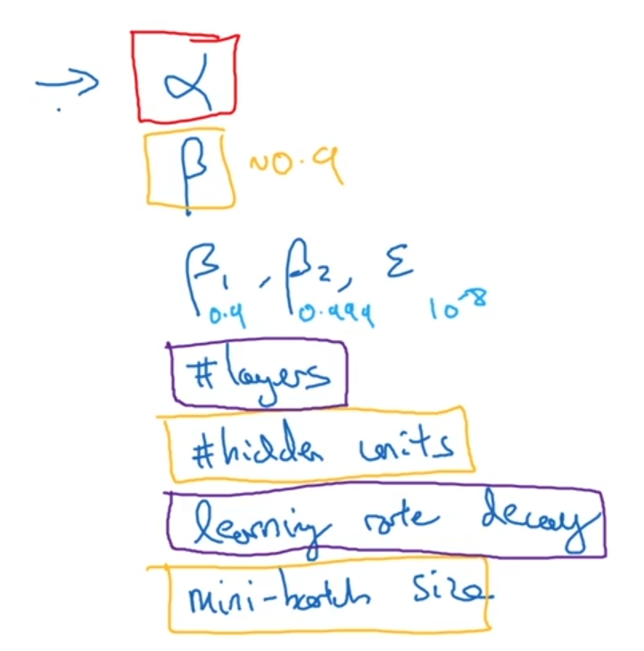

# 超参数调试，batch正则化和程序框架

---

## 1. 调试处理（Tuning process）

现在所学习到的一些超参数

{:height="50%" width="50%"}

---

## 2. 为超参数选择和适合范围（Using an appropriate scale to pick hyperparameters）

在范围内随机选择超参数，例如神经网络的节点数，$\alpha$的大小选择，$\beta$的大小选择

---

## 3. 网络中的正则化激活函数（Normalizing activations in a network（BN））

通过归一化激活值，加快后面层的W,b的训练速度，通常是归一化Z值

---

## 4. 将 Batch Norm拟合进神经网络（Fitting Batch Norm into a neural network）

获得一层的$Z[l]$，进行输入$\beta$和$\gamma$参数进行batch norm操作后进行激活，通过反向传播求出$d\beta$和$d\gamma$来更新每一层的$\beta$和$\gamma$

同时也能适用于mini_batch中，并且$\beta$和$\gamma$的维度和b一样

通过反向传播求出$d\beta$和$d\gamma$来更新每一层的$\beta$和$\gamma$

---

## 5. 为什么Batch Norm奏效？（Why does Batch Norm work?）

如下图：要计算第三层，那么很显然计算结果是依赖第二层的数据的。但是如果我们对第二层的数据进行了归一化，那么就可以将第二层的均值和方差都限制在同一分布，而且这两个参数是自动学习的。也就是归一化后的数据可以减弱前层参数的作用与后层参数的作用之间的联系，它使得网络每层都可以自己学习。

batch norm在某种程度上有正则化的效果，因为归一化会使各个层之间的依赖性降低，而且归一化有带来一定的噪声，有点像dropout。

---

## 6. 测试时的Batch Norm（Batch Norm at test time）

使用指数加权平均，在每一步中保留$μ$和$σ^{2}$，就可以得到训练后的$μ$和$σ^{2}$

---

## 7. Softmax 回归（Softmax Regression）

输出端为每个分类的概率，是一个（C,1）的数组

最有一层的激活函数为Softmax function

进行多分类，决策边界可以看出

---

## 8. 训练一个Softmax 分类器（Training a softmax classifier）

当C=2时，相当余logistic regression

Y为(c,m)的数组

---
