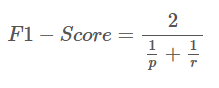
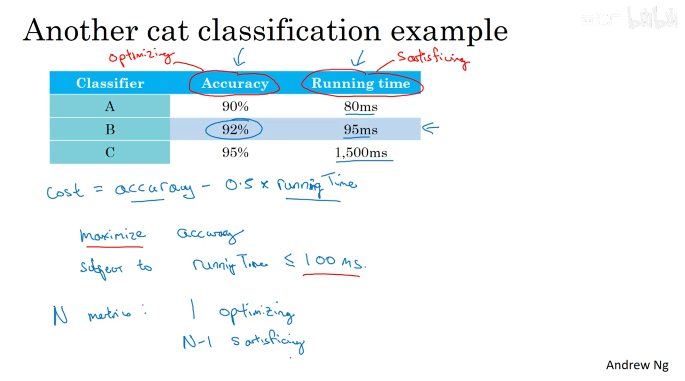
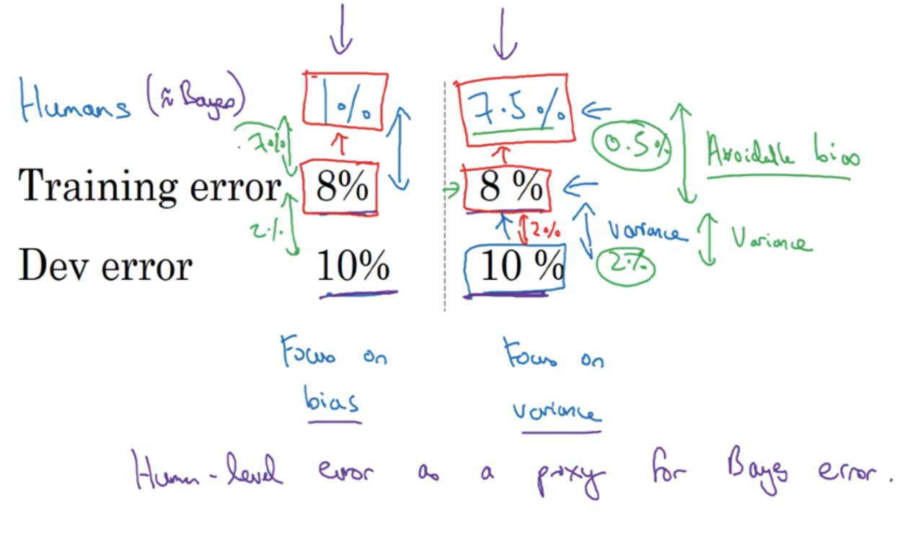
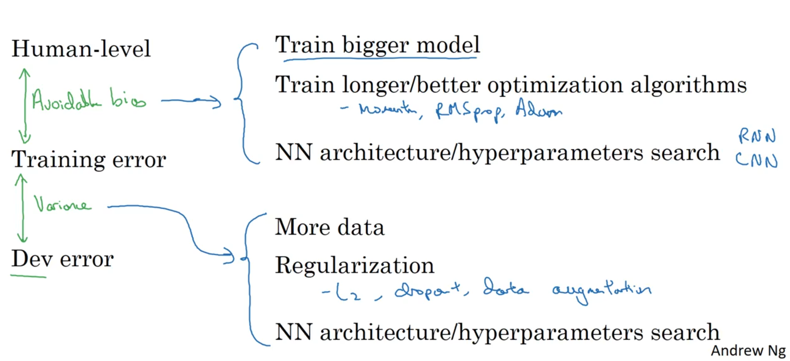

# 机器学习策略（1）(ML Strategy (1))

- [机器学习策略（1）(ML Strategy (1))](#机器学习策略1ml-strategy-1)
  - [1. 正交化(Orthogonalization)](#1-正交化orthogonalization)
  - [2. 单一数字评估指标(Single number evaluation metric)](#2-单一数字评估指标single-number-evaluation-metric)
  - [3. 满足和优化指标 (Satisficing and Optimizing metric)](#3-满足和优化指标-satisficing-and-optimizing-metric)
  - [4. 训练集、开发集、测试集的划分(Train/dev/test distributions)](#4-训练集开发集测试集的划分traindevtest-distributions)
  - [5. 改善你的模型表现 (Improving your model performance)](#5-改善你的模型表现-improving-your-model-performance)

---

## 1. 正交化(Orthogonalization)

在设计过程中，最好是保证几个变量相互独立，也就是正交。

在监督学习中，以下几个应该正交：

- 损失函数应该在训练集上表现很好
  - 否则，就使用更大的神经网络，或者使用更好的优化算法
- 在验证集上表现很好
  - 否则，就用正则化或者训练集上要更多的数据
- 在测试机上表现很好
  - 否则，就使用更大的验证集
- 现实中表现很好
  - 否则，就检查一下验证集是不是对的，损失函数是不是好的

---

## 2. 单一数字评估指标(Single number evaluation metric)

在训练模型中，当然需要一种指标来评估一下模型是不是好的。

一般使用两个参数：

- 准确率p：在预测的数据中，是正确的概率
- 召回率r：在真实数据中，预测是正确的概率

使用`F1 score`把两个指标统一起来

面对不同的算法，你也可以通过不同的单一数字评估指标来评价，比如平均损失之类的

---

## 3. 满足和优化指标 (Satisficing and Optimizing metric)

满足指标都是一个区间范围，比如时间上只要小于100ms就可以，这样子，就在满足满足指标的情况下，选择最优指标（如精确度最高）最好的那个模型。

比如运行时间为满足指标，而准确率为优化指标，通常时选择一个为优化指标，其他为满足指标

---

## 4. 训练集、开发集、测试集的划分(Train/dev/test distributions)

应该使验证集和测试集的数据满足统一分布。

---

## 5. 改善你的模型表现 (Improving your model performance)

我们训练出来的结果，应该和人类表现作比较，如果差距比较小，那么说明很接近了，如果差距比较大，应该着重优化缩小这个可避免的偏差。

减少bias：

- 训练更大的模型
- 更长的时间，更优化的算法（Momentum，RMSprop，Adam）
- 寻找更好的网络架构、更好的参数

减少variance：

- 收集更多的数据
- 正则化
- 更好的架构和参数

---
