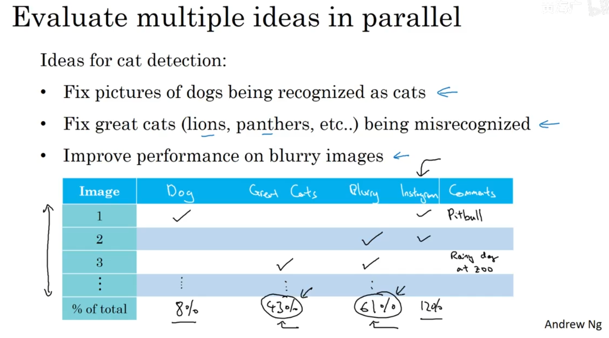
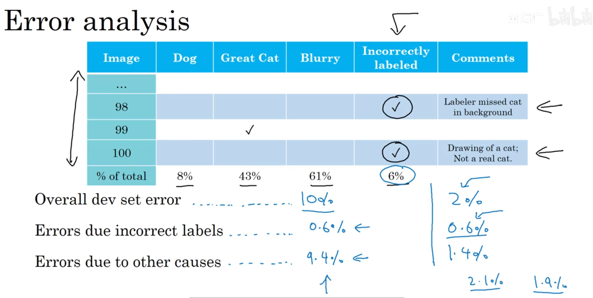
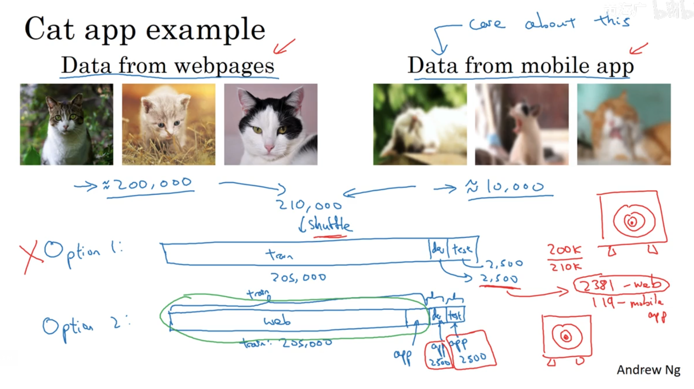
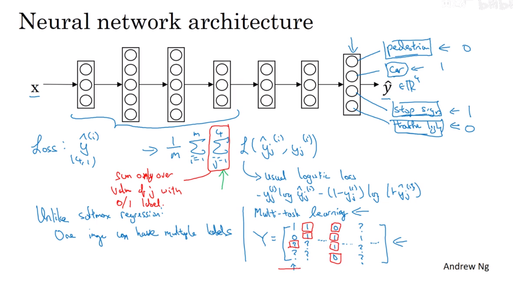
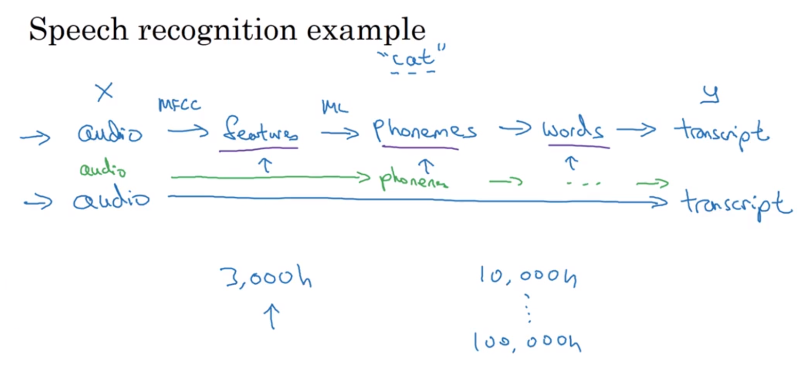

# 机器学习策略（2）(ML Strategy (2))

- [机器学习策略（2）(ML Strategy (2))](#机器学习策略2ml-strategy-2)
  - [1. 误差分析 (Carrying out error analysis)](#1-误差分析-carrying-out-error-analysis)
  - [2. 清除标注错误的数据(Cleaning up incorrectly labeled data)](#2-清除标注错误的数据cleaning-up-incorrectly-labeled-data)
  - [3. 快速搭建你的第一个系统，并进行迭代(Build your first system quickly, then iterate)](#3-快速搭建你的第一个系统并进行迭代build-your-first-system-quickly-then-iterate)
  - [4. 在不同的分布上的训练集和测试集 (Training and testing on different distributions)](#4-在不同的分布上的训练集和测试集-training-and-testing-on-different-distributions)
  - [5. 迁移学习 (Transfer learning)](#5-迁移学习-transfer-learning)
  - [6. 多任务学习(Multi-task learning)](#6-多任务学习multi-task-learning)
  - [7. 端到端的深度学习(nd-to-end deep learning)](#7-端到端的深度学习nd-to-end-deep-learning)
    - [7.1 什么是端到端的深度学习？ (What is end-to-end deep learning?)](#71-什么是端到端的深度学习-what-is-end-to-end-deep-learning)

---

## 1. 误差分析 (Carrying out error analysis)

对于训练后的模型，如果不进行误差分析，那么很难提升精度。所以应该在验证集中，找到标记错误的那些样本，统计一下都是因为什么原因出现的错误，如是不是照片模糊，还是本来是猫把它标记成狗了等等。

---

## 2. 清除标注错误的数据(Cleaning up incorrectly labeled data)

总体误差是10%，然后发现因为人工错误标记引起的误差是0.6%，那么其他原因造成的误差就是9.4%，这个时候应该集中精力去找那9.4%的误差原因，并进行修正。

---

## 3. 快速搭建你的第一个系统，并进行迭代(Build your first system quickly, then iterate)

快速设立`dev/test`数据集以及评估指标，先搭建一个系统，逐步迭代。

---

## 4. 在不同的分布上的训练集和测试集 (Training and testing on different distributions)

20W张照片时网上找的，1W张照片时手机拍的，实际上要测试的是用户在手机拍摄情况下的准确度。但是问题是手机上拍摄的数据不足，假设只有1万张。也就是训练集和测试集不是在同一分布。

应该用20万张照片，再加上5000张照片作为训练集，然后把剩下来的5000张照片对半分为验证集和测试集，那样子才更为符合实际情况。

---

## 5. 迁移学习 (Transfer learning)

迁移学习有限制：

- 必须是相关的类型，比如都是图像识别，都是语音识别
- A的数据远大于B，如果B的数据够多，那自己从头开始学不就好了

---

## 6. 多任务学习(Multi-task learning)

softmax一次只识别一种物体，而多任务学习一次可以识别多种物体。

在标注样本中，只标注了每张图片的一部分，比如说图片中有行人和车，只标注的行人，有没有车是不知道的，那么可以设为问号`y=[0 1 ? 1]`，这样也是可以训练的，但是在计算loss的时候，要把这个未标记的部分扣除，不要计算在内。

---

## 7. 端到端的深度学习(nd-to-end deep learning)

### 7.1 什么是端到端的深度学习？ (What is end-to-end deep learning?)

算法通常使用多步计算

端到端学习则直接忽略的这个过程，直接拍一张照片放入模型，输出结果。

需要很大量的数据的时候才能进行端到端学习；如果数据很少，那么还是手动干预，设计一些组件效果会好一点。

---
