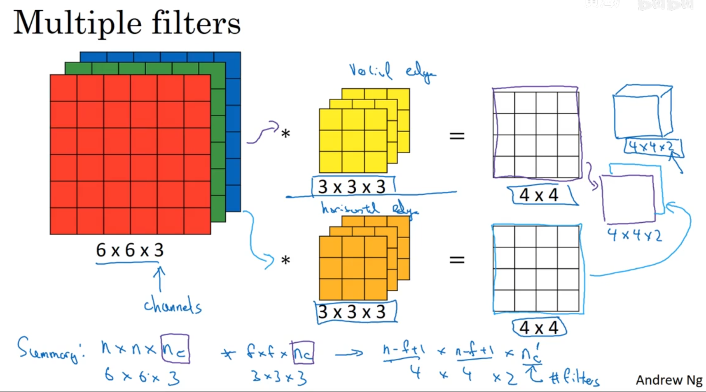

# 卷积神经网络(Foundations of Convolutional Neural Networks)

- [卷积神经网络(Foundations of Convolutional Neural Networks)](#卷积神经网络foundations-of-convolutional-neural-networks)
  - [1. 计算机视觉（Computer vision）](#1-计算机视觉computer-vision)
  - [2. 边缘检测（Edge detection）](#2-边缘检测edge-detection)
    - [2.1 水平检测和垂直检测](#21-水平检测和垂直检测)
    - [2.2 Learning to detect edges](#22-learning-to-detect-edges)
  - [3. Padding(填充)](#3-padding填充)
    - [3.1 Padding(填充)操作](#31-padding填充操作)
    - [3.2 Valid and Same convolutoins](#32-valid-and-same-convolutoins)
  - [4. 卷积步长（Strided convolutions）](#4-卷积步长strided-convolutions)
  - [5. 三维卷积（Convolutions over volumes）](#5-三维卷积convolutions-over-volumes)
    - [5.1 Convolutions on RGB images](#51-convolutions-on-rgb-images)
    - [5.2 Multiple filters(多个卷积核)](#52-multiple-filters多个卷积核)
  - [6. 单层卷积网络（One layer of a convolutional network）](#6-单层卷积网络one-layer-of-a-convolutional-network)
  - [7. 简单卷积网络示例（A simple convolution network example）](#7-简单卷积网络示例a-simple-convolution-network-example)
  - [8. 池化层（Pooling layers）](#8-池化层pooling-layers)
    - [8.1 Max pooling(最大池化)](#81-max-pooling最大池化)
    - [8.2 Average pooling(平均池化)](#82-average-pooling平均池化)
  - [9. 卷积神经网络示例（Convolutional neural network example）](#9-卷积神经网络示例convolutional-neural-network-example)
  - [10. 为什么使用卷积？（Why convolutions?）](#10-为什么使用卷积why-convolutions)

---

## 1. 计算机视觉（Computer vision）

用传统的深度学习算法，假设你有一张64×64的猫片，又有RGB三通道，那么这个时候是64×64×3=12288，即输入参数的维度为12288，如果图片再大一点，比如说是1000×1000的，假设有1000个隐藏神经元，那么就是第一层的参数矩阵有30亿个参数！

---

## 2. 边缘检测（Edge detection）

### 2.1 水平检测和垂直检测

水平检测和垂直检测，如下图

垂直检测中，垂直边缘的`filter`可以将原图片中间的边缘区分出来，`Vertical edge detection` 如下：

卷积操作：

过程：由明转暗

水平检测：

### 2.2 Learning to detect edges

将卷积后的结果当成一个一个参数进行学习，可以得到新的过滤器，提取不同的特征

---

## 3. Padding(填充)

### 3.1 Padding(填充)操作

每经过一次卷积运算，图片的像素都会变小，图片就会越来越小，并且从卷积的运算方法来看，边缘和角落的位置卷积的次数少，会丢失有用信息。

`padding`就是在图片四周填补上像素。

计算如下：
$$
原数据是n×n，filter为f×f，padding为p×p\\
得到的矩阵大小是(n+2p−f+1)×(n+2p−f+1)
$$

### 3.2 Valid and Same convolutoins

`padding`有两种类型：

- `Valid convolutoins`指`p=0`，不进行填充

- `Same convolution`指`input size = output size` 即`p=(f-1)/2`，f通常为奇数，奇数的话存在像素中心点

---

## 4. 卷积步长（Strided convolutions）

卷积的步长也就是每一次运算后平移的距离，之前使用都是stride=1。

$$
stride = s时得到的矩阵大小是:
\left\lfloor\frac{n+2 p-f}{s}+1\right\rfloor \times\left\lfloor\frac{n+2 p-f}{s}+1\right\rfloor
$$

---

## 5. 三维卷积（Convolutions over volumes）

### 5.1 Convolutions on RGB images

RGB图片有三种颜色，使用立体卷积，对每个通道进行卷积

对于不同的通道可以是不同的卷积核，可以得到不同的特征

### 5.2 Multiple filters(多个卷积核)

因为不同的卷积核可以提取不同的图片特征，所以可以有很多个卷积核，同时提取图片的特征，如分别提取图片的水平和垂直边缘特征。

有两个卷积核，比如说水平和垂直边缘卷积核，此时输出的图片就是有两通道的图片`4×4×2`

通道数channel：即卷积核要作用在原图片上，原图片的通道处$n_{c}$，卷积核的通道数必须和原图片通道数相同

个数：即要使用多少个这样的卷积核，使用$n_{c}^{'}$表示，卷积核的个数也就是输出图片的通道数，如有两个卷积核，那么生成了的图片`4×4×2`，`2`就是卷积核的个数

即生成后的图片维度为：$(n−f+1)×(n−f+1)×n_{c}^{'}$

---

## 6. 单层卷积网络（One layer of a convolutional network）

和前向传播差不多，滤波器作为W，图片像素为X，下图使用了两个filter

每层的参数规格：

---

## 7. 简单卷积网络示例（A simple convolution network example）

一层一层搭建卷积网络，设置每一层的fliter格式和大小，stride大小，padding大小

典型的卷积网络有三层，分别为卷积层(conv)，池化层(pooling)，全连接层(FC)

---

## 8. 池化层（Pooling layers）

用于压缩数据，加速运算，提高提取特征的鲁棒性

### 8.1 Max pooling(最大池化)

取范围内的最大值，提取到区域内的某些特征，超参数为fliter大小，stride大小

### 8.2 Average pooling(平均池化)

取范围内的平均值，最大池化使用比平均池化高

---

## 9. 卷积神经网络示例（Convolutional neural network example）

将一个卷积层和池化层当作一层，全连接层就像单层神经网络一样

随着层数增长，$n_{h}$和$n_{w}$会不断的下降，$n_{c}$增长

---

## 10. 为什么使用卷积？（Why convolutions?）

- 相对于传统深度学习，计算量小
- 参数共享：卷积核的参数是原图片中各个像素之间共享的，所以大大减少了参数
- 连接的稀疏性：每个输出值，实际上只取决于很少量的输入而已

训练一个猫咪鉴别器：

---
