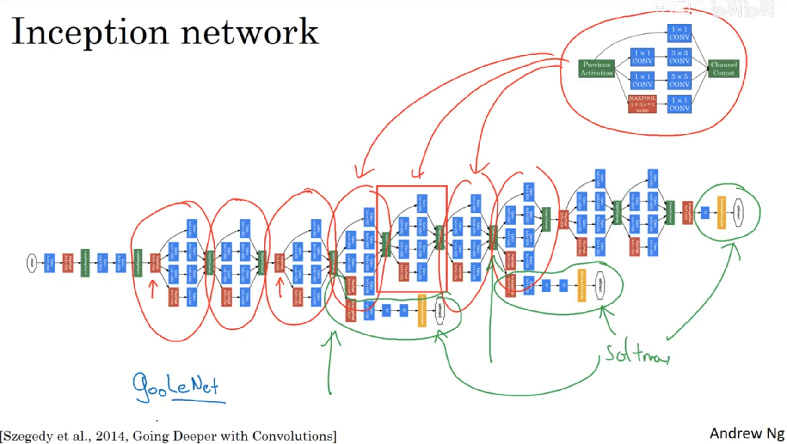

# 实例探究(Deep convolutional models: case studies)

---

## 1. 经典网络（Classic networks）

### 1.1 LeNet-5

`LeNet-5`主要是单通道的手写字体的识别，这是80年代提出的算法，当时没有用`padding`，而且`pooling`用的是`average pooling`，但是现在大家都用`max pooling`

最后预测用的是`sigmoid`和`tanh`，而现在都用了`softmax`

### 1.2 AlexNet

AlexNet是2012年提出的算法。用来对彩色的图片进行处理，其实大致的结构和LeNet-5是很相似的，但是网络更大，参数更多了，使用ReLU作为激活函数，并且采用多GPU进行计算。

其中有一个叫LRN(局部响应归一化)的操作，对一个位置，对其所有信道进行归一化。

### 1.3 VGG-16

VGG-16是2015的论文，比较简化的是，卷积层和池化层都是用相同的卷积核大小，卷积核都是3×3，stride=1，same padding，池化层用的maxpooling，为2×2，stride=2。只是在卷积的时候改变了每一层的通道数。

网络很大，参数有1.38亿个参数，但是结构并不复杂

---

## 2. 残差网络（Residual Networks (ResNets)）

### 2.1 概念

残差网络是由若干个残差块组成的。

因为在非常深的网络中会存在梯度消失和梯度爆炸的问题，为此，引入了`Skip Connection`来解决，也就是残差网络的实现。

在原本的传播过程(称为主线)中，加上了$a{[l]}$到$z{[l+2]}$的连接，成为`short cut`或者`skip connetction`。

### 2.2 ResNet为何有用？

加上残差块以后，更深的网络最差也只是和前面的效果一样，何况还有可能更好。

---

## 3. 网络中的网络以及 1×1 卷积（Network in Network and 1×1 convolutions）

计算过程相当余一个全连接网络

用`1×1`的卷积核可以来减少通道数，从而减少参数个数，同样也可以增加通道和保持通道数。

---

## 4.谷歌 Inception 网络（Inception network）

### 4.1 谷歌 Inception 网络简介（Inception network motivation）

`Inception`的主要好处就是不需要人工来选择`filter`的大小和是否要添加池化层的问题

把各个卷积核的大小和`max pool`一起加进去，然后让机器自己学习里面的参数

最大的问题是计算成本，这得需要用到前面的`1×1`的卷积核

使用`1×1`的卷积核来减少信道，称为瓶颈层，合理构建瓶颈层，既能明显减小数据规模，也不会降低网络性能

### 4.2 Inception 网络（Inception network）

`Inception module`

`Inception` 网络中有多个`Inception module`

其中有一些分支，这些分支就是用隐藏层直接进行全连接，然后`softmax`预测

---

## 5.  迁移学习（Transfer Learning）

用别人训练好的网络，固定他们已经训练好的网络参数，然后套到自己的训练集上，完成训练。

只改变已有网络的最后一层softmax就可以

如果你有一定量的数据，那么freeze的范围可以减少，你可以训练后面的几层隐藏层，或者自己设计后面的隐藏层。

---

## 6. 数据扩充（Data augmentation）

数据不够的话，进行数据扩充是很有用的。

方法有：

- 镜像
- 随机裁剪
- 色彩转换color shifting（如三通道：R+20,G-20,B+20）等等

tips:

在数据比赛中

- ensembling：训练多个网络模型，然后平均结果，或者加权平均
- 测试时使用muti-crop，也就是在把单张测试图片用数据扩充的形式变成很多张，然后运行分类器，得到的结果进行平均。

---
