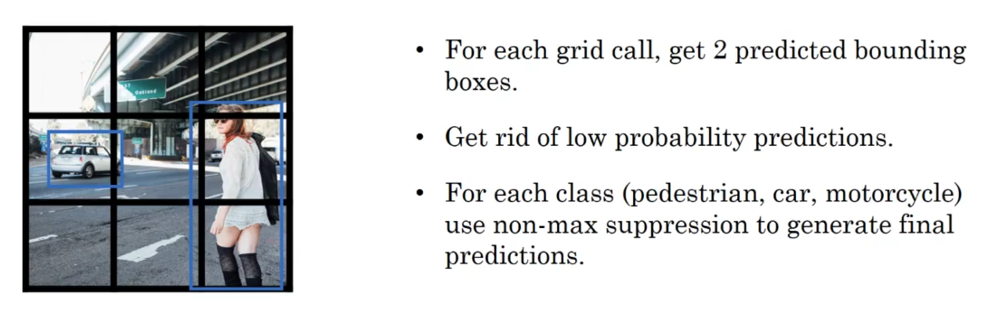

# 目标检测（Object detection）

---

## 1. 目标定位（Object localization）

我们需要分类的类别有三个，行人，汽车，自行车，如果什么都没有，那么就是背景。

目标标签y一共有8个参数：

- $P{_c}$：被检测为某一类的概率，是否有目标
- $b{_x}$，$b{_y}$，$b{_h}$，$b{_w}$：边框参数，目标的位置x,y，高宽h,w
- $c{_1}$，$c{_2}$，$c{_3}$：行人、汽车、自行车

---

## 2. 特征点检测（Landmark detection）

要检测人脸，那么可以在人脸上标注若干个特征点，假设有64个特征点，那么这个时候就有128个参数了，再加上判断是否有人脸，就有129个参数。

假设要检测的是人体肢体的动作，那么同样也可以标注若干个肢体上的特征点。

---

## 3. 目标检测（Object detection）

### 3.1 滑动窗口（Sliding windows）

目标检测通常采用的是滑动窗口的方法来检测的

先用训练集训练一个卷积网络，然后用一定窗口的大小，按照指定的步长，遍历整个图像；而后再选取更大的窗口，再次遍历，依次循环。这样子，每个窗口都相当于一张小图片，对这个小图片进行图像识别，从而得到预测结果。

但计算量很大

### 3.2 全连接层转化为卷积层

使用`400`个`5×5`的卷积核，进行卷积，得到了`1×1×400`，而后再使用`400`个`1×1`的卷积核，再得到了`1×1×400`矩阵，就将全连接层转化成了卷积层。

### 3.3 卷积的滑动窗口实现（Convolutional implementation of sliding windows）

全连接层转化为卷积层的做法，可以一次性把滑动窗口的结果都计算出来。

滑动的窗口是`14×14×3`，原图像大小是`16×16×3`

红色为左上角的窗口，通过一系列卷积后最后的结果中左上角为红色窗口的输出

即只需要原图进行一次运算，就可以一次性得到多个滑动窗口的输出值

---

## 4. Bounding Box预测（Bounding box predictions）

滑动窗口的方法有一个问题，就是很多情况下并不能检测出窗口的精确位置。

那么如何找到这个准确的边界框呢？有一个很快的算法叫做`YOLO(you only look once)`，只需要计算一次便可以检测出物体的位置。

首先，将图片分为`n×n`个部分，如图是划分成了`3×3=9`份，而每一份都由一个向量`y`来表示。

输出`3×3×8`的向量

怎样编码边框，将一个格子的左上角作为`(0,0)`，右下角为`(1, 1)`

- $b{_x}$：为中心点的`x`在该格子中从0的比例
- $b{_y}$：为中心点的`y`在该格子中从0的比例
- $b{_h}$：该目标的框的高在该格子的比例
- $b{_w}$：该目标的框的宽在该格子的比例

---

## 5. 交并比（Intersection over union IoU）

衡量定位精确度

用交并比来判断，也就是两个框框的交集和并集之比

$$
Correct = IoU=\frac{\text { 交集面积 }}{\text { 并集面积 }}
$$

一般`IoU>=0.5`，说明检测正确，阈值可以自己设定

---

## 6. 非极大值抑制（Non-max suppression NMS）

在实际过程中，很可能很多个框框都检测出同一个物体，那么如何判断这些边界框检测的是同一个对象呢？

- 每一个框都会返回一个概率$P{_c}$我们需要先去掉那些概率比较低的框，如去掉$P{_c}≤0.55$的框。
- 在$P{_c}$中找到概率最大的框，然后用算法遍历其他的边框，找出并取消掉和这个边框IoU大于0.5的框（因为如果IoU大于0.5，我们可以认为是同一个物体）
- 循环第二步的操作

{:height="50%" width="50%"}

{:height="50%" width="50%"}

当你仅做汽车识别时：

---

## 7. Anchor Boxes

如果一张格子中有多个目标，那怎么办？这时候就需要`Anchor Box`了，可以同时检测出多个对象。

预先定义了两个不同形状的`Anchor box`，如比较高的来检测人，比较宽的来检测汽车，然后重新定义了目标向量`y`

最后输出的矩阵从原来的`3×3×8`变成了`3×3×16`，也可以是`3×3×2×8`，`?`代表没有意义

一般人工来指定`Anchor Boxes`大小，指定5到10个来覆盖多种不同的形状

更高级一点的使用`k-means`聚类算法，将不同的对象形状进行聚类，然后得到一组比较具有代表性的`boxes`

---

## 8. YOLO 算法（Putting it together: YOLO algorithm）

将前面讲的总结在一起形成`YOLO`算法

### 8.1 Training

`y`向量为`n × n × anchors × (5+classes)`

### 8.2 Making predictions

然后进行非极大值抑制

这是运行后得到：

丢弃$P{_c}$小于阈值的box

进行非极大值抑制后：

---

## 9.  候选区域(Region proposals)

其他的目标检测算法，不过貌似都是比较慢的。

### 9.1 R-CNN

用R-CNN后，只选择一些候选的窗口，不需要对整个图片进行滑动

R-CNN使用的是图像分割算法，将图片分割成很多个色块，在色块上面跑卷积网络，从而减少了窗口数量。

### 9.2 Fast R-CNN

候选区域，使用滑动窗口在区分所有的候选区域。即用卷积实现滑动窗口。

### 9.3 Faster R-CNN

使用卷积神经网络而不是图像分割来获得候选区域。

---
